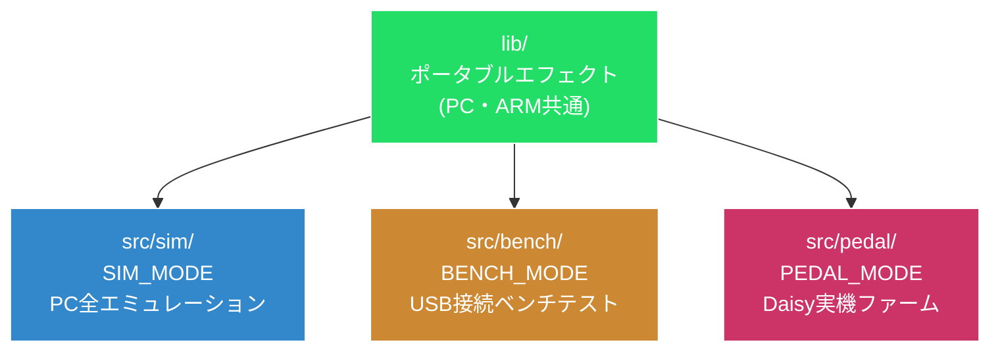
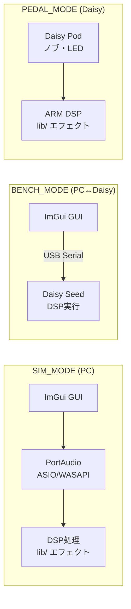
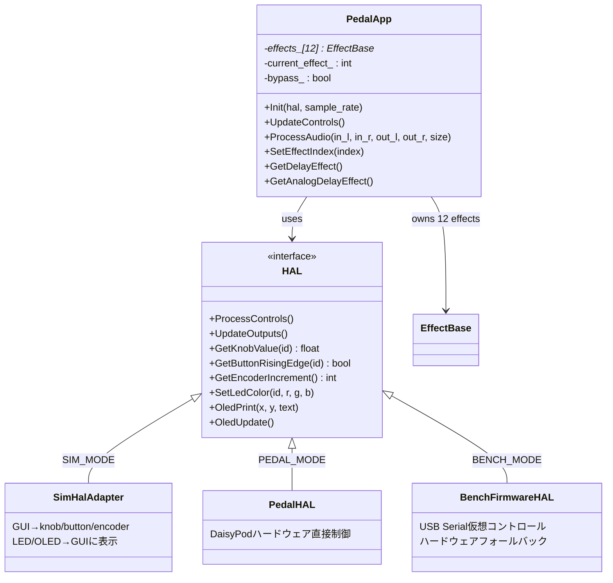
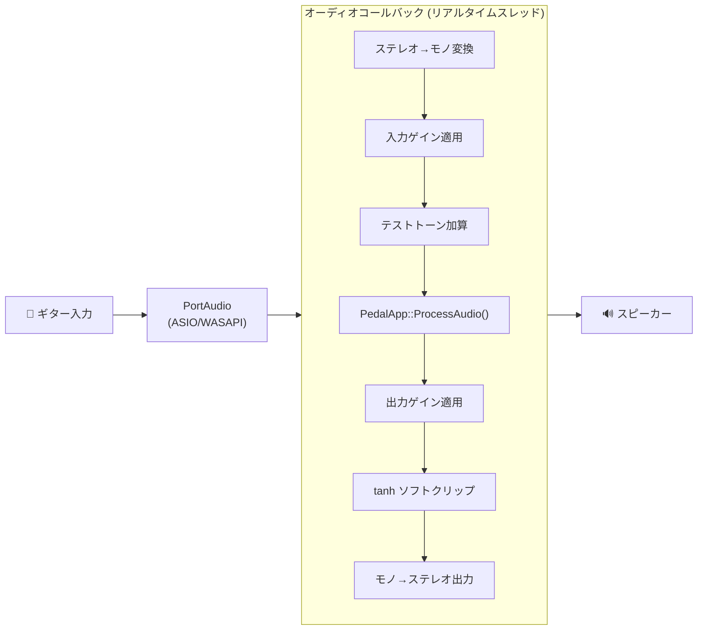
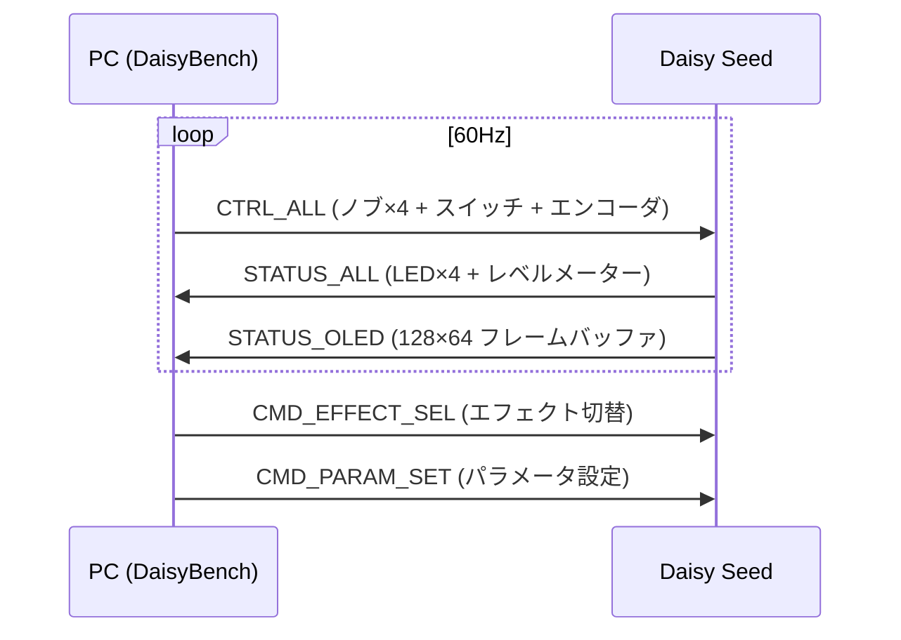
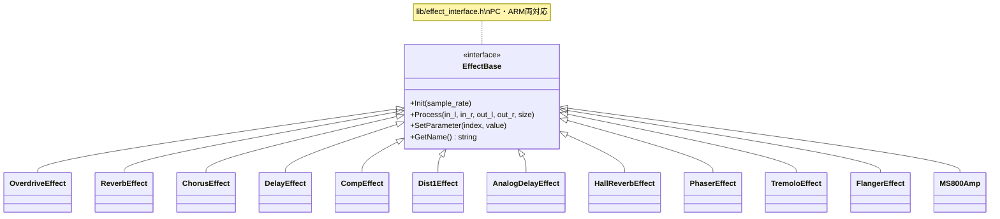
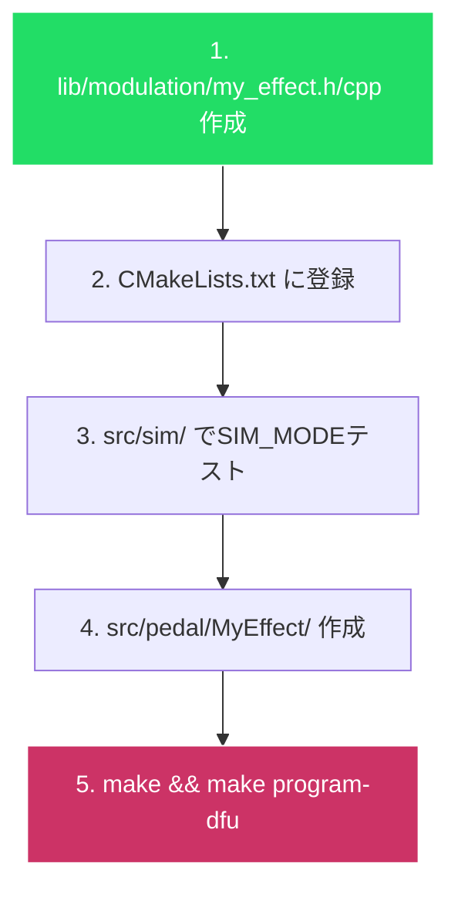
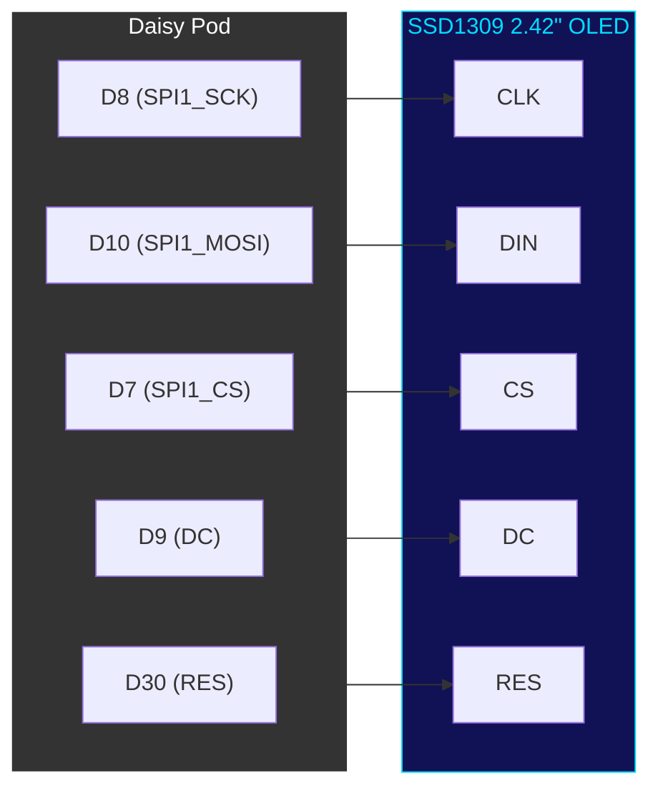

# DaisySim — Daisy Seed Multi-Effects Development Platform

Daisy Seed用マルチエフェクター開発プラットフォーム。
**同じエフェクトコード**が、PCシミュレータでもDaisy Seed実機でも動きます。



---

## 3つのビルドモード

| モード | 説明 | 出力 | 用途 |
|--------|------|------|------|
| **SIM_MODE** | PCシミュレータ — PC上で全てエミュレーション | `DaisySim.exe` | 開発・デバッグ・実機なし動作確認 |
| **BENCH_MODE** | ベンチテスト — PC↔Daisy USB通信 | `DaisyBench.exe` + FW | 実機DSPテスト・ハードウェア検証 |
| **PEDAL_MODE** | Daisy Seedネイティブファームウェア（ARM Cortex-M7） | `.bin` / `.elf` | 本番用ファームウェア書き込み |



---

## プロジェクト構成

```
daisy_sim/
├── CMakeLists.txt          # ルートCMake (DAISY_MODE切替)
├── cmake/
│   └── local.cmake         # ユーザー固有設定 (.gitignore対象)
│
├── lib/                    # ★ ポータブルエフェクト (PC・ARM共通)
│   ├── effect_interface.h  #   エフェクト基底クラス
│   ├── dsp_blocks.h        #   DSPプリミティブ (Biquad, DelayLine等)
│   ├── hal.h               #   HALインターフェース (全モード共通)
│   ├── pedal_app.h/cpp     #   共通アプリロジック (12エフェクト管理)
│   ├── platform.h          #   プラットフォーム抽象化 (旧)
│   ├── amp/                #   アンプ系
│   │   └── ms800_amp.h/cpp #     Marshall JCM800モデル
│   ├── delay/              #   ディレイ系
│   │   ├── delay_effect.h/cpp      #  ステレオディレイ (2.0s)
│   │   └── analog_delay_effect.h/cpp #  アナログディレイ (3.0s)
│   ├── drive/              #   歪み系
│   │   ├── overdrive_effect.h/cpp
│   │   └── dist1_effect.h/cpp      #  BOSS DS-1モデル
│   ├── modulation/         #   モジュレーション系
│   │   ├── chorus_effect.h/cpp
│   │   ├── tremolo_effect.h/cpp
│   │   ├── flanger_effect.h/cpp
│   │   └── phaser_effect.h/cpp
│   ├── dynamics/           #   ダイナミクス
│   │   └── comp_effect.h/cpp       #  MXR Dyna Compモデル
│   └── reverb/             #   リバーブ
│       ├── reverb_effect.h/cpp     #  Freeverbモデル
│       └── hall_reverb_effect.h/cpp #  FDNリバーブ
│
├── src/
│   ├── sim/                # SIM_MODE (PCシミュレータ)
│   │   ├── main.cpp, app.cpp/h
│   │   ├── sim_hal_adapter.h  # SimHalAdapter (HAL実装)
│   │   ├── daisysp_wrapper.h  # 12種エフェクト実装 (レガシー)
│   │   ├── audio/          #   PortAudio (ASIO/WASAPI)
│   │   ├── gui/            #   ImGuiウィジェット
│   │   ├── hal/            #   SimHAL (HWエミュレーション)
│   │   └── external/imgui/ #   Dear ImGui
│   │
│   ├── pedal/              # PEDAL_MODE (DaisyExamplesパターン)
│   │   ├── pedal_hal.h     #   PedalHAL (DaisyPodラッパー)
│   │   └── Delay/
│   │       ├── Delay.cpp   #   lib/delay/ を使用
│   │       └── Makefile    #   libDaisy Makefileシステム
│   │
│   └── bench/              # BENCH_MODE (USB通信)
│       ├── bench_protocol.h #  バイナリプロトコル定義
│       ├── bench_host.h/cpp #  PC側ホスト
│       └── firmware/       #   Daisy側ベンチFW
│           ├── main.cpp    #   PedalApp + 全12エフェクト
│           ├── bench_firmware_hal.h # BenchFirmwareHAL
│           └── Makefile
│
├── tests/                  # テスト (CMake)
│   ├── test_ms800.cpp      #   MS800安定性テスト (8項目)
│   └── test_ui_arrays.cpp  #   UI配列整合性テスト (6項目)
│
├── etc/zoom/               # ZOOM MS-50G+ リバースエンジニアリング
├── docs/                   # ドキュメント・ダイアグラム
└── tools/                  # スクリプト
```

---

## クイックスタート

### 必要環境

| 環境 | 必要なもの |
|------|-----------|
| **Windows** | MSYS2 UCRT64 (gcc, cmake, ninja, SDL2, PortAudio) |
| **Linux/WSL** | cmake, g++, libsdl2-dev, portaudio19-dev |
| **PEDAL_MODE** | ARM GCC (`arm-none-eabi-gcc`) + libDaisy + DaisySP |

### SIM_MODE（PCシミュレータ）

```bash
# Windows (MSYS2 UCRT64 or Git Bash)
PATH="/c/msys64/ucrt64/bin:$PATH"
cmake -B build/sim -DDAISY_MODE=SIM_MODE -G Ninja
ninja -C build/sim
./build/sim/DaisySim.exe
```

### BENCH_MODE（USBベンチテスト）

```bash
# PC側ホスト
PATH="/c/msys64/ucrt64/bin:$PATH"
cmake -B build/bench -DDAISY_MODE=BENCH_MODE -G Ninja
ninja -C build/bench

# Daisy側ファームウェア (ARM toolchain必要)
cd src/bench/firmware && make && make program-dfu
```

### PEDAL_MODE（実機ファームウェア）

```bash
# libDaisy Makefileシステム使用
cd src/pedal/Delay
make
make program-dfu    # DFUモードでDaisyに書き込み
```

### テスト

```bash
cd tests
PATH="/c/msys64/ucrt64/bin:$PATH"
cmake -B build -G Ninja && ninja -C build
./build/test_ms800.exe      # MS800安定性テスト (8項目)
./build/test_ui_arrays.exe  # UI配列整合性テスト (6項目)
```

---

## エフェクト一覧

ZOOM MS-50G+のリバースエンジニアリングを元に実装した12種のエフェクト。

| # | エフェクト | モデル | 概要 |
|---|-----------|--------|------|
| 0 | **Overdrive** | — | ソフトクリップ歪み |
| 1 | **Reverb** | Freeverb | 8コム+4オールパスのステレオリバーブ |
| 2 | **Chorus** | ZOOM Chorus | LFOモジュレーション遅延 |
| 3 | **Delay** | — | ステレオディレイ+トーン (最大2.0秒) |
| 4 | **Comp** | MXR Dyna Comp | エンベロープフォロワー+ソフトニー圧縮 |
| 5 | **DIST 1** | BOSS DS-1 | 4xオーバーサンプリング+ハードクリップ |
| 6 | **AnalogDly** | ZOOM AnalogDly | 最大3.0秒+Hi-Dampビカッドフィルタ |
| 7 | **Hall** | ZOOM Hall | FDNリバーブ (4拡散AP+4コム) |
| 8 | **Phaser** | ZOOM Phaser | 6段オールパス+LFOスイープ |
| 9 | **Tremolo** | ZOOM Tremolo | LFO振幅変調 (sin/tri/square) |
| 10 | **Flanger** | ZOOM VinFlngr | 短遅延+フィードバック+LFO |
| 11 | **MS 800** | Marshall JCM800 | 回路モデリング (プリEQ+非対称クリッピング+トーンスタック) |

### ポータブルエフェクト (lib/)

PC (SIM_MODE/BENCH_MODE) とDaisy Seed (PEDAL_MODE) の両方でコンパイル可能な共通エフェクトコード。

```cpp
// lib/effect_interface.h
class EffectBase {
    virtual void Init(float sample_rate) = 0;
    virtual void Process(const float* in_l, const float* in_r,
                         float* out_l, float* out_r, size_t size) = 0;
    virtual void SetParameter(int index, float value) = 0;  // 0.0〜1.0
    virtual const char* GetName() const = 0;
};
```

---

## アーキテクチャ

### HAL + PedalApp (共通設計)

全3モードが同じ `PedalApp` を使い、HAL実装だけが異なります。



### SDRAM管理 (ARM)

Daisy Seed は SRAM 512KB しかないため、大容量ディレイバッファは SDRAM (64MB) に配置。

```cpp
// firmware main.cpp での使用例
static daisysp::DelayLine<float, 96000>  DSY_SDRAM_BSS sdram_del_l;  // SDRAM上
static daisysp::DelayLine<float, 96000>  DSY_SDRAM_BSS sdram_del_r;

pedal_app.GetDelayEffect()->SetDelayLines(&sdram_del_l, &sdram_del_r);
pedal_app.Init(hal, sample_rate);
```

PC (`SIM_MODE`) ではクラス内部にストレージを持つため `SetDelayLines()` 不要。

### 信号フロー (SIM_MODE)



### Bench プロトコル

PC↔Daisy Seed間のUSBシリアル通信 (115200 baud CDC仮想シリアル)。



**フレームフォーマット:**
```
[SYNC0: 0xDA] [SYNC1: 0x15] [TYPE: 1B] [LEN: 2B LE] [PAYLOAD: 0-1040B] [CRC8: 1B]
```

### ポータブルエフェクト一覧 (lib/)

全12エフェクトが PC (SIM_MODE/BENCH_MODE) と Daisy Seed (PEDAL_MODE) の両方でコンパイル・実行可能。



---

## 新しいエフェクトの追加

### ファームウェア対応エフェクト (推奨)

`lib/` に追加すれば、SIM_MODE・BENCH_MODE・PEDAL_MODEすべてで使えます。



#### 1. エフェクトを作成

`lib/modulation/my_effect.h`:
```cpp
#pragma once
#include "effect_interface.h"
#include "dsp_blocks.h"

namespace DaisyFX {
class MyEffect : public EffectBase {
public:
    void Init(float sample_rate) override;
    void Process(const float* in_l, const float* in_r,
                 float* out_l, float* out_r, size_t size) override;
    const char* GetName() const override { return "MyEffect"; }
    int GetNumParameters() const override { return 3; }
private:
    daisysp::DelayLine<float, 48000> delay_l_;
    float lfo_phase_ = 0.0f;
};
} // namespace DaisyFX
```

#### 2. CMakeに登録

`CMakeLists.txt` の `LIB_EFFECTS_SOURCES`:
```cmake
set(LIB_EFFECTS_SOURCES
    lib/delay/delay_effect.cpp
    lib/drive/overdrive_effect.cpp
    lib/modulation/chorus_effect.cpp
    lib/amp/ms800_amp.cpp
    lib/modulation/my_effect.cpp    # ← 追加
)
```

#### 3. Daisy Seedファームウェアを作成

`src/pedal/MyEffect/MyEffect.cpp` + `Makefile`:

```makefile
TARGET = MyEffect
CPP_SOURCES = MyEffect.cpp ../../../lib/modulation/my_effect.cpp
LIBDAISY_DIR ?= ../../../DaisyExamples/libDaisy
DAISYSP_DIR ?= ../../../DaisyExamples/DaisySP
C_INCLUDES += -I../../../lib -I../../../lib/modulation
SYSTEM_FILES_DIR = $(LIBDAISY_DIR)/core
include $(SYSTEM_FILES_DIR)/Makefile
```

#### 4. ビルド & 書き込み

```bash
# SIM_MODEでテスト
PATH="/c/msys64/ucrt64/bin:$PATH" ninja -C build/sim

# Daisyに書き込み
cd src/pedal/MyEffect && make && make program-dfu
```

---

## ポータブルコードのルール

`lib/` のコードは ARM Cortex-M7 (Daisy Seed STM32H750) でコンパイルできる必要があります。

| OK | NG (ARM でコンパイルエラー) |
|----|-----------------------------|
| `float buf[4096];` | `std::vector<float> buf;` |
| `daisysp::DelayLine<float,N>` | `new float[N];` |
| `static const float table[];` | `std::string name;` |
| `#include <cmath>` | `#include <iostream>` |
| `DaisyFX::Biquad filter;` | `printf()` / `std::cout` |

**禁止**: STLコンテナ、動的メモリ(`new`/`delete`)、`std::string`、`printf`

### DSPビルディングブロック (dsp_blocks.h)

| パーツ | 用途 | 使用例 |
|--------|------|--------|
| `daisysp::DelayLine<T,N>` | ディレイライン | `dl.Write(in); out = dl.Read();` |
| `daisysp::fonepole()` | 1次ローパス | `fonepole(smooth, target, 0.001f);` |
| `DaisyFX::Biquad` | 2次IIR (LPF/HPF/EQ) | `bq.SetLPF(1000, 48000); out = bq.Process(in);` |
| `DaisyFX::OnePole` | トーンフィルタ | `tone.SetFreq(3000); out = tone.Process(in);` |

---

## Windowsフルセットアップ

全3モード（SIM / BENCH / PEDAL）を使えるようにする手順。

### 1. MSYS2 + PC向けツールチェーン

```bash
# MSYS2インストール: https://www.msys2.org/
# MSYS2 UCRT64ターミナルで:
pacman -S mingw-w64-ucrt-x86_64-{gcc,cmake,ninja,SDL2,portaudio,pkgconf}
pacman -S make  # PEDAL/BENCH firmware ビルドに必要
```

**重要**: Git Bash や VS Code ターミナルでは以下の PATH 設定が必要:
```bash
export PATH="/c/msys64/ucrt64/bin:/c/msys64/usr/bin:$PATH"
```

### 2. ARM ツールチェーン (PEDAL_MODE / BENCH firmware)

Daisy Seed ファームウェアのビルドに必要。SIM_MODE のみ使う場合は不要。

1. [Arm GNU Toolchain](https://developer.arm.com/downloads/-/arm-gnu-toolchain-downloads) から `arm-none-eabi` (12.2以上) をダウンロード・インストール
2. PATH に追加:
   ```bash
   export PATH="/c/Program Files (x86)/Arm GNU Toolchain arm-none-eabi/12.2 mpacbti-rel1/bin:$PATH"
   ```
3. 確認:
   ```bash
   arm-none-eabi-gcc --version  # arm-none-eabi-gcc 12.2.1 以上
   ```

### 3. DaisyExamples + libDaisy + DaisySP

```bash
# DaisyExamples リポジトリ
git clone https://github.com/electro-smith/DaisyExamples ~/ws/DaisyExamples
cd ~/ws/DaisyExamples

# libDaisy と DaisySP のサブモジュール初期化
git submodule update --init libDaisy DaisySP

# libDaisy ビルド (ARM ファームウェアのリンクに必要)
cd libDaisy && make
cd ..

# DaisySP ビルド (ARM ファームウェアのリンクに必要)
cd DaisySP && make
```

### 4. ローカル設定

`cmake/local.cmake` を作成 (`.gitignore`対象):
```cmake
set(DAISY_EXAMPLES_PATH "C:/Users/<ユーザー名>/ws/DaisyExamples" CACHE PATH "" FORCE)
set(USE_DAISYSP ON CACHE BOOL "" FORCE)
# ASIO対応PortAudio (省略可 — 超低レイテンシが必要な場合)
if(WIN32)
    set(CUSTOM_PORTAUDIO_PATH "C:/Users/<ユーザー名>/ws/portaudio" CACHE PATH "" FORCE)
endif()
```

### 5. 全モードビルド確認

```bash
export PATH="/c/msys64/ucrt64/bin:/c/msys64/usr/bin:$PATH"
export PATH="/c/Program Files (x86)/Arm GNU Toolchain arm-none-eabi/12.2 mpacbti-rel1/bin:$PATH"

# SIM_MODE (PCシミュレータ)
cmake -B build_root -DDAISY_TARGET=SITL -G Ninja
ninja -C build_root
./build_root/DaisySim.exe

# テスト
cd tests && cmake -B build -G Ninja && ninja -C build
./build/test_ms800.exe && ./build/test_ui_arrays.exe
cd ..

# PEDAL_MODE ファームウェア (Delay)
cd src/pedal/Delay && make
# make program-dfu  # DFUモードでDaisyに書き込み
cd ../../..

# BENCH firmware (全12エフェクト)
cd src/bench/firmware && make
# make program-dfu  # DFUモードでDaisyに書き込み
cd ../../..
```

### トラブルシューティング

| 症状 | 原因 | 対処 |
|------|------|------|
| `mkdir -p: コマンドの構文が誤っています` | Windows版makeがMSYS2のmakeでない | `pacman -S make` で MSYS2版をインストール、`/c/msys64/usr/bin` を PATH に |
| `-ldaisy: No such file` | libDaisy 未ビルド | `cd DaisyExamples/libDaisy && make` |
| `-ldaisysp: No such file` | DaisySP 未ビルド | `cd DaisyExamples/DaisySP && make` |
| SRAM overflow (>512KB) | DelayLine がクラス内に直接配置 | `SetDelayLines()` で SDRAM バッファを注入 |
| `fonepole` / `DelayLine` 再定義 | `daisysp.h` と `dsp_blocks.h` の同時include | ファームウェアでは `daisysp.h` を直接includeしない |

---

## ASIO対応 (超低レイテンシ)

ギター演奏用途で2ms以下のレイテンシを実現。

| ドライバモード | レイテンシ | 備考 |
|--------------|-----------|------|
| WASAPI Shared | 10〜30ms | 追加設定不要 |
| WASAPI Exclusive | 3〜10ms | ASIOドライバ不要 |
| **ASIO** | **1〜3ms** | ASIOドライバ必要 |

シミュレータ内の **Audio Settings [+]** から切替可能。

---

## オーディオ仕様

| 項目 | 値 |
|------|-----|
| サンプルレート | 48,000 Hz |
| バッファサイズ | 64サンプル (設定可能: 64〜1024) |
| チャンネル | モノラル処理 (ステレオI/O → 内部モノ → ステレオ出力) |
| 入力ゲイン | 0〜+50 dB |
| 出力ゲイン | -60〜+6 dB |
| クリッパー | tanh ソフトクリップ (±0.9閾値) |

---

## GUI操作

| 操作 | 機能 |
|------|------|
| **SPACE** | オーディオ開始/停止 |
| **1** / **2** / **3** | スイッチ1〜3トグル |
| **ESC** | 終了 |
| **Knob 1〜4** | エフェクトパラメータ (マウスドラッグ) |
| **Effect Type** | ドロップダウンで12種から選択 |
| **Audio Settings [+]** | ドライバ・デバイス・バッファサイズ設定 |

---

## ハードウェア構成 (Daisy Pod + SSD1309 OLED)



OLED接続後も **13ピン** が空きGPIOとして利用可能。

---

## ライセンス

MIT License
