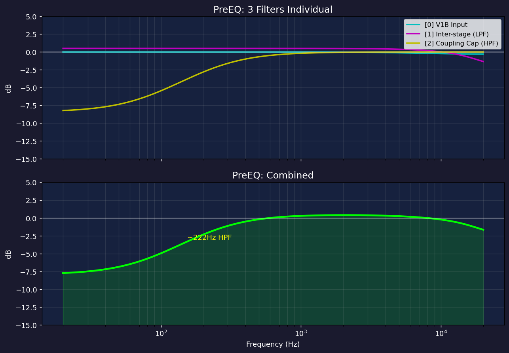
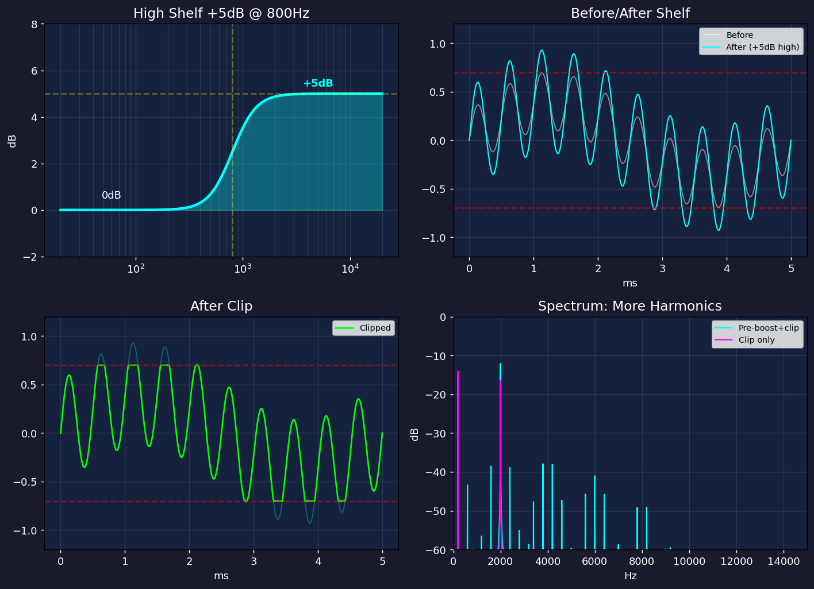
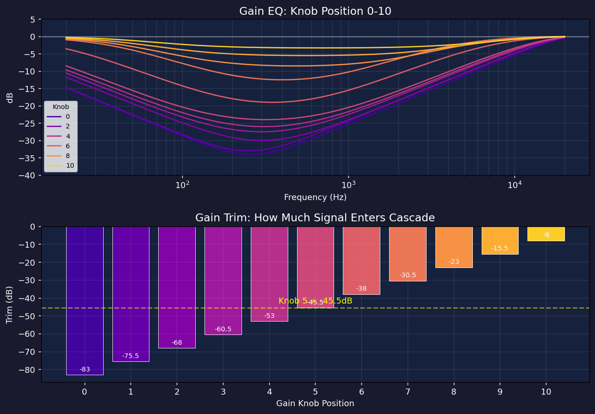
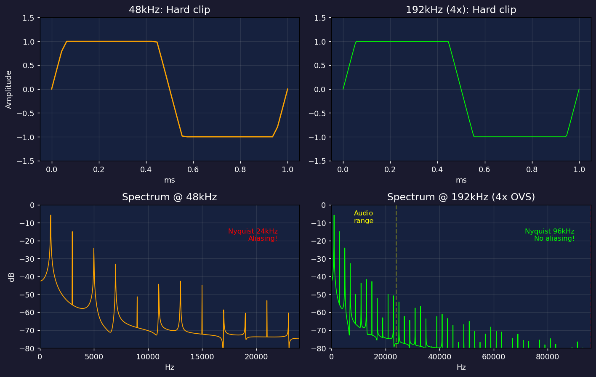
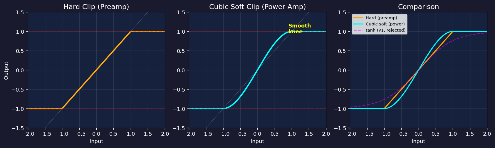
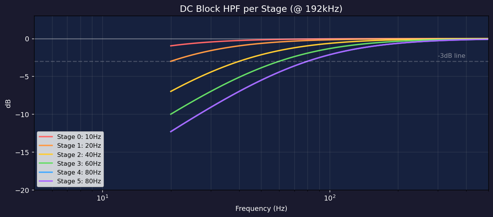
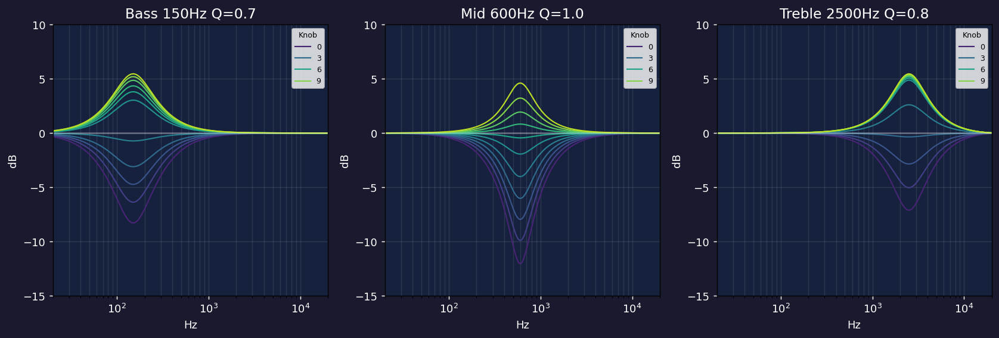
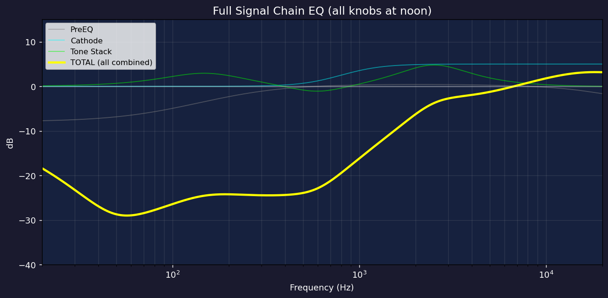

# JCM800 DSP アンプシミュレータ — 初心者向け徹底解説

> Marshall JCM800 2203 のギターアンプを、コンピュータの中で再現する仕組みを
> ゼロから解説します。プログラミングの知識があれば、DSPや音響の知識は不要です。

## 目次

1. [全体像 — 信号の旅](#1-全体像--信号の旅)
2. [Step 0: ステレオ→モノ変換](#step-0-ステレオモノ変換)
3. [Step 1: Input Gain — 入力の音量調整](#step-1-input-gain--入力の音量調整)
4. [Step 2: PreEQ — 入力回路のフィルタ](#step-2-preeq--入力回路のフィルタ)
5. [Step 3: Cathode Bypass — 高域ブーストの秘密](#step-3-cathode-bypass--高域ブーストの秘密)
6. [Step 4: Gain EQ + Trim — ゲインノブの仕組み](#step-4-gain-eq--trim--ゲインノブの仕組み)
7. [Step 5: 4x オーバーサンプリング](#step-5-4x-オーバーサンプリング)
8. [Step 6: 6段ゲインカスケード — アンプの心臓部](#step-6-6段ゲインカスケード--アンプの心臓部)
9. [Step 7: Presence EQ](#step-7-presence-eq)
10. [Step 8: ダウンサンプリング](#step-8-ダウンサンプリング)
11. [Step 9: Tone Stack — Bass/Mid/Treble](#step-9-tone-stack--bassmidtreble)
12. [Step 10: 出力 — Sub Cut + Volume + Clamp](#step-10-出力--sub-cut--volume--clamp)
13. [全体の周波数特性](#全体の周波数特性)
14. [用語集](#用語集)

---

## 1. 全体像 — 信号の旅

ギターの信号が入って、スピーカーから出るまでの全行程:

```
🎸 ギター
 │
 ▼
[Mono Sum] ──→ [Input Gain] ──→ [PreEQ] ──→ [Cathode Bypass]
                                                    │
                                              +5dB 高域ブースト
                                                    │
                                              [Gain EQ + Trim]
                                                    │
                                          ゲインノブで歪み量を調整
                                                    │
                                    ┌───── 4x Upsample ─────┐
                                    │                         │
                                    │   ⚡ 6段ゲインカスケード    │
                                    │   (449,000倍 → 歪み)     │
                                    │                         │
                                    │   Presence EQ            │
                                    │                         │
                                    └───── 4x Downsample ────┘
                                                    │
                                              [Tone Stack]
                                            Bass / Mid / Treble
                                                    │
                                              [Sub Cut + Volume]
                                                    │
                                                    ▼
                                              🔊 スピーカー
```

**ファイル**: [`ms800_amp.cpp`](../../shared/effects/amp/ms800_amp.cpp) の `Process()` 関数 (L319-391)

---

## Step 0: ステレオ→モノ変換

```cpp
float x = (in_l[i] + in_r[i]) * 0.5f;   // L334
```

PC のオーディオインターフェースからは左右2チャンネルが来る。
実物のアンプはモノラル入力なので、左右を足して2で割る。

```
左: +0.05  ─┐
             ├──→ (0.05 + 0.03) / 2 = 0.04
右: +0.03  ─┘
```

ギターの生音は `±0.01〜±0.1` くらい。とても小さい。

---

## Step 1: Input Gain — 入力の音量調整

```cpp
x *= input_gain_;   // L337
```

**input_gain_ の計算** (L269-270):
```cpp
input_gain_ = input_val * input_val * 1.41f;  // 二乗テーパー
```

| Input ノブ | 計算 | 倍率 | dB |
|-----------|------|------|-----|
| 0.0 (最小) | 0² × 1.41 | 0.000 | -∞ (無音) |
| 0.5 (真ん中) | 0.25 × 1.41 | 0.353 | -9 dB |
| 1.0 (最大) | 1.0 × 1.41 | 1.410 | +3 dB |

### なぜ二乗？

人間の耳は対数的に音量を感じる。リニアだとノブの前半と後半で聴感上の変化が違いすぎる。
二乗にすると **小さい音量の微調整がしやすくなる**。

```
ノブの位置:  0%──────50%──────100%
リニア:      0%      50%      100%   ← 前半も後半も同じ変化
二乗:        0%      25%      100%   ← 前半はゆっくり、後半で急上昇
```

**例**: x = 0.04, ノブ 0.5 の場合 → `0.04 × 0.353 = 0.0141`

---

## Step 2: PreEQ — 入力回路のフィルタ

```cpp
for (int f = 0; f < 3; f++)          // L340-341
    x = pre_eq_[f].Process(x);
```

3つの1次IIRフィルタを直列に通す。JCM800 の入力回路（ジャック→最初の真空管）の特性を再現。

### IIR1フィルタとは

「前回の入力」と「前回の出力」を覚えていて、今の入力と混ぜる:

```cpp
out = a0 × 今の入力 + a1 × 前の入力 + b1 × 前の出力
```

たった3つの係数 (a0, a1, b1) で周波数特性が決まる。

### 3つのフィルタの正体

| # | 係数 | 何をしている | なぜそうなる |
|---|------|------------|------------|
| [0] | (0.976, -0.367, 0.391) | ほぼフラット | 入力ジャックの微小な色付け |
| [1] | (0.958, 0.218, -0.110) | 高域がやや落ちる | 配線の浮遊容量による「なまり」 |
| [2] | (0.991, -0.980, 0.971) | **低域をカット (HPF)** | カップリングキャップの副作用 |

### なぜ低域をカットするのか

実機では真空管の段と段の間に **カップリングコンデンサ** がある:

```
 [真空管A] ──┤├── [真空管B]
              ↑
         コンデンサ
```

真空管は +200V の DC(直流) で動いている。この DC が次の段に漏れると壊れるので、
コンデンサで DC を遮断する。でもコンデンサは **低い周波数も通しにくい**。
だから DC を遮断する副作用として、低域の信号も落ちる。

**DSP で意図的に HPF にしたのではなく、実機が「こうなっている」のを再現している。**



---

## Step 3: Cathode Bypass — 高域ブーストの秘密

```cpp
x = cathode_bypass_.Process(x);   // L346
```

800Hz 以上を **+5dB** 持ち上げるハイシェルフフィルタ。

### 実機の回路

JCM800 の V1A 真空管のカソード（足元）に 0.68µF のコンデンサがある:

```
        グリッド ← 入力
          │
        [V1A 真空管]
          │
        カソード
          │
        [抵抗 820Ω]──┬── GND
                      │
                   [0.68µF]  ← バイパスキャップ
                      │
                     GND
```

- **コンデンサなし**: 抵抗がフィードバックとなり、全帯域でゲインが下がる
- **コンデンサあり**: 高い周波数はコンデンサを通って GND に逃げる → 高域のフィードバックが消える → **高域だけゲインが上がる**

### なぜ歪みの「前」に置くのが超重要か

```
【本モデル】歪みの前にブースト
  高域 +5dB → 歪み → 高域が多くクリップ → 倍音がたくさん生まれる (ノイズ増幅なし)

【v1】歪みの後にブースト
  歪み → 高域 +7dB → 倍音もノイズも同じだけ増幅される (ノイズ増加!)
```

歪み(クリッピング)は **入力が大きいほど倍音をたくさん作る** 非線形処理。
だから歪みの前に高域を大きくすれば、歪みが **勝手に** 高域の倍音を作ってくれる。
歪みの後にEQで足すと、信号もノイズも区別なく増幅してしまう。



---

## Step 4: Gain EQ + Trim — ゲインノブの仕組み

```cpp
x = gain_eq_.Process(x) * gain_trim_;   // L350
```

**Gain ノブの2つの仕事**:

1. **gain_eq_**: 中域をカットする Peak EQ (ノブが低いほど深くカット)
2. **gain_trim_**: 全体の音量を絞るスカラー値

### なぜこんなに絞るのか

この後の6段カスケードで **449,000倍** に増幅される。
もし信号をそのまま入れたら、一瞬で ±1.0 を超えて全部クリップしてしまう。

Gain ノブの役割は **「歪ませる前にどれだけ信号を絞るか」** を決めること:

```
Gain 0 (min):  -83dB = 0.00007倍  → ほぼ無音、全く歪まない
Gain 5 (noon): -45.5dB = 0.0053倍 → 適度に歪む
Gain 10 (max): -8dB = 0.398倍     → ガンガン歪む
```

つまり **Gain ノブは「増やす」のではなく「絞りを緩める」** コントロール。



上のグラフ:
- **上段**: Gain EQ の周波数特性。ノブ 0 では 260Hz 付近を -34dB もカット。ノブ 10 では -3dB（軽いカット）
- **下段**: Gain Trim の値。-83dB（ほぼ無音）から -8dB まで

---

## Step 5: 4x オーバーサンプリング

```cpp
// L354-358: 1サンプル → 4サンプルに増やす
up[0] = ovs_up2_.Process(ovs_up_.Process(x * 4.0f));  // 元のサンプル
up[1] = ovs_up2_.Process(ovs_up_.Process(0.0f));       // ゼロ挿入
up[2] = ovs_up2_.Process(ovs_up_.Process(0.0f));       // ゼロ挿入
up[3] = ovs_up2_.Process(ovs_up_.Process(0.0f));       // ゼロ挿入
```

### なぜ必要か — エイリアシング問題

デジタル音声はサンプルレート（例: 48,000Hz）の半分（24,000Hz）までしか正しく表現できない
（**ナイキスト定理**）。

ハードクリップは波形をバッサリ切るので、理論上 **無限の倍音** が生まれる。
48kHz のまま処理すると、24kHz を超えた倍音が折り返して **エイリアシングノイズ** になる。

```
48kHz の場合:
  1kHz の歪み → 3kHz, 5kHz, 7kHz, ..., 23kHz, [25kHz→折り返して23kHzに!]
  ↑ これがジリジリした不快なノイズ

192kHz (4x) の場合:
  1kHz の歪み → 3kHz, 5kHz, 7kHz, ..., 95kHz ← 全部聴こえない帯域に収まる!
```

4倍にすることで、96kHz まで倍音を正しく扱える。

### 処理の流れ

```
48kHz: ── x ──────────────────── (1サンプル)
              ↓ ゼロ挿入
192kHz: ── x ── 0 ── 0 ── 0 ── (4サンプル、3つは0)
              ↓ LPFフィルタ × 2段
192kHz: ── a ── b ── c ── d ── (4サンプル、滑らかに補間)
              ↓ 歪み処理 (この速度で実行)
192kHz: ── a'── b'── c'── d'──
```

`× 4.0` は **ゼロ挿入でエネルギーが1/4になるのを補正** するため。



左側 (48kHz) はサンプル数が少なくギザギザ。右側 (192kHz) は滑らか。
スペクトルを見ると、48kHz ではナイキスト付近に折り返しノイズがあるが、192kHz ではクリーン。

---

## Step 6: 6段ゲインカスケード — アンプの心臓部

```cpp
// L160-179 (ProcessNonlinear)
for (int g = 0; g < 6; g++) {
    v *= kStageGain[g];            // ① 増幅
    // ② クリップ (ハード or ソフト)
    v = dc_block_[g].Process(v);   // ③ DCブロック
    v = SafeClamp(v);              // ④ 安全装置
}
```

**ここがアンプの音を決める最も重要な部分。** 192kHz で動作し、1入力サンプルあたり4回呼ばれる。

### 各ステージの役割

| Stage | 名前 | ゲイン | 実機の部品 | クリップ |
|-------|------|--------|----------|---------|
| 0 | V1B | ×7.6 | 12AX7 片側。入力初段 | Hard |
| 1 | V1A | **×27.3** | 12AX7 もう片側。**最もゲインが高い** | Hard |
| 2 | V2A | ×7.1 | 2本目の12AX7 片側 | Hard |
| 3 | V2B | ×4.8 | カソードフォロワー（インピーダンス変換） | Hard |
| 4 | Power | ×7.9 | EL34 パワー管 | **Soft** |
| 5 | OT | ×6.3 | 出力トランス | **Soft** |

**合計**: 7.6 × 27.3 × 7.1 × 4.8 × 7.9 × 6.3 = **約 449,000倍 (+113dB)**

### ① 増幅

```cpp
v *= kStageGain[g];  // 例: Stage 1 → v = v × 27.3
```

ギターの小さな信号 (0.001 くらい) が段を追うごとに巨大になっていく。

### ② クリップ — 2種類の歪み方

**プリアンプ (Stage 0-3): ハードクリップ**
```cpp
if (v > 1.0f) v = 1.0f;
else if (v < -1.0f) v = -1.0f;
```
限界を超えた信号をバッサリ切り落とす。フラットトップの波形 → ジャキジャキした倍音。

**パワーアンプ (Stage 4-5): キュービックソフトクリップ**
```cpp
v = 1.5f * v - 0.5f * v * v * v;
```
なめらかに丸まる。ピッキングの強弱に追従する「サグ感」。

```
ハードクリップ:           ソフトクリップ:

    ┌────────┐               ╭────────╮
    │        │              ╱          ╲
────┘        └────      ──╱              ╲──
バッサリ切断              なめらかに丸まる
→ 鋭い倍音               → 温かい倍音
```



### なぜ tanh ではダメだったか (v1 の失敗)

v1 では全段 `tanh()` を使っていた。tanh はソフトすぎて:
- 飽和時の RMS が低い → SNR(信号対ノイズ比)が悪化
- JCM800 のキレのある歪みが出ない
- ユーザーが「ノイズが増えた」と報告 → ハードクリップに戻した

### ③ DCブロック — ステージ間カップリングキャップ

```cpp
v = dc_block_[g].Process(v);
```

各ステージの後に1次HPF。実機のカップリングコンデンサを再現。

```
IIR1: y[n] = x[n] - x[n-1] + R × y[n-1]
```

**ポイント**: 段が進むほどカットオフ周波数が高い（後段ほどタイト）。

| Stage | カットオフ | 効果 |
|-------|----------|------|
| 0 | 10 Hz | ほぼ素通し（広帯域な歪み） |
| 1 | 20 Hz | サブベースを軽減 |
| 2 | 40 Hz | 低域がタイトに |
| 3 | 60 Hz | さらにタイト |
| 4 | 80 Hz | パワーアンプのローエンド制御 |
| 5 | 80 Hz | 出力トランスの帯域制限 |

**なぜ段ごとに違うか**: 実機のカップリングキャパシタの容量が段ごとに違う。
後段ほど容量が小さい = HPF カットオフが高い。v1 は全段 7.6Hz で統一していたため、
低域が膨らんでいた。



### ④ SafeClamp — 安全装置

```cpp
if (x != x) return 0.0f;  // NaN チェック (NaN は自分自身と等しくない！)
if (x > 10.0f) return 10.0f;
if (x < -10.0f) return -10.0f;
```

449,000倍のゲインチェーンでは、浮動小数点エラーが蓄積して Inf や NaN になりうる。
これがスピーカーに到達するとポップノイズや機器の故障の原因に。
毎段のクランプで伝搬を防ぐ。

---

## Step 7: Presence EQ

```cpp
v = presence_boost_.Process(v);   // L186
v = presence_cut_.Process(v);     // L188
```

JCM800 の Presence ノブはパワーアンプの **ネガティブフィードバックループ** の
周波数特性を変える。オーバーサンプリングレート (192kHz) で処理。

- **Boost**: ノブに連動した Peak EQ。ノブ 10 で +5.8dB@900Hz
- **Cut**: ノブ > 5 で中域を軽くカット（NFB の周波数選択性を近似）

ノブ 0〜4 ではほぼ何もしない（boost は 0〜0.4dB）。
ノブ 5 以上で効き始め、高域の「存在感」が増す。

---

## Step 8: ダウンサンプリング

```cpp
// L366-368: 4サンプル → 1サンプルに戻す
for (int k = 0; k < 3; k++)
    ovs_dn2_.Process(ovs_dn_.Process(dn[k]));    // フィルタ状態を更新（出力は捨てる）
float y = ovs_dn2_.Process(ovs_dn_.Process(dn[3]));  // 最後のサンプルだけ使う
```

192kHz → 48kHz に戻す。4サンプルのうち最後の1つだけ使う。

**重要**: 前の3サンプルの出力は使わないが、フィルタの **内部状態** (z1, z2) は
更新される。これを飛ばすと波形が不連続になってノイズが出る。

アンチエイリアスLPFを通すことで、24kHz 以上の成分を除去してから間引く。

---

## Step 9: Tone Stack — Bass/Mid/Treble

```cpp
y = tone_bass_.Process(y);     // 150Hz Peak EQ   L371
y = tone_mid_.Process(y);      // 600Hz Peak EQ   L372
y = tone_treble_.Process(y);   // 2500Hz Peak EQ  L373
```

マーシャルの「FMV (Fender-Marshall-Vox)型」パッシブトーンスタックを
3つの独立した Peak EQ で近似。

### JCM800 の音の核心: ミッドスクープ

Mid ノブを真ん中にすると **-1.9dB** になる。1.0 未満のリニア値 (0.80) → カット。

```
ノブ位置:  0     5(noon)    10
Mid dB:  -12.0   -1.9     +4.6
          ↑                 ↑
       深いスクープ      軽いブースト
```

これが JCM800 の特徴的な **「V字サウンド」** を作る:
- 低域と高域が出ている
- 中域が凹んでいる
- バンドサウンドの中でギターが「抜ける」

v1 ではノブ真ん中で +4.9dB のブーストだったため、マーシャルらしさが出なかった。



---

## Step 10: 出力 — Sub Cut + Volume + Clamp

```cpp
y = sub_cut_.Process(y);   // 50Hz -7dB カット    L377
y *= output_gain_;          // VOL ノブ連動        L381
if (y > 1.0f) y = 1.0f;   // 最終クランプ        L384-385
out_l[i] = y;              // デュアルモノ出力     L388-389
out_r[i] = y;
```

### Sub Cut

50Hz を -7dB カット。もこもこした低域を防ぎ、タイトなローエンドにする。

### Volume

テーブル補間で dB 値を取得し、リニアゲインに変換:

| VOL | 0 | 5 | 10 |
|-----|---|---|---|
| dB | -74.5 | -8.0 | -0.95 |
| 倍率 | 0.0002 | 0.398 | 0.898 |

### 最終クランプ

`±1.0` に収める。デジタルオーディオでこれを超えるとクリッピングノイズになる。

最後に左右チャンネルに同じ値を書き込む（デュアルモノ）。

---

## 全体の周波数特性

全てのフィルタ（PreEQ + Cathode Bypass + Gain EQ + Tone Stack + Sub Cut）を
合わせた、ノブ全部真ん中での周波数特性:



黄色い線が全体の合算。この「形」がアンプのキャラクターを決める。

---

## 用語集

| 用語 | 意味 |
|------|------|
| **dB (デシベル)** | 音量の対数表現。+6dB = 2倍、+20dB = 10倍、-20dB = 1/10倍 |
| **Hz (ヘルツ)** | 1秒間の振動回数。20Hz = 超低音、1kHz = 中音、20kHz = 超高音 |
| **サンプルレート** | 1秒間に音を記録する回数。48,000Hz = 1秒に48,000個 |
| **ナイキスト周波数** | サンプルレートの半分。これ以上の周波数は表現不可 |
| **エイリアシング** | ナイキスト超えの音が折り返して不快なノイズになる現象 |
| **オーバーサンプリング** | 処理中だけサンプルレートを上げて折り返しを防ぐ |
| **HPF** | ハイパスフィルタ。低い周波数を落とす |
| **LPF** | ローパスフィルタ。高い周波数を落とす |
| **IIR** | 無限インパルス応答フィルタ。前回の出力を使うフィルタ |
| **Biquad** | 2次のIIRフィルタ。係数5つで様々な特性を作れる万能フィルタ |
| **Peak EQ** | 特定の周波数をブースト/カットするフィルタ |
| **High Shelf** | 指定周波数以上を一律にブースト/カットするフィルタ |
| **クリッピング** | 信号が限界を超えた時に切り落とすこと = 歪みの正体 |
| **倍音** | 元の周波数の整数倍の音。歪みで生成され、音の「色」を決める |
| **DC** | 直流。0Hz の成分。アンプ回路では +200V 等の動作電圧 |
| **NFB** | ネガティブフィードバック。出力の一部を入力に戻してゲインを安定させる |
| **カップリングキャップ** | 段間のコンデンサ。DCを遮断し、信号だけ通す |
| **カソードバイパス** | 真空管のカソード抵抗をコンデンサでバイパスし、高域ゲインを上げる |
| **NaN** | Not a Number。浮動小数点の異常値。自分自身と等しくない |

---

## ソースコード

| ファイル | 内容 |
|---------|------|
| [`ms800_amp.h`](../../shared/effects/amp/ms800_amp.h) | クラス定義、メンバ変数 |
| [`ms800_amp.cpp`](../../shared/effects/amp/ms800_amp.cpp) | 全処理実装 |
| [`ms800_amp.md`](../../shared/effects/amp/ms800_amp.md) | 技術仕様書（上級者向け） |
| [`dsp_blocks.h`](../../shared/effects/dsp_blocks.h) | Biquad, OnePole 等の DSP 部品 |
| [`effect_interface.h`](../../shared/effects/effect_interface.h) | エフェクト基底クラス |
