# アコースティックシミュレータ改善研究ノート

ZOOM MS-50G+ の Aco.Sim 実装を分析し、学術研究に基づく改善案を松竹梅の3段階で提案する。

---

## 0. DSP用語ガイド（初心者向け）

この文書を読むために必要な用語を、ギター的な例えと図を交えて解説する。

---

### 0.1 デジタル音声の基本 — 「音」はどう数値になるか

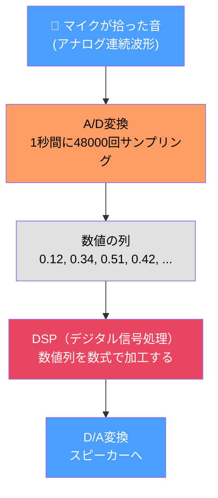

- 48000Hz (48kHz) = CD音質
- 96kHz = ハイレゾ
- 192kHz = オーバーサンプリング時（後述）
- 各サンプルは -1.0 ~ +1.0 の小数値

> **ポイント:** DSPとは「数値の列を別の数値の列に変える計算」のこと。
> フィルタも歪みもリバーブも、全部「数値の加工ルール」が違うだけ。

---

### 0.2 フィルタとは何か — トーンノブの正体

フィルタとは「周波数ごとに音量を変える処理」。

ギター的に言うと: トーンノブ全開 = バイパス（フィルタなし）、トーンノブ絞る = LPF (fc が下がる = こもる)

#### フィルタの主な種類

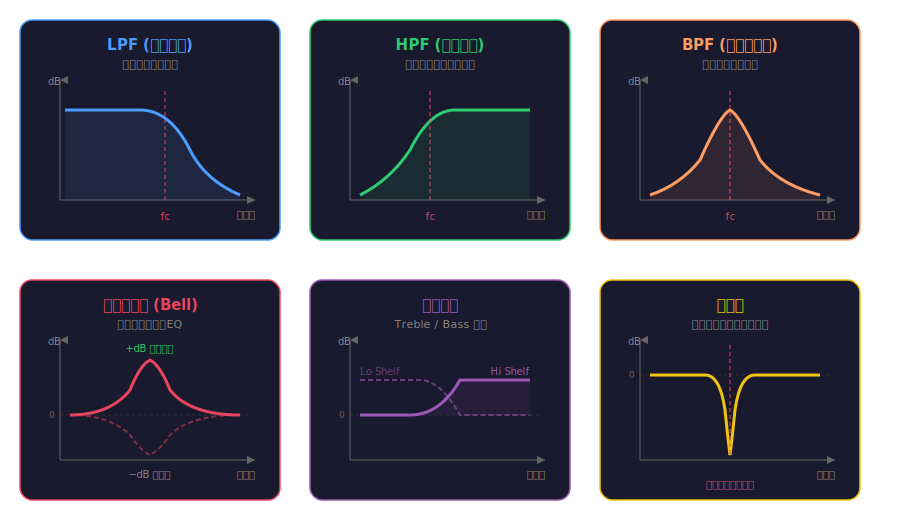

---

### 0.3 バイクワッド (Biquad) — フィルタのレゴブロック

バイクワッドは**5つの数値（係数）で定義される万能フィルタ部品**。
係数の値を変えるだけで LPF にも HPF にも EQ にもなる。

---

#### まず名前の意味から

**Biquad** = **Bi**（2つの）+ **Quad**（ratic = 2次式）

伝達関数（後述）の分子と分母がどちらも2次式 → 「2つの2次式」→ バイクワッド。これだけ。

> **要するに:** 「2次の分数フィルタ」の省略名。名前が難しそうに見えるだけで、中身は単純。

---

#### バイクワッドをブラックボックスとして見る

まず数式は一旦忘れて、バイクワッドを「**5つのツマミがついた箱**」として考える。


- 入力: 音のサンプル列（数値の列）が入ってくる
- 5つのツマミ: b0, b1, b2, a1, a2 という5つの数値
- 出力: ツマミの設定に応じて加工された音が出てくる

ギターで例えると:
- b0, b1, b2, a1, a2 の**値を変えるだけで、中身の回路を変えずに**:
  - **トーンノブ**（LPF）にもなるし
  - **ワウペダル**（BPF）にもなるし
  - **パラメトリックEQ**（ピーキング）にもなる

> **これが「万能フィルタ部品」と呼ばれる理由。** 1つのプログラムで全種類のフィルタを作れる。DSPにとっての「レゴブロック」。

---

#### z⁻¹ = 「1つ前を覚えておくメモ帳」

バイクワッドの仕組みを理解する鍵は **z⁻¹**（ゼット・インバース・ワン）。

これは難しい記号に見えるが、意味はシンプル:

```
z⁻¹ = 「1つ前のサンプルの値」を取り出す箱
```

48kHz のオーディオなら、1サンプル = 1/48000秒 ≈ 0.02ms。

```
時刻:          t=0      t=1      t=2      t=3      t=4
入力 x[n]:     0.5      0.8      0.3     -0.2     -0.7
                         ↑
            z⁻¹を通すと:
z⁻¹の出力:    0(※)     0.5      0.8      0.3     -0.2
                         ↑ 1つ前の値(0.5)が出てくる

(※ 最初は「1つ前」が存在しないので 0)
```

> **つまり z⁻¹ は「記憶装置」。** 前回の値を覚えておいて、次回それを出す。ディレイペダルの超短い版（0.02ms）。

z⁻² は「2つ前を覚えておくメモ帳」。z⁻¹ を2回通したのと同じ:

```
時刻:          t=0      t=1      t=2      t=3      t=4
入力 x[n]:     0.5      0.8      0.3     -0.2     -0.7
z⁻² の出力:   0        0        0.5      0.8      0.3
                                  ↑ 2つ前の値(0.5)が出てくる
```

---

#### 手を動かして理解する — 1サンプルずつ追跡

バイクワッドの計算式を「レシピ」として書くと:

```
出力 y[n] = b0 × 今の入力
          + b1 × 1つ前の入力
          + b2 × 2つ前の入力
          - a1 × 1つ前の出力     ← フィードバック!
          - a2 × 2つ前の出力     ← フィードバック!
```

これだけ。掛け算して足すだけ。

##### 実際の数値で追跡してみよう

簡単な LPF（トーンノブを絞った状態）の係数:

```
b0 = 0.1,  b1 = 0.2,  b2 = 0.1,  a1 = -1.2,  a2 = 0.5
```

入力として「パンッ」というアタック音 → `[1.0, 0, 0, 0, 0, ...]` を入れてみる:

```
■ t=0: 入力=1.0（パン！）
  y[0] = 0.1×1.0  + 0.2×0    + 0.1×0    - (-1.2)×0    - 0.5×0
       = 0.1
       ↑ 入力1.0に対して0.1だけ通った（90%カット）

■ t=1: 入力=0（もう叩いてない）
  y[1] = 0.1×0    + 0.2×1.0  + 0.1×0    - (-1.2)×0.1  - 0.5×0
       = 0  +  0.2  +  0  +  0.12  -  0
       = 0.32
       ↑ 入力は0なのに出力が増えた！ → フィードバック(a1)が前回の出力0.1を戻した

■ t=2: 入力=0
  y[2] = 0.1×0    + 0.2×0    + 0.1×1.0  - (-1.2)×0.32  - 0.5×0.1
       = 0  +  0  +  0.1  +  0.384  -  0.05
       = 0.434
       ↑ さらに膨らむ！ フィードバックが出力を「反響」させている

■ t=3: 入力=0
  y[3] = 0.1×0    + 0.2×0    + 0.1×0    - (-1.2)×0.434  - 0.5×0.32
       = 0  +  0  +  0  +  0.521  -  0.16
       = 0.361
       ↑ ピークを過ぎて減衰し始めた

■ t=4: 入力=0
  y[4] = 0  +  0  +  0  - (-1.2)×0.361  - 0.5×0.434
       = 0.433  -  0.217
       = 0.216
       ↑ 徐々に小さくなっていく（余韻が減衰）
```

波形にすると:

```
入力:   █
出力:   ▏ ▍ ▌ ▎ ▏ ·
        t0  t1  t2  t3  t4

入力は t=0 の一瞬だけなのに、出力は「ボーン」と余韻を持って鳴る
→ これがボディ共鳴の原理！
```

> **ここが核心:** フィードバック（a1, a2）が「前回の出力を入力に戻す」ことで、入力が止まっても出力が続く。これが**共鳴（レゾナンス）**の正体。アコギのボディが「ボーン」と鳴り続けるのは、木の振動がフィードバックループを作っているから。バイクワッドのフィードバックはこれをデジタルで模倣している。

---

#### フィードバックの強さと音の関係

a1, a2 の値（フィードバックの強さ）で、共鳴の性格が変わる:

```
フィードバック弱い (a2 ≈ 0.3):
  入力: █
  出力: ▌ ▎ · ·          ← すぐ消える。「コッ」という短い音
  → Q が低い。ゆるやかなフィルタ

フィードバック中 (a2 ≈ 0.8):
  入力: █
  出力: ▍ ▌ █ ▌ ▎ ▏ ·   ← しばらく鳴り続ける。「ポーン」
  → Q が中。はっきりした共鳴

フィードバック強い (a2 ≈ 0.99):
  入力: █
  出力: ▏ ▍ ▌ █ █ █ ▌ ▍ ▏ · ·  ← 長く響く。「ボーーーン」
  → Q が高い。鋭い共鳴。ワウを強く踏んだ状態

フィードバック強すぎ (a2 ≥ 1.0):
  入力: █
  出力: ▏ ▍ ▌ █ ██ ███ ████ → 無限大！！
  → 発振。ハウリングと同じ。フィルタが壊れた状態
```

> **ギターで例えると:**
> - a2 ≈ 0.3 → トーンノブを軽く絞った程度。ゆるやか
> - a2 ≈ 0.8 → ワウの半踏み。「ワァ」と特定帯域が鳴る
> - a2 ≈ 0.99 → ワウ全踏みでフィードバック上げた状態。「ピーー」寸前
> - a2 ≥ 1.0 → ハウリング。マイクをスピーカーに近づけた状態

---

#### なぜ特定の周波数「だけ」が強まるのか — フィードバックとEQの関係

バイクワッドはリバーブと同じフィードバック構造なのに、なぜEQ（周波数の選別）ができるのか？

**答え: フィードバックが速すぎて「エコー」にならず、「波の干渉」になるから。**

##### ディレイの長さで効果が変わる

```
■ ディレイ 500ms → エコー/リバーブ
  「パン！」→ ・・・パン・・・パン・・・パン・・・
  人間の耳に「繰り返し」として聞こえる

■ ディレイ 0.02ms (z⁻¹ = 1サンプル@48kHz) → バイクワッド
  「パン！」→ パパパパパパパパ... (毎秒48000回ループ)
  速すぎて「繰り返し」とは聞こえない → 音色の変化として聞こえる
```

##### 波の干渉 — 共鳴が起きる仕組み

フィードバックで戻ってきた波と、新しく入ってくる波が重なる。**波の位置関係（位相）が周波数ごとに違う**ため、結果が周波数ごとに変わる:

```
【強め合う周波数】波の山と山がぴったり重なる

    入力:  ╱╲  ╱╲  ╱╲  ╱╲
    戻り:  ╱╲  ╱╲  ╱╲  ╱╲   ← 山の位置が一致
           ↓↓ 足し合わせると ↓↓
    合計: ╱╲ ╱╲ ╱╲ ╱╲  ← 振幅2倍！ → ブースト (共鳴)
          ↑大↑大↑大↑大


【弱め合う周波数】波の山と谷がぶつかる

    入力:  ╱╲  ╱╲  ╱╲  ╱╲
    戻り:  ╲╱  ╲╱  ╲╱  ╲╱   ← 山と谷が逆（逆位相）
           ↓↓ 足し合わせると ↓↓
    合計: ──────────────────  ← 打ち消してゼロ！ → カット (ノッチ)


【中間の周波数】少しずれて重なる

    入力:  ╱╲  ╱╲  ╱╲  ╱╲
    戻り:    ╱╲  ╱╲  ╱╲  ╱╲ ← 少しずれている
           ↓↓ 足し合わせると ↓↓
    合計:  ～∽～∽～∽～∽～∽  ← 中途半端に変化 → やや変化
```

> **これは物理の世界と全く同じ原理:**
>
> | 現象 | フィードバック | 強め合う条件 |
> |---|---|---|
> | ギターの弦 | 弦の端で振動が反射して戻る | 弦の長さ = 波長の半分の整数倍 |
> | 管楽器の管 | 管の端で空気の振動が反射 | 管の長さ = 波長の1/4の整数倍 |
> | アコギのボディ | 板の振動が跳ね返って戻る | ボディの寸法に合った周波数 |
> | **バイクワッド** | **z⁻¹で出力が入力に戻る** | **a1, a2 で決まる周波数** |
>
> ギターの弦が「特定の音程でしか鳴らない」ように、バイクワッドも「特定の周波数でしか共鳴しない」。この選択性がEQ動作の正体。

##### a1 が共鳴周波数を決める理由

a1 の値が「フィードバックが戻る時の位相回転量」を決めている:

```
a1 ≈ -2.0  →  低い周波数の波とぴったり合う  →  低域で共鳴
a1 ≈ -1.4  →  中域の波と合う                →  中域で共鳴
a1 ≈  0.0  →  高い周波数の波と合う          →  高域で共鳴

ギターで例えると: a1 = 「弦の長さ」（どの音程で鳴るか）
```

a2 は共鳴の「鋭さ」(Q) を決める:

```
a2 ≈ 0.3  →  弱い干渉。なだらかなEQカーブ     ← 弦の振動がすぐ止まる
a2 ≈ 0.99 →  強い干渉。鋭いピーク              ← 弦がいつまでも鳴り続ける

ギターで例えると: a2 = 「ボディの材質」（どれだけ長く鳴り続けるか）
```

> **→ インタラクティブ学習ツール:** この波の干渉を視覚的に体験できるツール →
> [biquad-learning-tool.html](biquad-learning-tool.html) で実際に試せる

---

#### b係数とa係数の役割分担

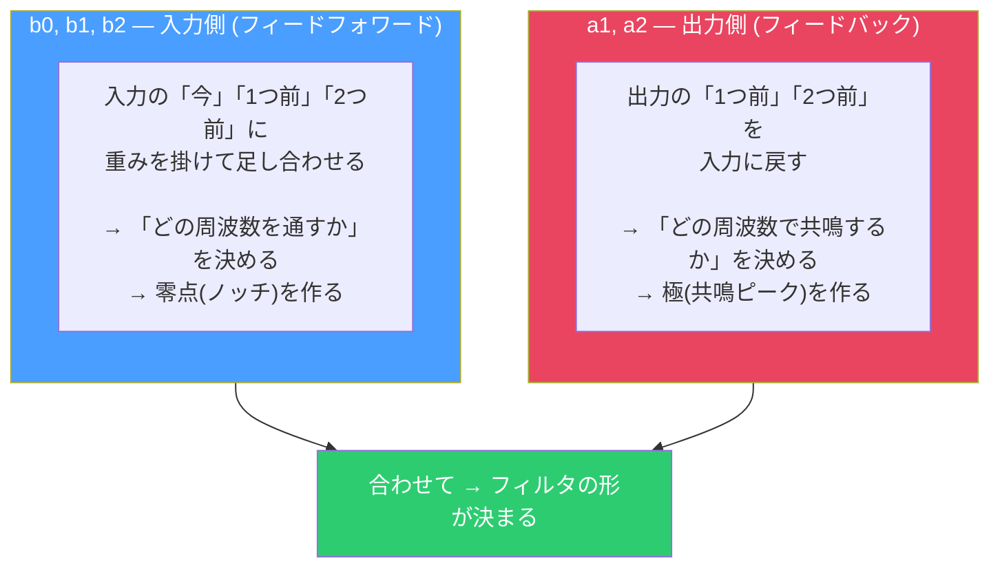

| | b0, b1, b2 (入力側) | a1, a2 (出力側) |
|---|---|---|
| **何をするか** | 入力の履歴に重みを掛けて足す | 出力の履歴を入力に戻す |
| **音への効果** | 特定の周波数を消す（ノッチ） | 特定の周波数を響かせる（共鳴） |
| **専門用語** | 零点 (zero) を作る | 極 (pole) を作る |
| **フィードバック** | なし（安全） | あり（強すぎると発振） |
| **ギターで例えると** | ノッチフィルターの谷 | ワウペダルのピーク |

---

#### 5つの係数でなぜ何でも作れるのか

「たった5つの数値で全種類のフィルタ？」と思うかもしれないが、理由は単純:

**バイクワッドは「1つの共鳴ピーク」と「1つのノッチ」を同時に作れる。** これがフィルタの最小単位であり、複雑なフィルタは全て「ピークとノッチの組み合わせ」で作れる。

```
LPF (トーンノブ絞り):
  → 高域にノッチ群を置く = b係数で高域を消す
  → 低域に軽い共鳴 = a係数で低域を残す

HPF (ベースカット):
  → 低域にノッチ群を置く = b係数で低域を消す
  → 高域を通す = a係数で高域を残す

BPF (ワウの半踏み):
  → 中域に共鳴ピーク = a係数で強いフィードバック
  → それ以外をカット = b係数で上下をカット

ピーキングEQ (+6dB at 1kHz):
  → 1kHz付近に共鳴 = a係数で軽いフィードバック
  → それ以外はそのまま = b係数で素通し

ノッチ (ハウリング除去):
  → 特定周波数だけ消す = b係数でぴったり零点を配置
  → それ以外はそのまま = a係数はほぼなし
```

> **1つのバイクワッドで足りない場合は？** → 複数つなげる（カスケードまたは並列）。バイクワッド3つで「3つの共鳴ピーク + 3つのノッチ」を作れる。アコギのボディには10-30個の共鳴がある → 10-30個のバイクワッドが必要、というわけ。

---

#### ここまでの理解チェック

```
Q: バイクワッドの中でやっていることは？
A: 掛け算して足すだけ。
   入力の今・1つ前・2つ前に重みを掛けて足し、
   出力の1つ前・2つ前を戻す（フィードバック）。

Q: なぜ共鳴が起きるのか？
A: フィードバック (a1, a2) が前回の出力を入力に戻すから。
   入力が止まっても出力が続く = 共鳴。

Q: 5つの数値 (b0,b1,b2,a1,a2) の役割は？
A: b = 「どの周波数を通す/消すか」
   a = 「どの周波数で共鳴するか」「共鳴の強さ(Q)」

Q: なぜ「万能」なのか？
A: 全てのフィルタは「共鳴ピーク + ノッチ」の組み合わせ。
   バイクワッドはこの最小単位を1つ作れる部品。
```

---

#### 数式（参考）

ここまでの直感的理解があれば、数式も読める:

```
         b0 + b1 * z^-1 + b2 * z^-2        ← 分子: 入力側の重み(零点を決める)
H(z) = ────────────────────────────────      ← H(z) = 「周波数ごとの音量変化」
          1 + a1 * z^-1 + a2 * z^-2         ← 分母: フィードバックの重み(極を決める)
```

- 分子 = 0 になる周波数 → 音が消える = **零点**
- 分母 = 0 になる周波数 → 音が無限に増幅 = **極**（実際は有限だが強い共鳴）
- z⁻¹ = 1つ前の値、z⁻² = 2つ前の値

> これは先ほどの「レシピ」を分数にまとめて書いただけ。新しい情報はない。

#### 信号の流れ図 (Direct Form I)

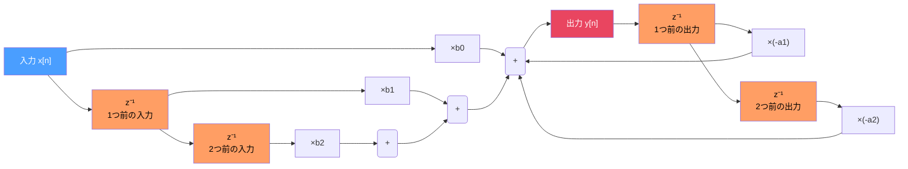

```
  上半分 (b0,b1,b2): 入力の履歴に重みを掛けて足す → FIR的な部分（零点）
  下半分 (a1,a2): 出力の履歴を戻す → IIR的な部分（極 = 共鳴）
```

#### 係数と音の関係 — 具体例

```
例: fc=1kHz, Q=2 のピーキングEQ (+6dB)

  b0 = 1.023    ← 「今の入力」の重み。1より大きい = ブースト
  b1 = -1.845   ← 「1つ前の入力」。負の値 = 位相反転して引く
  b2 = 0.862    ← 「2つ前の入力」
  a1 = -1.845   ← 「1つ前の出力」のフィードバック量
  a2 = 0.885    ← 「2つ前の出力」のフィードバック量

  5つの数値を変えるだけで、どんなフィルタにもなる:
    LPF:   b0=小, b1=小, b2=小, a1=大, a2=中  → 入力を弱く、フィードバックで共鳴
    HPF:   b0=大, b1=負大, b2=大, a1=大, a2=中 → 低域を相殺
    Peak:  上の例の通り
```

#### fc, Q, ゲイン → 係数への変換

実際には b0〜a2 の5つの数値を直接いじることはほぼない。代わりに **fc（中心周波数）、Q（鋭さ）、ゲイン（何dBブースト/カットするか）** という3つの「人間にわかるパラメータ」を決めて、公式で係数を計算する。

```
人間が決める:        公式で変換:          フィルタが使う:
  fc = 1000Hz   ─┐                    ┌→ b0 = 1.023
  Q  = 2.0      ─┼→  cookbook公式  ─→ ├→ b1 = -1.845
  gain = +6dB   ─┘   (Robert Bristow  ├→ b2 = 0.862
                       -Johnson)       ├→ a1 = -1.845
                                       └→ a2 = 0.885
```

> **"Audio EQ Cookbook"** (Robert Bristow-Johnson) という有名な文書に、全種類のフィルタの変換公式がまとまっている。DSP開発者のバイブル。
>
> https://www.w3.org/2011/audio/audio-eq-cookbook.html

#### バイクワッドを繋げる

**カスケード (直列)** — ZOOMのAcSimはこの方式


各段が前段の出力を加工。段数を増やすと複雑な特性が作れる。

**並列 (パラレル)** — 学術研究が推奨する方式

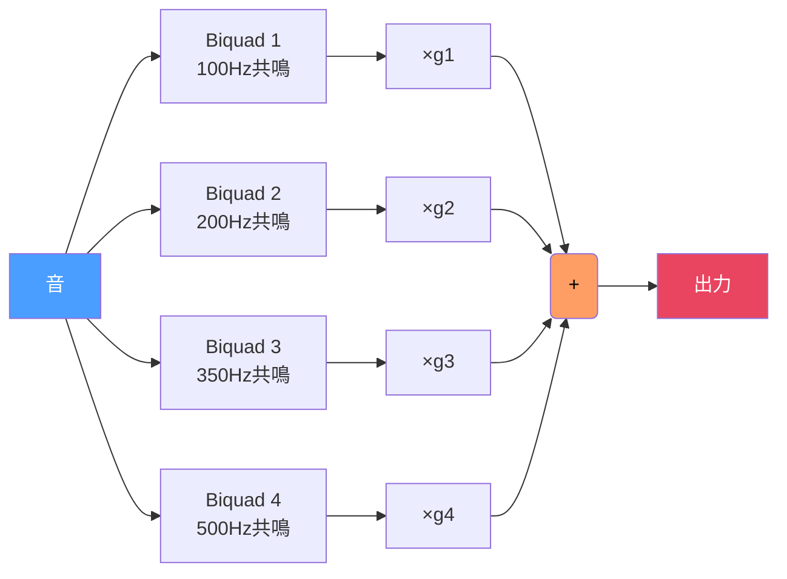

同じ入力を全部に通して、結果を足す。各バイクワッドが1つの共鳴モードを独立に担当。

---

### 0.4 IIRフィルタ vs FIRフィルタ

**IIRフィルタ (Infinite Impulse Response)** — 出力を入力にフィードバックする構造


- 「無限長の応答」を有限個の係数で表現できる
- 長所: 少ない係数で急峻な特性。バイクワッド5個で済む計算が多い
- 短所: フィードバックが強すぎると発振する（無限に音が大きくなる）
- 身近な例: アンプのトーン回路、ワウペダル、ディレイのフィードバック
- ギター的に: ディレイのフィードバックを上げすぎると「キーーン！」と発振する。あれがIIRの暴走

**FIRフィルタ (Finite Impulse Response)** — フィードバックなし。入力の履歴だけを見る

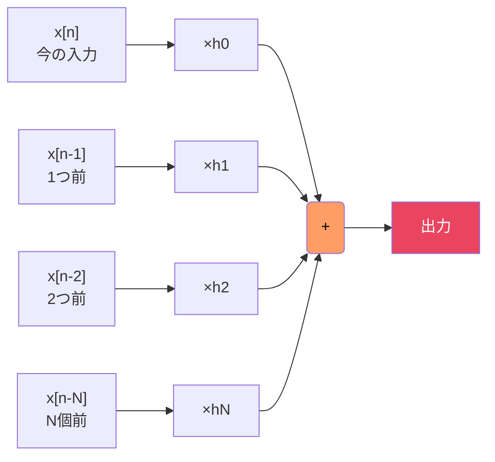

- 長所: 絶対に発振しない（安全）。直線位相が実現可能
- 短所: 急峻な特性には大量の係数(tap)が必要
- 身近な例: IRリバーブ。ホールの響きを2秒分録音→96000個の係数
- ギター的に: IRリバーブが「安定してるけど重い」のはFIRだから

#### 比較表

| | IIR | FIR |
|---|---|---|
| **フィードバック** | あり (出力→入力) | なし |
| **100Hz共鳴に必要な係数数** | 5個 (バイクワッド1段) | ~480個 (10ms分のIR) |
| **安定性** | 発振の危険あり | 絶対安全 |
| **位相** | 非直線位相 | 直線位相可能 |
| **用途** | EQ, ワウ, 共鳴器 | IRリバーブ, キャビシミュ |

---

### 0.5 伝達関数 — 「音がどう変わるか」の地図

伝達関数とは「入力に対して出力がどう変わるか」を周波数ごとに記述したもの。

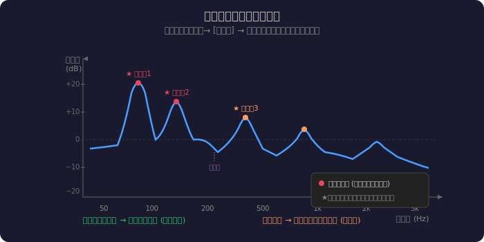

読み方:
- 100Hz に +18dB のピーク → ボディが100Hzで強く共鳴する
- 200Hz に +12dB のピーク → 200Hzでも共鳴するがやや弱い
- 300Hz に -5dB の谷 → 300Hz付近は逆に弱まる（反共鳴）

#### 伝達関数モデル — エレキの音をアコギにする全体像

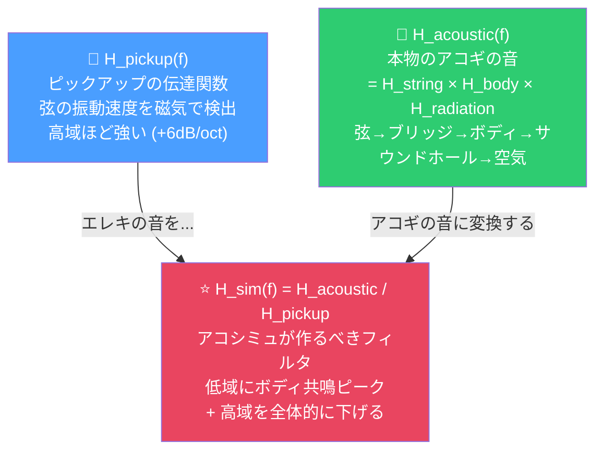

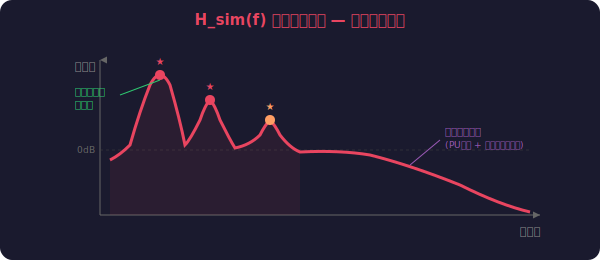

> **要するに:**
> 1. エレキのPUは「弦の振動速度」を拾う → 高域が強い、ボディの箱鳴りなし
> 2. アコギの音は「弦の振動がボディを通って放射された音」 → 低中域の共鳴が豊か
> 3. アコシミュは「1を2に変換するフィルタ」→ 伝達関数の割り算で正解の形が決まる
> 4. この「正解の形」をどれだけ正確にフィルタで再現できるかが品質の差

---

### 0.6 フィルタの基本タイプ早見表

| 名前 | 音への効果 | ギターでの身近な例 |
|---|---|---|
| **LPF (ローパス)** | 高域を削る。こもる | トーンノブを絞る |
| **HPF (ハイパス)** | 低域を削る。軽くなる | ベースカットスイッチ |
| **BPF (バンドパス)** | 特定帯域だけ通す | ワウペダルの半開き状態 |
| **ピーキング (Bell)** | 特定周波数を持ち上げ/削り | パラメトリックEQの1バンド |
| **シェルフ** | ある周波数以上(以下)を全体的に上げ下げ | アンプの Treble / Bass |
| **ノッチ** | 特定周波数をピンポイントで消す | ハウリングサプレッサー |
| **オールパス** | 音量は変えず位相だけ変える | フェイザーの中身 |
| **コムフィルタ** | 櫛状に周波数を強め/弱める | フランジャーの中身 |

---

### 0.7 DSP処理の用語

#### サンプリングとオーバーサンプリング

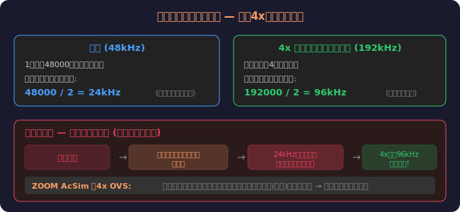

#### クリッピング（歪み）

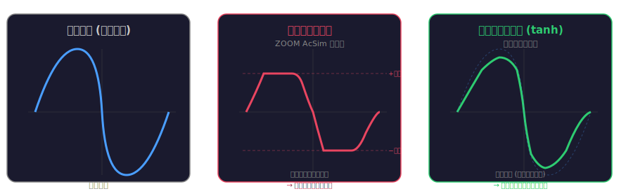

#### エンベロープ

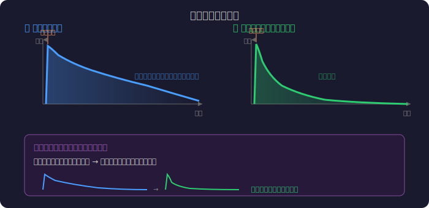

#### LFO (Low Frequency Oscillator)

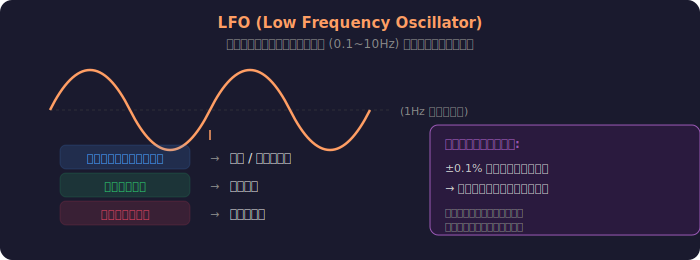

---

### 0.8 フィルタ構成 — カスケード vs 並列

#### カスケード（直列）


各段が前段の出力を入力として受け取る。段数を増やすと、より急峻なフィルタ特性が作れる。

ZOOM AcSim (11段カスケード):


問題: 各段が互いに干渉する。「100Hzの共鳴」を作ろうとすると、後段のフィルタが影響を受ける。ボディの物理現象（独立した複数の共鳴）を表現しにくい。

#### 並列（パラレル）

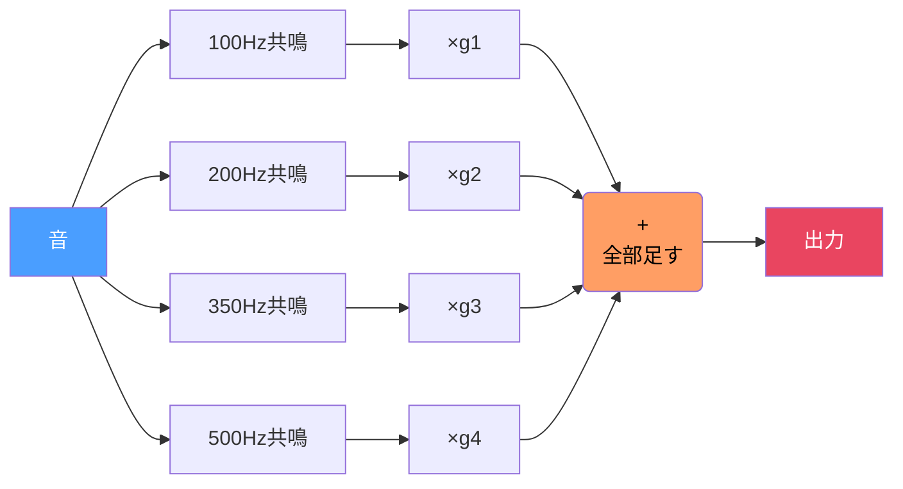

同じ入力をすべてのバイクワッドに同時に通し、出力を足し合わせる。

利点:
1. 各共鳴が独立 → ボディの物理に合致
2. g1,g2,g3,g4 を変えるだけで各共鳴の強さを個別調整
3. 共鳴周波数をスケーリング → ボディサイズ変更
4. 量子化ノイズが低い → 固定小数点DSPでも高品質

> **なぜ並列が重要か:**
> 実際のアコギボディは、複数の周波数で**同時に、独立して**共鳴する。
> これは物理的に「複数の振動モードが重ね合わさっている」状態。
> 並列バイクワッドはこの物理現象をそのまま模倣する構造。
> カスケードではこの「独立した重ね合わせ」を自然に表現できない。

---

### 0.9 共鳴・IR・畳み込み

#### 共鳴モード

アコギのボディを叩くと、木の箱全体が複数の「振動パターン」で同時に振動する。

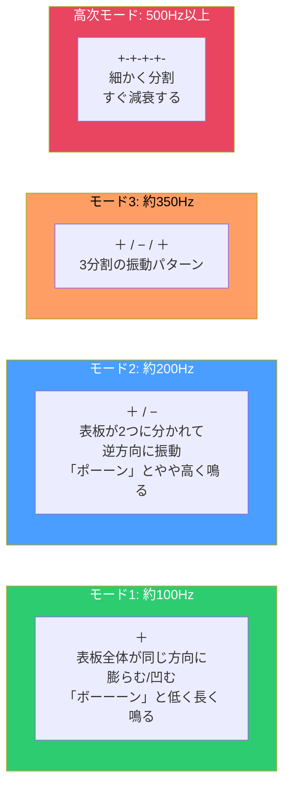

- **低次モード** (モード1,2,3): 長く響く → **IIRフィルタ**で再現するのが効率的
- **高次モード** (500Hz以上): すぐ消える → 短い**FIRフィルタ**で再現可能
- → これが「ボディファクタリング」のアイデア（松プラン）

#### IR（インパルス応答）

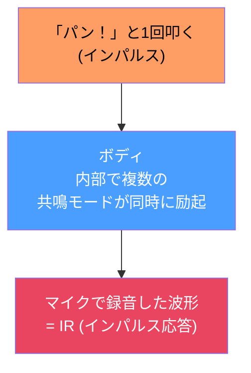

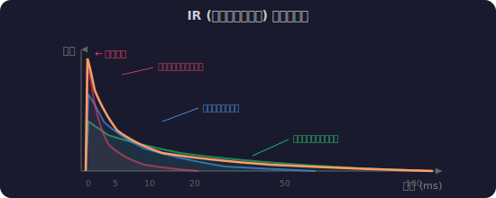

このIR全体（例: 100ms = 4800サンプル@48kHz）をFIRフィルタの係数としてそのまま使えば、完璧なボディ再現になる。ただし4800tapのFIRは計算量が多い → ボディファクタリングで効率化

#### 畳み込み

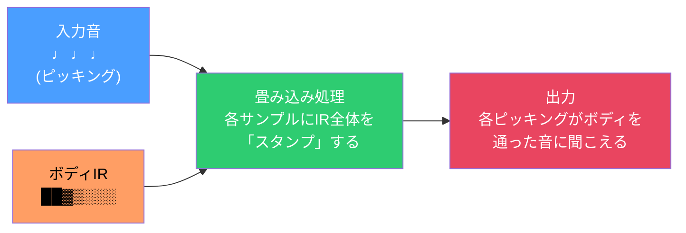

IRリバーブと全く同じ原理:
- IRリバーブ → ホールのIRを畳み込み → ホールにいる音になる
- ボディシミュ → ボディのIRを畳み込み → ボディを通った音になる

---

## 1. ZOOM Aco.Sim の現行実装分析

### 基本スペック

| 項目 | 値 |
|---|---|
| ファイル | `ACOSIM.ZD2` |
| DSP負荷 | 12.80% |
| コードサイズ | 6144 bytes (1536命令) |
| 推定バイクワッド段数 | ~11段 |
| オーバーサンプリング | 4x (192kHz) |
| クリッピング | 対称ハードクリップ |
| ソースパス | `ZDL_DRV_AcoSim` (**ドライブカテゴリ**) |

### パラメータ

| パラメータ | 範囲 | デフォルト | 役割 |
|---|---|---|---|
| Top | 0-100 | 80 | 弦のキラキラ感（高域倍音の付加） |
| Body | 0-100 | 50 | ボディ共鳴（箱鳴りの厚み） |
| Tone | 0-100 | 100 | 全体の明るさ |
| VOL | 0-100 | 80 | 出力音量 |

### 信号フロー

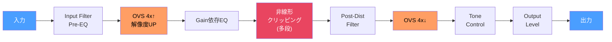

> **読み方:** 左から右に音が流れていく。各 `[ブロック]` が1つの処理。
> 矢印 `→` は「この音を次の処理に渡す」という意味。

### 実装の特徴と問題点

**重要な発見: ドライブ基盤の流用**

`_SUB_Drive_KawaOD` (川崎OD?) というドライブ用のサブルーチンを呼んでおり、
AcSim はオーバードライブ/ディストーションのアーキテクチャ上に構築されている。

> **つまりどういうことか:**
> アコギシミュレータなのに、中身はオーバードライブ回路の改造品。
> 「歪みペダルのEQカーブをアコギっぽくチューニングした」というのが実態。
> アコギのボディが物理的にどう振動するか — という発想は入っていない。

つまり ZOOM の Aco.Sim は:
- **ボディ共鳴の物理モデルではない** — EQカーブ+軽い歪みで「アコギっぽいニュアンス」を作る
- **4xオーバーサンプリングは歪み用** — アコギシミュではなく、エイリアシング回避のため
- **ハードクリップは意図的** — ピエゾピックアップ的なコンプレッション感の模倣か
- **11段バイクワッドの大部分はEQシェイピング** — ボディ共鳴モード個別モデルではない

### 係数テーブルの分析

`_Fx_DRV_AcoSim_toneCoe_tbl` (33 float) は11ステップ×3係数の1次IIRフィルタテーブル:

```
ステップ0:  b0=0.034, b1=0.034, a1=0.931  → fc ≈ 500Hz  (こもった音)
ステップ5:  b0=0.153, b1=0.153, a1=0.695  → fc ≈ 2.5kHz (普通の明るさ)
ステップ10: b0=0.872, b1=0.872, a1=-0.744 → fc ≈ 15kHz  (ほぼ素通し)
```

> **解説:** Toneノブを0→100に回すと、LPFのカットオフ周波数が500Hz→15kHzに上がる。
> ギターアンプの Tone ノブと全く同じ仕組み。
> b0, b1 はフィルタの「入力側の重み」、a1 は「出力のフィードバック量」。
> a1が1に近い = 強くフィードバック = 急峻にカット。
> これはボディの共鳴をモデル化しているわけではなく、単なるトーンコントロール。

### 本質的な限界

ZOOM の実装は「エレキの音をEQと軽い歪みで加工してアコギ風の音色にする」というアプローチ。
学術研究が示す「ボディ共鳴の物理的再現」とは根本的に異なる。

> **例え話:**
> ZOOM方式 = 写真に茶色いフィルターをかけて「木っぽく見せる」
> 研究方式 = 実際の木目のテクスチャデータを貼り付ける
> 遠目には似て見えるが、近づくと違いがはっきりわかる。

---

## 2. 学術研究サーベイ

### 2.1 基礎論文: エレキ→アコギ変換の3要素

**"Acoustic Sound from the Electric Guitar Using DSP Techniques"**
Karjalainen, Penttinen, Välimäki — IEEE ICASSP 2000

アコギの音を再現するには3つの要素が必要:

| 要素 | 内容 | なぜ必要か | ZOOMの実装 |
|---|---|---|---|
| **(1) ボディ共鳴フィルタ** | アコギボディの伝達関数を線形フィルタで再現 | アコギの音色の大部分はボディの箱鳴りが決める | △ EQで近似 |
| **(2) 時変変調** | 倍音のビート（うなり）を再現する変調 | アコギはボディの微振動で倍音が揺らぐ。これが「生きた音」の正体 | × なし |
| **(3) エンベロープ補正** | アコギ特有のアタック/ディケイカーブ | エレキとアコギでは音の立ち上がりと減衰のカーブが違う | × なし |

> **ボディ共鳴とは:**
> アコギのボディ（木の箱）は、弦の振動を受けて特定の周波数で強く振動する。
> これが「箱鳴り」で、アコギらしい暖かさや太さの正体。
> エレキの磁気ピックアップは弦の振動だけを拾うので、この箱鳴りが一切入らない。
> アコースティックシミュレータの最重要課題は「この箱鳴りをデジタル処理で足す」こと。

- ボディ共鳴の忠実な再現には**約500次のフィルタ**（250段のバイクワッド）が必要
- https://www.researchgate.net/publication/3858672

### 2.2 フィルタ設計手法の比較

**"More Acoustic Sounding Timbre from Guitar Pickups"**
Karjalainen, Penttinen, Välimäki — DAFx-99

3種のフィルタ設計を比較:

| 手法 | 次数 | 長所 | 短所 |
|---|---|---|---|
| **長FIR** (ボディIR直接) | 1000-4000 tap | 最も忠実 | メモリ・計算量大 |
| **IIR共振器** (各ボディモード) | 高次 | 低域モード忠実 | 高域の密なモード再現困難 |
| **Warped IIR (WIIR)** | ~120次 | 知覚スケールに最適化 | 設計がやや複雑 |

> **3つの手法を料理に例えると:**
> - **長FIR** = 本物のアコギの響きを丸ごとコピー。完璧だがデータが巨大（フルコースを全部持ち歩く）
> - **IIR共振器** = 主要な共鳴を数式で再現。効率的だが低い音しかうまくいかない（メインの皿だけ再現）
> - **Warped IIR** = 人間の耳が敏感な帯域に計算資源を集中。少ない計算で「聞こえる範囲では同等」を実現（味の決め手だけ押さえる）

- WIIR が組み込み向けに最も有望
- https://www.dafx.de/paper-archive/1999/karjalainen.pdf

### 2.3 並列バイクワッドによるボディモデリング

**"Direct Design of Parallel Second-Order Filters for Instrument Body Modeling"**
Balázs Bank — ICMC 2007

- **並列バイクワッド構成**を対数周波数スケールで設計
- 従来IIRの**約1/4の次数**で同等の知覚品質
- 各セクションがボディの1共鳴モードに対応 → 個別調整可能
- 並列構造はカスケードより**量子化ノイズが低い** (固定小数点DSP向き)
- リアルタイムでボディサイズ/キャラクターを変形可能
- https://home.mit.bme.hu/~bank/publist/icmc07.pdf

> **なぜこの論文が重要か — 並列バイクワッドの直感的理解:**
>
> アコギのボディは、叩くと複数の音程で同時に「ボーン」と鳴る。
> 例えば 100Hz、200Hz、350Hz、500Hz... と同時に共鳴している。
>
> この論文は「各共鳴ごとに1個のバイクワッドを割り当てて、全部同時に鳴らす（並列）」という方法。
>
> ```
>          ┌→ [100Hz共鳴] →┐
>   入力 → ├→ [200Hz共鳴] →┼→ 足し合わせ → 出力
>          ├→ [350Hz共鳴] →┤
>          └→ [500Hz共鳴] →┘
> ```
>
> 従来「250段必要」と言われていたものが、この手法だと**60段で同等品質**になる。
> しかも各共鳴を個別に上げ下げできるので「ボディサイズを変える」ような操作が簡単。

### 2.4 ボディモーフィング

**"Morphing Instrument Body Models"**
Välimäki, Tolonen — DAFx-01

- Warped IIR フィルタ（Kautz フィルタ）で**120次**のボディ応答モデル
- フィルタ係数の補間で異なるボディ間を**スムーズにモーフィング**
- ギターボディ → バイオリンボディ など異種楽器間の変形も可能
- 1つのノブで「ドレッドノート → クラシカル → パーラー」と変化
- https://www.researchgate.net/publication/2565842

> **モーフィングとは:**
> 2つのボディモデル A と B のフィルタ係数を、割合を変えながらブレンドすること。
> Body=0 なら A の音、Body=100 なら B の音、Body=50 なら A と B の中間の音になる。
> ノブを回すとスムーズにボディが「変身」する感覚。

### 2.5 コミューテッド合成とボディファクタリング

**"Commuted Synthesis"**
Julius O. Smith III — Stanford CCRMA

ボディIRの効率的な分解手法:

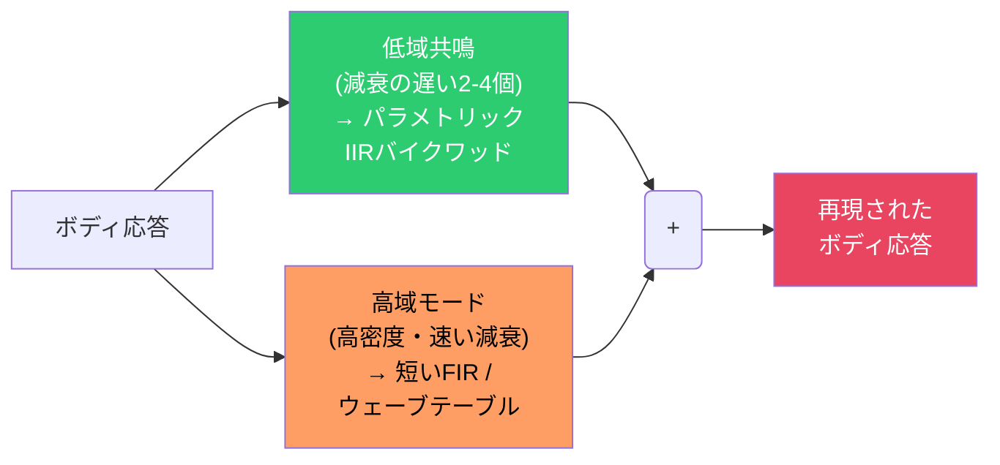

> **ボディファクタリングの直感的理解:**
>
> アコギのボディの響きを録音して分析すると:
> - **低い音の共鳴** (100Hzとか): 「ボーーーン」と長く響く → 長い履歴が必要 → IIRが得意
> - **高い音の共鳴** (1kHz以上): 「カッ」とすぐ消える → 短い履歴で十分 → FIRで記録
>
> 全部をFIRでやると4000tapも必要で重い。全部をIIRでやると500次も必要。
> でも「長く響く低音部分だけIIR、すぐ消える高音部分はFIR」と分担すれば
> IIR 4段 + FIR 256tap で済む。**いいとこ取り**。

- 低域共鳴 (80-200Hz): IIRでないと非現実的な長さのFIRが必要
- 高域モード: 減衰が速いので200-500 tapのFIRで十分
- **ハイブリッド構成が計算コスト的に最も実践的**
- https://ccrma.stanford.edu/~jos/pasp/Commuted_Synthesis.html

### 2.6 受動的アドミタンス行列

**"Passive Admittance Matrix Modeling for Guitar Synthesis"**
Bank, Karjalainen — DAFx-10

- フィルタの**受動性**（安定性保証）を保つ設計手法
- ブリッジの機械的アドミタンスを受動的2次セクションでモデル化
- ライブ入力処理でのフィルタ発散防止に重要
- https://dafx10.iem.at/proceedings/papers/BankKarjalainen_DAFx10_P60.pdf

> **「受動性」がなぜ大事か:**
> IIRフィルタはフィードバック構造を持つため、係数の設計を間違えると
> 出力が際限なく大きくなる（発振/発散）。ライブ演奏中にこれが起きると
> 巨大なノイズが出てスピーカーやアンプを壊す危険がある。
> 「受動的」とは「入力以上のエネルギーを絶対に出さない」という安全保証のこと。

### 2.7 Yamaha の振動・音響シミュレーション

- 弦→ブリッジ→ボディの振動伝達経路を有限要素法でモデル化
- トップ板の振動モード、サウンドホールの放射特性を物理的にシミュレート
- 楽器設計用途だが、シミュレータの目標特性の参考になる
- https://www.yamaha.com/ja/tech-design/research/technologies/acoustic-guitar-analysis/

> **有限要素法 (FEM):** ボディの木材を細かいメッシュに分割し、
> 各点がどう振動するかを物理法則に基づいてコンピュータで計算する手法。
> リアルタイム処理には重すぎるが、「正解のボディ応答」を求めるのに使える。
> この正解データからフィルタ係数を設計する、という流れ。

---

## 3. 改善提案: 松竹梅

> **松竹梅の考え方:**
> - **梅** = 最小コスト。ZOOMの既存ハードで動く。「今より少しマシ」
> - **竹** = 本格的。学術研究の成果を活用。「ちゃんとアコギっぽい」
> - **松** = 最高品質。複数の研究を組み合わせ。「本物と区別がつきにくい」

### 梅: 最小限の改善 (ZOOM互換レベルの計算量)

**コンセプト: 既存アーキテクチャのEQカーブを改善**

> **方針:** ZOOMの現行実装から「不要な歪み処理」を取り除き、
> 空いたリソースで「ボディ共鳴っぽいEQ」を追加する。中身はEQのまま。

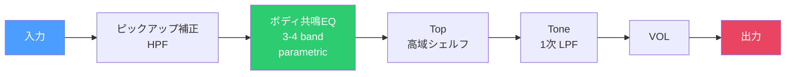

改善ポイント:
- 歪みパス (OVS 4x + クリップ) を**廃止** → DSP負荷を大幅に解放
- 解放したリソースで**パラメトリックEQの段数を増やす** (3-4バンド)
- ピックアップの速度検出特性を補正する**HPF** (磁気PUは変位微分を検出)
- ボディ共鳴の主要ピーク (100Hz, 200Hz, 400Hz付近) を**固定パラメトリックEQ**で付加

> **「ピックアップ補正」とは:**
> エレキの磁気ピックアップは弦の「振動速度」を拾う（微分検出）。
> アコギの音は弦の「振動変位」がボディに伝わったもの。
> 速度と変位は微分/積分の関係なので、高域が強調されている。
> これを補正するために低域を持ち上げる（HPFの逆 = 積分 ≈ ローシェルフブースト）。

| 項目 | 値 |
|---|---|
| 推定フィルタ次数 | ~12次 (6段バイクワッド) |
| 推定DSP負荷 | ~5% (歪みパス除去で軽量化) |
| パラメータ | Top, Body, Tone, VOL (互換) |
| 音質向上 | △ 多少改善。歪み感がなくなりクリーンに |
| ボディ再現度 | × 共鳴モードの密度が足りない |

疑似コード:

```c
void acosim_ume(float *in, float *out, int n, State *s, Params *p) {
  // n = 処理するサンプル数（1秒間に48000個の音データが来る）
  for (int i = 0; i < n; i++) {
    float x = in[i];  // 1サンプル取り出す（-1.0 ~ +1.0 の小数）

    // ピックアップ補正: 磁気PUの微分特性を補償 (積分 ≈ LPF)
    // → 高域が強すぎるのを抑えて、アコギ的な周波数バランスに近づける
    x = biquad(&s->pu_comp, x);  // fc~80Hz, shelving -6dB/oct

    // ボディ共鳴 (固定周波数パラメトリックEQ)
    // → アコギボディが鳴る周波数をEQで持ち上げる（3箇所）
    x = biquad(&s->body_lo, x);   // 100Hz peak, Q=3, gain=Body*12dB
    x = biquad(&s->body_mid, x);  // 200Hz peak, Q=4, gain=Body*8dB
    x = biquad(&s->body_hi, x);   // 400Hz peak, Q=5, gain=Body*6dB
    // Q = 共鳴の「鋭さ」。高いほど狭くて鋭いピーク。

    // Top: 高域の弦キラキラ感
    x = biquad(&s->top_shelf, x);  // 2kHz shelf, gain=Top*6dB

    // Tone: 1次LPF（トーンノブ）
    x = onepole_lpf(&s->tone, x, p->tone_fc);

    out[i] = x * p->vol;  // 音量を掛けて出力
  }
}
```

---

### 竹: 本格的なボディモデリング (DSP負荷 ~15-20%)

**コンセプト: 並列バイクワッドによる実測ボディ共鳴の再現**

Bank (2007) の手法に基づき、実測アコギボディIRから並列バイクワッドフィルタを設計。

> **梅との決定的な違い:**
> 梅は「アコギっぽい周波数に見える EQ カーブ」を手作業で設定。
> 竹は「本物のアコギを叩いて録音し、その響きをフィルタに変換」する。
> データの出発点が「エンジニアの勘」から「実測」に変わる。


改善ポイント:
- **実測ボディIR**からフィルタ係数を設計 (オフラインで最適化)
- **20-30段の並列バイクワッド**: 各セクションが1つのボディ共鳴モードに対応
- 対数周波数スケール設計: 低域は密に、高域は粗く → 知覚的に効率的
- **時変変調**: 弦のビート感を微小なピッチ/振幅変調で再現
- Body パラメータでボディサイズをモーフィング (共鳴周波数のスケーリング)

> **「対数周波数スケール」とは:**
> 人間の耳は低い音の違いには敏感だが、高い音の違いには鈍感。
> 100Hzと200Hzの差は明確に聞き分けられるが、10000Hzと10100Hzの差はわからない。
> だから低域にフィルタを多く配置し、高域は少なくする。これが「対数スケール」。
> ピアノの鍵盤が低音側は広く、高音側は狭く感じるのと同じ理屈。

| 項目 | 値 |
|---|---|
| 推定フィルタ次数 | ~60次 (30段並列バイクワッド) |
| 推定DSP負荷 | ~15-20% |
| パラメータ | Body (ボディサイズ), Top (弦感), Tone, VOL |
| 音質向上 | ○ ボディ共鳴が物理的に正しい響き |
| ボディ再現度 | ○ 主要モードを忠実に再現 |

疑似コード:

```c
// オフラインで設計済みの並列バイクワッド係数 (実測IRから最適化)
// body_sections[]: 各セクションの {b0, b1, b2, a1, a2, gain, center_freq}
//   b0,b1,b2 = 入力側の重み、a1,a2 = フィードバックの重み
//   gain = この共鳴モードの音量、center_freq = 共鳴の中心周波数

void acosim_take(float *in, float *out, int n, State *s, Params *p) {
  // Body ノブ(0-100)でボディの大きさをスケール
  // 大きいボディ = 共鳴周波数が低くなる（大きな箱はゆっくり振動する）
  float body_scale = 0.8 + p->body * 0.004;  // 0.8x(小さめ) ~ 1.2x(大きめ)
  update_body_freqs(s->body_sections, N_SECTIONS, body_scale);

  for (int i = 0; i < n; i++) {
    float x = in[i];

    // ピックアップ補正
    x = biquad(&s->pu_comp, x);

    // ★ ここが梅との最大の違い ★
    // 並列バイクワッド ボディフィルタ
    // → 同じ入力 x を全セクションに同時に通し、結果を足し合わせる
    float body_out = 0;
    for (int j = 0; j < N_SECTIONS; j++) {
      // 各セクションが1つの共鳴モードを担当
      // 例: j=0 → 95Hz, j=1 → 185Hz, j=2 → 290Hz, ...
      body_out += biquad(&s->body[j], x) * s->body_sections[j].gain;
    }

    // Top: 原音の高域成分をミックス（弦のキラキラ感）
    float top = highshelf(&s->top_filter, x) * p->top;

    // 時変変調 (弦のビート感)
    // → 音量をゆ〜っくり揺らすことで、アコギの「生きた感じ」を出す
    float mod = 1.0 + 0.002 * sin(s->mod_phase);  // ±0.2% の微小な揺れ
    s->mod_phase += 0.0001;  // 約0.76Hz の超低速LFO
    body_out *= mod;

    float y = body_out + top * 0.3;
    y = onepole_lpf(&s->tone, y, p->tone_fc);
    out[i] = y * p->vol;
  }
}
```

#### フィルタ係数設計フロー (オフライン)

> **「オフライン」とは:**
> ペダルの中でリアルタイムに計算するのではなく、
> PC上で事前に計算しておき、結果（係数の数値テーブル）だけをペダルに書き込む。
> ペダルは「このテーブルの数値を使ってフィルタを動かす」だけなので軽い。

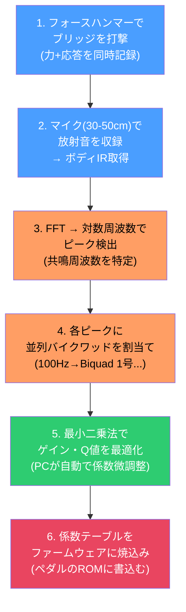

#### 竹プラン実装ガイド — IR → 並列バイクワッド係数 → フィルタ

竹は「一般的な正攻法」であり、市販アコシミュペダル（BOSS, TC等）もほぼこの方式。
以下に、IRの入手から動作確認までの具体的な手順を示す。

##### ステップ0: 環境準備

```bash
# Python 3.8+ が必要
pip install numpy scipy matplotlib soundfile
```

##### ステップ1: アコギIRの入手

```
方法A: 購入する（最も手軽）
  → 3 Sigma Audio, ML Sound Lab, Ownhammer 等でアコギIRを購入
  → WAVファイルで提供される。数千円程度

方法B: 自分で測定する
  必要機材:
  ・アコギ（測定したいボディ）
  ・小型スピーカー or フォースハンマー
  ・コンデンサーマイク + オーディオI/F

  手順:
  1. スピーカーをブリッジに押し当てる
  2. スイープ信号 (20Hz-20kHz, 5秒) を再生
  3. 30-50cm離したマイクで録音
  4. 逆畳み込みでIRを算出:

  import numpy as np
  from scipy.signal import fftconvolve
  # sweep: 再生した信号, recorded: 録音した信号
  inv_sweep = sweep[::-1]  # 時間反転
  ir = fftconvolve(recorded, inv_sweep, mode='full')
  # → ir がボディのインパルス応答
```

##### ステップ2: IRの分析 — 共鳴モードを見つける

```python
import numpy as np
from scipy.io import wavfile
from scipy.signal import find_peaks
import matplotlib.pyplot as plt

# IR読み込み
sr, ir = wavfile.read('acoustic_body_ir.wav')
if ir.ndim > 1: ir = ir[:, 0]    # モノラルに
ir = ir.astype(float) / np.max(np.abs(ir))  # 正規化

# FFTでスペクトル取得
N = len(ir)
spectrum = np.fft.rfft(ir)
freqs = np.fft.rfftfreq(N, 1.0 / sr)
mag_db = 20 * np.log10(np.abs(spectrum) + 1e-10)

# ピーク検出 (= 共鳴モード)
peaks, props = find_peaks(mag_db, height=-20, distance=5, prominence=3)

print("検出された共鳴モード:")
for i, p in enumerate(peaks):
    print(f"  モード{i+1}: {freqs[p]:.0f} Hz ({mag_db[p]:.1f} dB)")

# 確認プロット
plt.figure(figsize=(12, 5))
plt.semilogx(freqs[1:], mag_db[1:], color='#ff9e64', linewidth=0.8)
plt.scatter(freqs[peaks], mag_db[peaks], color='#e94560', zorder=5)
for p in peaks:
    plt.annotate(f'{freqs[p]:.0f}Hz', (freqs[p], mag_db[p]),
                 fontsize=8, ha='center', va='bottom')
plt.xlabel('周波数 (Hz)')
plt.ylabel('振幅 (dB)')
plt.title('ボディIRのスペクトル — 赤点が共鳴モード')
plt.xlim(50, 10000)
plt.grid(True, alpha=0.3)
plt.tight_layout()
plt.savefig('body_spectrum.png', dpi=150)
plt.show()
```

##### ステップ3: 並列バイクワッド係数の設計

```python
from scipy.signal import iirpeak, sosfreqz
from scipy.optimize import minimize

def design_parallel_biquads(ir, sr, n_sections=20):
    """
    実測IRから並列バイクワッド係数を設計する。

    ir: インパルス応答 (1D numpy array)
    sr: サンプリングレート
    n_sections: バイクワッドのセクション数 (20-30が実用的)

    戻り値: sos (n_sections x 6), gains (n_sections,), direct (2,)
    """
    # --- 目標スペクトル ---
    N = max(len(ir), 4096)
    target = np.fft.rfft(ir, N)
    freqs = np.fft.rfftfreq(N, 1.0 / sr)
    target_db = 20 * np.log10(np.abs(target) + 1e-10)

    # --- 対数スケールでセクション配置 ---
    # 低域は密に、高域は粗く（人間の聴覚特性に合わせる）
    section_freqs = np.logspace(
        np.log10(60),               # 最低 60Hz
        np.log10(sr / 2 * 0.9),     # 最高 ナイキスト×0.9
        n_sections
    )

    # --- 各セクションの初期値: 最寄りのピークに合わせる ---
    sos = np.zeros((n_sections, 6))  # [b0, b1, b2, 1, a1, a2] × n
    gains = np.ones(n_sections)

    for i, fc in enumerate(section_freqs):
        # 正規化周波数 (0〜1, 1=ナイキスト)
        w0 = fc / (sr / 2)
        Q = 5.0  # 初期Q値

        # ピーキングフィルタの係数を計算 (Audio EQ Cookbook)
        b, a = iirpeak(w0, Q)
        sos[i] = [b[0], b[1], b[2], a[0], a[1], a[2]]

        # ゲイン: 目標スペクトルのその周波数でのレベル
        idx = np.argmin(np.abs(freqs - fc))
        gains[i] = np.abs(target[idx])

    # --- 最適化: 目標スペクトルとの誤差を最小化 ---
    def cost(params):
        """目標との対数スペクトル誤差"""
        g = params[:n_sections]
        qs = params[n_sections:]

        # 並列応答を計算
        model = np.zeros(len(freqs), dtype=complex)
        for i in range(n_sections):
            fc = section_freqs[i]
            w0 = fc / (sr / 2)
            Q = max(qs[i], 0.5)  # Q < 0.5 は不安定
            b, a = iirpeak(w0, Q)
            _, h = sosfreqz([[b[0],b[1],b[2],a[0],a[1],a[2]]],
                           worN=freqs, fs=sr)
            model += g[i] * h.flatten()

        model_db = 20 * np.log10(np.abs(model) + 1e-10)
        # 対数周波数で重み付け（低域重視）
        weight = 1.0 / (freqs + 100)
        error = (target_db[:len(model_db)] - model_db) * weight
        return np.sum(error ** 2)

    # 初期パラメータ: [ゲイン×n, Q値×n]
    x0 = np.concatenate([gains, np.full(n_sections, 5.0)])

    print("最適化中... (数秒かかります)")
    result = minimize(cost, x0, method='L-BFGS-B',
                     bounds=[(0, None)] * n_sections +  # ゲイン >= 0
                            [(0.5, 50)] * n_sections)   # 0.5 <= Q <= 50

    opt_gains = result.x[:n_sections]
    opt_qs = result.x[n_sections:]

    # 最適化結果でsos更新
    for i in range(n_sections):
        w0 = section_freqs[i] / (sr / 2)
        Q = opt_qs[i]
        b, a = iirpeak(w0, Q)
        sos[i] = [b[0], b[1], b[2], a[0], a[1], a[2]]

    # --- 直接項の計算 (全体レベル補正) ---
    # 並列バイクワッドの出力を足すだけだとDC/高域のレベルが合わない
    # → d0 + d1*z^-1 で補正
    model_final = np.zeros(len(freqs), dtype=complex)
    for i in range(n_sections):
        _, h = sosfreqz([sos[i]], worN=freqs, fs=sr)
        model_final += opt_gains[i] * h.flatten()

    residual = target[:len(model_final)] - model_final
    # 直接項: 残差の平均的なレベルで近似
    d0 = np.real(np.mean(residual))
    d1 = np.real(np.mean(residual * np.exp(-1j * 2 * np.pi * freqs / sr)))
    direct = np.array([d0, d1])

    return sos, opt_gains, direct, section_freqs

# 使用例:
# sos, gains, direct, freqs = design_parallel_biquads(ir, sr, n_sections=20)
```

##### ステップ4: リアルタイム処理 (C言語 / 組み込み向け)

```c
#include <math.h>

#define N_SECTIONS 20   // 並列バイクワッドの数
#define MAX_SECTIONS 30

// --- バイクワッド1段のステート ---
typedef struct {
    float x1, x2;  // 入力の履歴 (z⁻¹, z⁻²)
    float y1, y2;  // 出力の履歴 (z⁻¹, z⁻²)
} BiquadState;

// --- バイクワッド1段の係数 ---
typedef struct {
    float b0, b1, b2;  // 入力側の重み
    float a1, a2;       // フィードバックの重み
    float gain;         // この共鳴モードのゲイン
} BiquadCoeffs;

// --- アコシミュ全体のステート ---
typedef struct {
    BiquadState body[MAX_SECTIONS];  // ボディ共鳴フィルタ
    BiquadState pu_comp;             // ピックアップ補正
    BiquadState tone;                // トーンフィルタ
    float mod_phase;                 // LFOの位相
} AcoSimState;

// --- 設計済みの係数 (Pythonで事前に計算してここに貼る) ---
static const BiquadCoeffs body_coeffs[N_SECTIONS] = {
    // Pythonの出力をここにコピペ
    // {b0, b1, b2, a1, a2, gain}
    // 例:
    {0.0045, 0.0, -0.0045, -1.9850, 0.9910, 1.20},  //  95Hz, Q=8
    {0.0058, 0.0, -0.0058, -1.9720, 0.9884, 0.85},  // 185Hz, Q=6
    {0.0073, 0.0, -0.0073, -1.9410, 0.9854, 0.62},  // 290Hz, Q=5
    // ... 残り17セクション
};
static const float direct_term[2] = {0.012, -0.008};

// --- バイクワッド1段の処理 ---
static inline float biquad_process(BiquadState *s,
                                    const BiquadCoeffs *c,
                                    float x) {
    float y = c->b0 * x + c->b1 * s->x1 + c->b2 * s->x2
                         - c->a1 * s->y1 - c->a2 * s->y2;
    s->x2 = s->x1;  s->x1 = x;
    s->y2 = s->y1;  s->y1 = y;
    return y;
}

// --- メイン処理関数 ---
// in, out: オーディオバッファ (48kHz, float)
// n: サンプル数 (通常 32 or 64)
// body: 0-100 ボディの響きの強さ
// top:  0-100 弦のキラキラ感
// tone: 0-100 トーン (明るさ)
// vol:  0-100 出力音量
void acosim_process(float *in, float *out, int n,
                    AcoSimState *s,
                    int body, int top, int tone, int vol) {
    float body_mix = body / 100.0f;
    float top_mix  = top / 100.0f;
    float vol_f    = vol / 100.0f;

    for (int i = 0; i < n; i++) {
        float x = in[i];

        // --- ピックアップ補正 ---
        // エレキPUの速度検出特性を補正 (低域ブースト)
        // pu_comp の係数は別途設計 (ローシェルフ +6dB @ 80Hz)
        x = biquad_process(&s->pu_comp, &pu_comp_coeffs, x);

        // --- ★ 並列バイクワッド: ボディ共鳴 ★ ---
        // 同じ入力 x を全セクションに同時に通し、結果を足す
        float body_out = direct_term[0] * x;  // 直接項 d0
        // (d1は1サンプル前の入力にかかるが、簡略化して省略可)

        for (int j = 0; j < N_SECTIONS; j++) {
            body_out += biquad_process(&s->body[j],
                                       &body_coeffs[j], x)
                        * body_coeffs[j].gain;
        }

        // --- Top: 原音の高域成分 ---
        // x の高域をハイシェルフで取り出してミックス
        float top_out = x * top_mix * 0.3f;

        // --- ミックス ---
        float y = body_out * body_mix + top_out;

        // --- 時変変調 (アコギの生きた感じ) ---
        // ±0.2% の微小な音量揺れ
        y *= 1.0f + 0.002f * sinf(s->mod_phase);
        s->mod_phase += 0.0001f;
        if (s->mod_phase > 6.2832f) s->mod_phase -= 6.2832f;

        // --- トーン (1次LPF) ---
        // tone=0: fc≈500Hz (暗い), tone=100: fc≈15kHz (明るい)
        float tone_fc = 500.0f + (tone / 100.0f) * 14500.0f;
        // (簡易LPF。本格的にはbiquadを使う)
        float alpha = tone_fc / (tone_fc + 48000.0f / 6.2832f);
        y = s->tone.y1 + alpha * (y - s->tone.y1);
        s->tone.y1 = y;

        out[i] = y * vol_f;
    }
}
```

##### ステップ5: 検証 — 元のIRとフィルタ出力を比較

```python
import numpy as np
from scipy.signal import sosfilt
import matplotlib.pyplot as plt

# sos, gains は ステップ3 で設計した係数
# ir は元のインパルス応答

# テスト: インパルスを並列フィルタに通す
impulse = np.zeros(len(ir))
impulse[0] = 1.0

# 並列処理を再現
output = np.zeros(len(ir))
for i in range(len(sos)):
    section_out = sosfilt([sos[i]], impulse)
    output += gains[i] * section_out
output += direct[0] * impulse  # 直接項

# --- 比較プロット ---
fig, axes = plt.subplots(2, 1, figsize=(12, 8))

# 時間波形
axes[0].plot(ir[:2000], alpha=0.7, label='元のIR', color='#4a9eff')
axes[0].plot(output[:2000], alpha=0.7, label='並列バイクワッド出力', color='#e94560')
axes[0].set_xlabel('サンプル')
axes[0].set_ylabel('振幅')
axes[0].legend()
axes[0].set_title('時間波形の比較')

# 周波数特性
def to_db(x, n=4096):
    s = np.fft.rfft(x, n)
    return np.fft.rfftfreq(n, 1/sr), 20*np.log10(np.abs(s) + 1e-10)

f1, db1 = to_db(ir)
f2, db2 = to_db(output)
axes[1].semilogx(f1, db1, alpha=0.7, label='元のIR', color='#4a9eff')
axes[1].semilogx(f2, db2, alpha=0.7, label='モデル', color='#e94560')
axes[1].set_xlabel('周波数 (Hz)')
axes[1].set_ylabel('dB')
axes[1].set_xlim(50, 15000)
axes[1].legend()
axes[1].set_title('周波数特性の比較 — ピークの位置と高さが合っているか確認')

plt.tight_layout()
plt.savefig('verification.png', dpi=150)
plt.show()

# 誤差の定量評価
error_db = np.mean(np.abs(db1[:len(db2)] - db2))
print(f"平均スペクトル誤差: {error_db:.1f} dB")
print(f"  → 3dB以下なら実用十分。1dB以下なら優秀。")
```

> **まずやること:**
> 1. `pip install numpy scipy matplotlib soundfile`
> 2. アコギIR (WAVファイル) を1つ入手
> 3. ステップ2 のコードを実行して共鳴モードを可視化
> 4. ステップ3 で係数を計算
> 5. ステップ5 で元IRと比較して精度を確認
> 6. 満足したらステップ4 のCコードに係数を貼り付けて組み込み
>
> **竹で不満が出たら松の要素を足す:**
> → エンベロープ補正、時変変調の強化、複数ボディのモーフィング等

---

### 松: 最高品質 (DSP負荷 ~25-35%)

**コンセプト: ハイブリッドボディモデリング + エンベロープ補正 + マルチボディ**

Smith (CCRMA) のボディファクタリングと Välimäki のモーフィングを組み合わせた最高品質設計。

> **竹との違い:**
> 竹は「1種類のボディを並列バイクワッドで再現」だった。
> 松は「5種類の実機ボディを測定し、ノブ1つで滑らかに切り替え可能」にする。
> さらにボディだけでなく、アタック感やビート感も含めて「アコギらしさ」を総合的に再現。

```mermaid
flowchart TD
    IN["入力"] --> PU["ピックアップ補正"]
    PU --> ENV["エンベロープフォロワ\n音の大きさを追跡"]
    ENV --> IIR["低域ボディ共鳴 IIR\n4段バイクワッド\n「ボーン」と長く響く低音"]
    ENV --> FIR["高域ボディ共鳴 短FIR\n256-512tap畳み込み\n「カッ」とすぐ消える高音"]
    ENV --> TOP["Top: 弦キャラクター\nキラキラ感を足す"]

    IIR --> MIX["ミックス +\nエンベロープ補正"]
    FIR --> MIX
    TOP --> MIX

    MIX --> MOD["時変変調\nマルチLFO ×3"]
    MOD --> TONE["Tone"] --> VOL["VOL"] --> OUT["出力"]

    BT["Body Type ノブ\nボディ間モーフィング"] -.-> IIR
    BT -.-> FIR

    style IN fill:#4a9eff,color:#fff
    style IIR fill:#2ecc71,color:#fff
    style FIR fill:#2ecc71,color:#fff
    style MOD fill:#ff9e64,color:#000
    style ENV fill:#9b59b6,color:#fff
    style OUT fill:#e94560,color:#fff
    style BT fill:#f1c40f,color:#000
```

Body Type ノブ: 複数ボディ間モーフィング

| 値 | ボディタイプ | 特徴 |
|---|---|---|
| 0 | Classical | ナイロン弦風の小型クラシックギター |
| 25 | Parlor | 小型パーラーギター。繊細な響き |
| 50 | OM/000 | 中型。バランスの良い万能ボディ |
| 75 | Dreadnought | 大型。力強い低音が特徴 |
| 100 | Jumbo | 最大。豊かでリッチな箱鳴り |

改善ポイント:
- **ボディファクタリング**: 低域共鳴はIIR、高域はFIR畳み込みのハイブリッド
- **複数ボディモデル間のモーフィング**: 係数補間で連続的に変化
- **エンベロープ補正**: アコギ特有の速いアタック+自然なディケイを再現
- **マルチLFO時変変調**: 複数の非整数比LFOで自然なビート感
- **ピエゾ的コンプレッション**: ソフトクリップで自然な飽和感 (ハードクリップではなく)

> **「非整数比LFO」とは:**
> 3つのLFOの速度を 0.37Hz, 0.53Hz, 0.71Hz のように「割り切れない比率」にする。
> 整数比 (1Hz, 2Hz, 3Hz) だと周期的に揃ってしまい機械的な揺れになる。
> 非整数比にすると永遠に同じパターンが繰り返されず、自然な揺らぎになる。
> 風に揺れる木の葉のように、規則的なようで不規則な動き。

| 項目 | 値 |
|---|---|
| 推定フィルタ次数 | 4段IIR + 256-512 tap FIR + EQ |
| 推定DSP負荷 | ~25-35% |
| パラメータ | Body Type (ボディ種別), Body (共鳴量), Top, Tone, VOL |
| 音質向上 | ◎ 実機アコギに迫る品質 |
| ボディ再現度 | ◎ 低域モードの残響 + 高域の密なモード |

疑似コード:

```c
// 5種類のボディモデル (オフラインで実測IRから設計)
typedef struct {
  BiquadCoeffs low_modes[4];        // 80-250Hz の主要共鳴 (IIR)
  float fir_coeffs[FIR_LEN];        // 高域の密なモード (FIR, 256-512tap)
  float attack_ms, decay_coeff;     // エンベロープ特性
  float string_character[5];        // Top パラメータ用 EQ カーブ
} BodyModel;
// ↑ 1つのアコギボディの特性を数値で記述した「設計図」

BodyModel bodies[5];  // 5種類の実機から測定したデータ

void acosim_matsu(float *in, float *out, int n, State *s, Params *p) {
  // ★ モーフィング処理 ★
  // Body Typeノブ(0-100)の位置に応じて、2つのボディモデルをブレンドする
  // 例: Body Type=60 → OM(idx=2)とDreadnought(idx=3)を 60:40 でブレンド
  int idx_lo = (int)(p->body_type * 4.0 / 100.0);
  int idx_hi = min(idx_lo + 1, 4);
  float frac = (p->body_type * 4.0 / 100.0) - idx_lo;
  BodyModel m = interpolate_body(bodies[idx_lo], bodies[idx_hi], frac);
  // → m に「現在のノブ位置に対応するブレンドされたボディモデル」が入る

  for (int i = 0; i < n; i++) {
    float x = in[i];

    // ピックアップ補正 (積分特性)
    x = biquad(&s->pu_comp, x);

    // エンベロープフォロワ: 今この瞬間の音の大きさを追跡
    // → ピッキング直後は大きく、その後だんだん小さくなる
    float env = envelope_follow(&s->env, x, m.attack_ms, m.decay_coeff);

    // ========== ボディファクタリング（ここが松の核心） ==========

    // (A) 低域共鳴モード: 個別IIRバイクワッド
    //     80Hz, 150Hz, 200Hz, 250Hz あたりの「ボーン」と響く部分
    //     IIRなので少ない計算で長い残響を再現できる
    float body_low = 0;
    for (int j = 0; j < 4; j++) {
      body_low += biquad(&s->low_mode[j], x) * p->body / 100.0;
    }

    // (B) 高域ボディモード: FIR畳み込み
    //     500Hz以上の細かい共鳴。すぐ減衰するのでFIRで十分
    //     IRリバーブと同じ原理だが、256-512tapと短い
    float body_high = fir_convolve(&s->fir_state, x, m.fir_coeffs, FIR_LEN);
    body_high *= p->body / 100.0;

    // (C) Top: 弦キャラクター（弦の鳴りっぽさを足す）
    float top = parametric_eq(&s->top_eq, x, m.string_character) * p->top / 100.0;

    // ミックス + エンベロープ補正
    float y = body_low + body_high + top;
    y *= envelope_shape(env);
    // ↑ アコギはエレキより「パンッ」と速く立ち上がり「フゥ〜ン」と自然に減衰する
    //   この独特のカーブに出力を整形する

    // 時変変調 (自然なビート感)
    float mod = 1.0;
    for (int k = 0; k < 3; k++) {
      mod += 0.001 * sin(s->lfo_phase[k]);    // ±0.1% の微小な揺れ × 3
      s->lfo_phase[k] += s->lfo_rate[k];      // 非整数比: 0.37Hz, 0.53Hz, 0.71Hz
    }
    y *= mod;  // 3つの揺れが重なって複雑で自然なビート感になる

    // ソフトクリップ (ピエゾ的な自然な飽和)
    // tanh = なめらかに圧縮するカーブ。大きい音だけ自然に潰れる
    // ハードクリップ（ZOOMの方式）は波形をバッサリ切るのでファズ的になる
    y = tanh(y * 1.5) / 1.5;

    y = onepole_lpf(&s->tone, y, p->tone_fc);
    out[i] = y * p->vol;
  }
}
```

#### ボディIR測定・係数設計フロー

```mermaid
flowchart TD
    S1["1. 実機5種のブリッジに\nフォースハンマーで打撃\n→ IR収録"]
    S2["2. FFT → スペクトル分析\n周波数ごとの成分に分解"]

    S2 --> LOW["3. 80-250Hz:\nピーク検出 → 4主要モード\nProny法/Steiglitz-McBride法\n→ IIRバイクワッド係数"]
    S2 --> HIGH["4. 250Hz以上:\nIRから低域除去した残差\n窓関数で切出し\n→ FIR係数 (256-512tap)"]

    S1 --> S2

    LOW --> S5["5. エンベロープ測定\nエレキ vs アコギ比較\n→ attack_ms, decay_coeff"]
    HIGH --> S5

    S5 --> S6["6. 5ボディ間の\n係数補間テスト\n不安定にならないか検証"]

    style S1 fill:#4a9eff,color:#fff
    style LOW fill:#2ecc71,color:#fff
    style HIGH fill:#ff9e64,color:#000
    style S6 fill:#e94560,color:#fff
```

---

## 4. 比較まとめ

| | ZOOM現行 | 梅 | 竹 | 松 |
|---|---|---|---|---|
| **一言で** | EQ+歪み | EQだけ | 実測ボディフィルタ | フルスペック |
| **アプローチ** | ドライブ回路の流用 | EQシェイピング | 並列バイクワッド | ハイブリッド IIR+FIR |
| **ボディ共鳴** | EQで近似 | 固定パラメトリックEQ | 実測IR基盤 20-30段並列 | 低域IIR 4段 + FIR 256-512tap |
| **時変変調** | なし | なし | 単一LFO | マルチLFO (非整数比) |
| **エンベロープ補正** | なし | なし | なし | エンベロープフォロワ+補正 |
| **ボディバリエーション** | なし | なし (固定) | サイズスケーリング | 5種モーフィング |
| **推定DSP負荷** | ~13% | ~5% | ~15-20% | ~25-35% |
| **推定フィルタ次数** | ~22次 (11段) | ~12次 | ~60次 | 8次IIR + 256-512tap FIR |
| **実装難易度** | - | 低 | 中 (係数設計が鍵) | 高 (実測+最適化必須) |

> **読み方:**
> - DSP負荷が低い = 他のエフェクトと併用しやすい
> - フィルタ次数が高い = より細かいボディ共鳴を再現できるが計算が重い
> - 実装難易度は「ペダルを自作する場合」の話。竹以上はPCでの事前計算が必須

### ZOOM現行 vs 各プラン

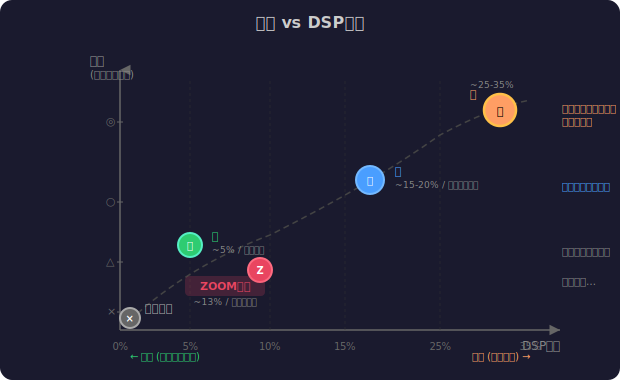

---

## 5. 設計判断Q&A — カスケード vs 並列を深掘り

### Q1: なぜ ZOOM は直列（カスケード）でやっているのか？

3つの理由がある。

**理由1: ドライブ基盤の流用**

ZOOMのAcSimは `_SUB_Drive_KawaOD` というオーバードライブ用サブルーチンを呼んでおり、ドライブ系エフェクトのアーキテクチャをそのまま転用している。ドライブエフェクトは「入力EQ → 歪み → 出力EQ」という直列構造が基本なので、AcSimも自然とカスケードになった。

> **つまり:** 新しく「アコギボディの物理モデル」を設計したのではなく、「既存の歪みペダルのEQカーブをアコギっぽくチューニングした」という経緯。開発コストとリスクが低い合理的な判断ではある。

**理由2: EQ的な設計思想**

カスケードバイクワッドは本質的にパラメトリックEQと同じ構造。音響エンジニアが「100Hzを3dBブースト、500Hzを2dBカット…」とEQを調整する感覚で設計できる。並列構造は直感的でなく、別の設計ツールが必要になる。

**理由3: 並列には実測＋オフライン最適化が必要**

並列バイクワッドの係数設計には:
1. 実際のアコギボディのIR（インパルス応答）を測定
2. PCでスペクトル分析し、共鳴モードを特定
3. 最小二乗法で係数を最適化

という工程が必要。カスケードEQなら「聴きながら手でチューニング」で済むが、並列は「測定→解析→最適化」のパイプラインが必須。ZOOMの開発フローにこの工程が組み込まれていなかった可能性が高い。

---

### Q2: カスケードと並列の実用的な違いは？

理論的には「同じ極と零点を持つフィルタは同じ伝達関数を持つ」ので、数学上は等価にできる。しかし実装上は大きな違いがある。

| 観点 | カスケード（直列） | 並列 |
|---|---|---|
| **パラメータの独立性** | × 後段が前段の出力を受けるため、1段変えると全体に影響 | ○ 各セクションが独立。1つ変えても他に影響なし |
| **量子化ノイズ** | × 段を通るたびにノイズが蓄積（11段通ると11倍）| ○ 各段のノイズが独立に加算（√11倍 ≈ 3.3倍）|
| **リアルタイム制御** | × 「100Hzの共鳴だけ変える」が困難 | ○ 該当セクションのゲインだけ変えればOK |
| **物理対応** | × ボディの共鳴モードとの対応が不明瞭 | ○ 1セクション = 1共鳴モード |
| **設計の手軽さ** | ○ EQ的に聴感で調整可能 | × 実測IR + 数値最適化が必要 |
| **既存資産の流用** | ○ EQ/ドライブの枠組みがそのまま使える | × 専用の設計ツールが必要 |

> **量子化ノイズが蓄積する直感的理解:**
> カスケードは「伝言ゲーム」のようなもの。11人が順番に伝えると、各段で少しずつ誤差（ノイズ）が足される。並列は「全員が同時に原文を読んで、各自の要約を最後に合わせる」方式。原文の精度が全段に保たれる。
>
> 固定小数点DSP（ZOOMのような組み込み機器）では、この差が音質に直結する。浮動小数点（PC/スマホ）なら差は小さいが、それでも並列の方が数値的に安全。

---

### Q3: 「同じ極と零点」とは何か？

フィルタの伝達関数 H(z) は分数式で書ける:

```
         b0 + b1·z⁻¹ + b2·z⁻²
H(z) = ─────────────────────────
          1 + a1·z⁻¹ + a2·z⁻²
```

- **零点 (zero):** 分子 = 0 になる周波数。その周波数の音が**消される（ノッチ）**
- **極 (pole):** 分母 = 0 になる周波数。その周波数の音が**強まる（共鳴）**

バイクワッド1段には **2つの極と2つの零点** がある（2次だから）。

#### ギターで例えると

| 概念 | ギターでの例え | 音への効果 |
|---|---|---|
| **極 (pole)** | アコギのボディが「ボーン」と鳴る周波数 | その周波数が強調される。Qが高い（極が単位円に近い）ほど鋭い共鳴 |
| **零点 (zero)** | ハウリングサプレッサーで消す周波数 | その周波数がピンポイントで消える |
| **極と零点のペア** | ワウペダル。ピークの隣に必ず谷がある | 共鳴と反共鳴が隣り合う = ボディらしい特性 |

#### なぜ「同じ極と零点なら同じ音」と言えるのか

伝達関数は極と零点の位置だけで完全に決まる（ゲイン定数を除く）。カスケードでも並列でも、最終的な極・零点の配置が同じなら、理論上は全く同じ周波数特性になる。

```
カスケード: H(z) = H1(z) × H2(z) × ... × HN(z)
                    ↑ 各段の極・零点が全部掛け合わさる

並列:       H(z) = H1(z) + H2(z) + ... + HN(z)
                    ↑ 各段の極・零点を足し合わせる → 通分すると同じ分数式にできる
```

> **ただし「理論上は同じ」でも実装上は違う。** 上のQ2で説明した量子化ノイズの蓄積パターンが異なるため、固定小数点環境（ZOOM等）では並列の方が高品質になる。

---

### Q4: 新規にアコシミュを作るなら並列一択か？

**答え: 並列一択ではない。ハイブリッドが最適。**

各構造には得意・不得意があり、用途に応じて使い分けるのがベスト:

| 処理内容 | 最適な構造 | 理由 |
|---|---|---|
| **ボディ共鳴（低域モード）** | 並列バイクワッド | 各共鳴モードが独立して調整可能。物理にも合致 (Bank 2007) |
| **ボディ共鳴（高域モード）** | 短いFIR | 高域は密なモードがすぐ減衰する。FIRの方が効率的 (Smith ボディファクタリング) |
| **ピックアップ補正** | カスケード | 単純なシェルフフィルタ1-2段。わざわざ並列にする理由がない |
| **トーンコントロール** | カスケード | 1次LPF。カスケードで十分 |
| **エンベロープ補正** | 別処理 | フィルタ構造の問題ではない |

#### 推奨アーキテクチャ

```
入力 → [カスケード] PU補正 (1-2段)
     → [並列] ボディ低域共鳴 (4-8段)     ─┐
     → [FIR] ボディ高域モード (256tap)    ─┤→ ミックス
     → [カスケード] Top/Tone (2-3段)      ─┘
     → 出力
```

> **最も重要なのは構造よりも係数の品質。**
> 並列にしても係数がデタラメなら意味がない。実測IRから適切に最適化された係数が入って初めて並列構造のメリットが活きる。
> 逆に言えば、カスケードでも係数が素晴らしければかなり良い音になる。
> 構造の選択は「天井の高さ」を決めるもので、実際の品質は「係数の精度」が決める。

#### 並列バイクワッドの実装上の注意: 直接項 (direct term)

並列バイクワッドでボディ応答を近似する場合、バイクワッドの出力を足すだけでは全体のレベルが合わない。特に非常に低い周波数や非常に高い周波数で誤差が出る。

これを補正するために **直接項** `d₀ + d₁·z⁻¹` を加える:

```
H(z) = (d₀ + d₁·z⁻¹) + Σ Hi(z)
        ↑ 直接項           ↑ 並列バイクワッドの和
```

> **直感的に:** 各バイクワッドは「共鳴ピーク」を担当するが、共鳴と共鳴の「谷間」のレベルまでは面倒を見てくれない。直接項はこの「ベースライン」を調整する役割。料理で言えば、各具材（バイクワッド）の味は決まったが、全体の塩加減（直接項）で最終調整する感覚。

---

## 6. さらに学びたい人へ

| レベル | リソース | 内容 |
|---|---|---|
| 入門 | Julius O. Smith III 「[Introduction to Digital Filters](https://ccrma.stanford.edu/~jos/filters/)」 | フィルタの基礎をゼロから。無料オンラインテキスト |
| 入門 | 「ギターエフェクターの自作と設計」(技術評論社) | アナログ回路だがフィルタの直感的理解に有用 |
| 中級 | Smith 「[Physical Audio Signal Processing](https://ccrma.stanford.edu/~jos/pasp/)」 | ボディモデリング含む物理モデル合成の教科書。無料 |
| 実践 | DAFx Conference 論文アーカイブ (https://www.dafx.de/) | ギター関連のDSP論文が多数。年次で検索可能 |

---

## 7. 参考文献

1. Karjalainen, Penttinen, Välimäki. "Acoustic Sound from the Electric Guitar Using DSP Techniques." IEEE ICASSP 2000. https://www.researchgate.net/publication/3858672
2. Karjalainen, Penttinen, Välimäki. "More Acoustic Sounding Timbre from Guitar Pickups." DAFx-99. https://www.dafx.de/paper-archive/1999/karjalainen.pdf
3. Penttinen, Karjalainen. "A Digital Filtering Approach to Obtain a More Acoustic Timbre for an Electric Guitar." https://www.researchgate.net/publication/228862710
4. Karjalainen, Välimäki, Jánosy. "Towards High-Quality Sound Synthesis of the Guitar and String Instruments." ICMC 1993.
5. Bank, B. "Direct Design of Parallel Second-Order Filters for Instrument Body Modeling." ICMC 2007. https://home.mit.bme.hu/~bank/publist/icmc07.pdf
6. Välimäki, Tolonen. "Morphing Instrument Body Models." DAFx-01. https://www.researchgate.net/publication/2565842
7. Bank, Karjalainen. "Passive Admittance Matrix Modeling for Guitar Synthesis." DAFx-10. https://dafx10.iem.at/proceedings/papers/BankKarjalainen_DAFx10_P60.pdf
8. Smith, J.O. "Commuted Synthesis." Physical Audio Signal Processing, Stanford CCRMA. https://ccrma.stanford.edu/~jos/pasp/Commuted_Synthesis.html
9. Yamaha. アコースティックギター振動・音響シミュレーション技術. https://www.yamaha.com/ja/tech-design/research/technologies/acoustic-guitar-analysis/
