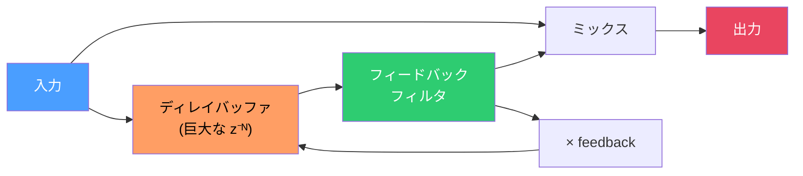
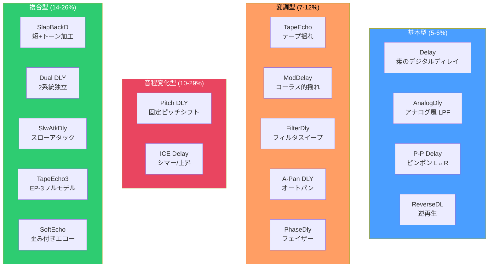
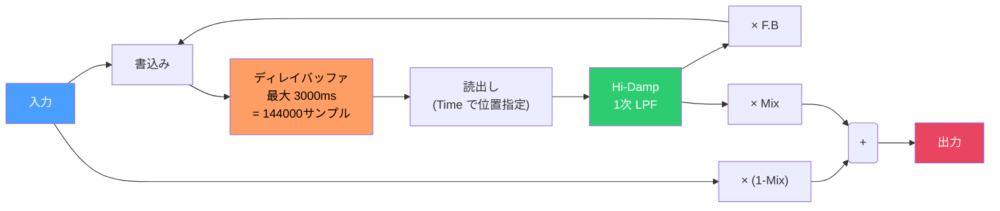
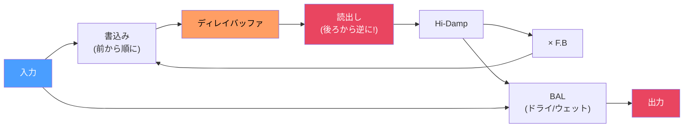
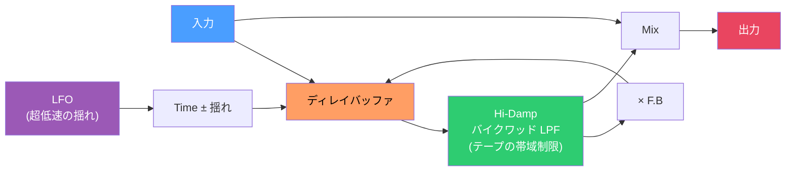
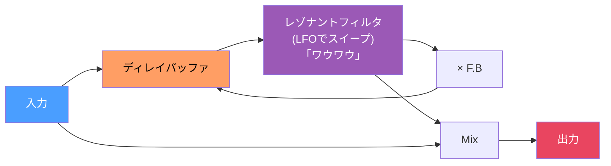
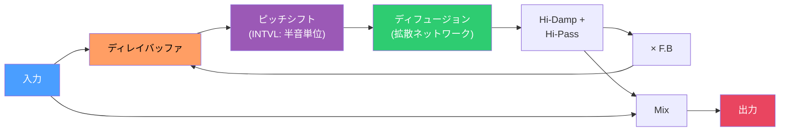
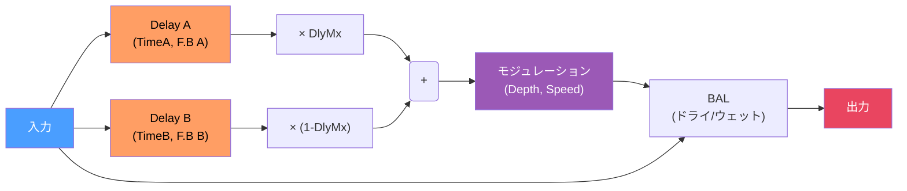
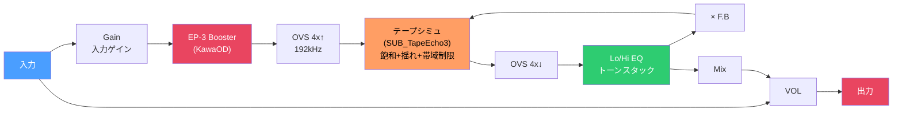
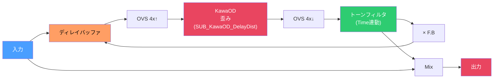

# ディレイエフェクト研究ノート

ZOOM MS-50G+ の全16ディレイエフェクトの逆アセンブリ解析をもとに、ディレイの信号処理を基礎から解説する。

---

## 0. ディレイの基礎 — バイクワッドの知識をディレイに繋げる

### ディレイとは何か

バイクワッドの z⁻¹ は「1サンプル遅延」(0.02ms) だった。ディレイはこれを**何万倍にも引き伸ばしたもの**。

```
バイクワッド:  z⁻¹ = 1サンプル = 0.02ms  → 周波数を選別する (EQ)
ディレイ:     z⁻ᴺ = N サンプル = 10〜3000ms → 音を繰り返す (エコー)

N = ディレイタイム × サンプリングレート
例: 500ms × 48000Hz = 24000サンプル
```

> **つまりディレイは「超長い z⁻¹」。** バイクワッドが z⁻¹ を1-2個使うのに対し、ディレイは z⁻¹ を数万個並べたバッファ（メモリ）を使う。

### ディレイの基本構造

すべてのディレイは同じ骨格を持っている:



疑似コード（全ディレイの共通骨格）:

```c
// これが全ディレイの核心。たった5行。
void basic_delay(float *in, float *out, int n, State *s, Params *p) {
    for (int i = 0; i < n; i++) {
        float x = in[i];
        float delayed = delay_read(s->buf, p->time * SAMPLE_RATE); // バッファから読む
        delayed = filter(delayed);                                  // フィルタ (種類はエフェクトによる)
        delay_write(s->buf, x + delayed * p->feedback);            // 入力+フィードバックを書く
        out[i] = x * (1.0 - p->mix) + delayed * p->mix;           // ドライ/ウェット混合
    }
}
```

> **16個のディレイエフェクトの違いは、この骨格の「中に何を挟むか」だけ。**

### ディレイの3つの核心パラメータ

| パラメータ | 意味 | ギターで例えると |
|---|---|---|
| **Time** | バッファの読み出し位置。遅延時間 | 山彦の距離。遠いほど遅く返ってくる |
| **Feedback (F.B)** | 出力をどれだけ入力に戻すか (0〜1) | 山彦が何回繰り返されるか |
| **Mix** | 原音と遅延音の混合比 | ドライ/ウェットのバランス |

```
Feedback = 0:    入力 → パン！ → （1回だけ） → パン！
Feedback = 0.5:  入力 → パン！ → パン → パン → パン → ぱ → ·
Feedback = 0.9:  入力 → パン！ → パン → パン → パン → パン → パン → パン → ぱ → ·
Feedback ≥ 1.0:  入力 → パン！ → パン → パン → パン → パンパンパン → ∞ 発振！
```

> **バイクワッドとの共通点:** フィードバックが音を「繰り返す」仕組みは同じ。バイクワッドは0.02ms単位で繰り返すから「共鳴」、ディレイは数百ms単位で繰り返すから「エコー」。

---

## 1. ZOOM MS-50G+ ディレイ全16種 — 分類と概要

### DSP負荷順 一覧

| # | エフェクト名 | DSP負荷 | コードサイズ | Biquad段数 | OVS | 特徴 |
|---|---|---|---|---|---|---|
| 1 | **Delay** | 5.50% | 960命令 | ~7 | - | 基本デジタルディレイ (3000ms) |
| 2 | **AnalogDly** | 5.50% | 960命令 | ~7 | - | アナログ風。ビクワッドHi-Damp |
| 3 | **P-P Delay** | 5.82% | 960命令 | ~7 | - | ピンポン (L↔R交互) |
| 4 | **ReverseDL** | 5.82% | 936命令 | ~8 | - | 逆再生ディレイ (1500ms) |
| 5 | **TapeEcho** | 6.97% | 896命令 | ~7 | - | テープエコー。ピッチ変動あり |
| 6 | **ModDelay** | 7.63% | 912命令 | ~6 | - | モジュレーション付きディレイ |
| 7 | **FilterDly** | 8.37% | 1168命令 | ~12 | - | フィルタスイープ + ディレイ |
| 8 | **Pitch DLY** | 10.01% | 1040命令 | ~9 | - | ピッチシフト付きディレイ |
| 9 | **A-Pan DLY** | 10.17% | 1624命令 | ~9 | - | オートパン + ディレイ |
| 10 | **PhaseDly** | 11.89% | 1656命令 | ~17 | - | フェイザー + ディレイ |
| 11 | **SlapBackD** | 13.70% | 1344命令 | ~16 | - | 短いディレイ。ロカビリー向け |
| 12 | **Dual DLY** | 16.73% | 2736命令 | ~21 | - | 2系統ディレイ (Eventide風) |
| 13 | **SlwAtkDly** | 17.39% | 1824命令 | ~18 | - | スローアタック + ディレイ |
| 14 | **TapeEcho3** | 17.88% | 2432命令 | ~18 | 4x | Maestro EP-3モデリング |
| 15 | **SoftEcho** | 26.08% | 1576命令 | ~14 | 4x | KawaOD歪み付きエコー |
| 16 | **ICE Delay** | 29.20% | 2584命令 | ~25 | - | ピッチシフト + シマー |

### 4つのカテゴリに分類



---

## 2. 基本型ディレイ — まずこれを理解する

### 2.1 Delay (素のデジタルディレイ)

**最もシンプルなディレイ。全ての基礎。**

| 項目 | 値 |
|---|---|
| DSP負荷 | 5.50% |
| 最大ディレイタイム | 3000ms |
| フィードバックフィルタ | 1次LPF (Hi-Damp) |
| 特殊処理 | なし |



**Hi-Damp (高域減衰フィルタ):**

繰り返すたびに高域を削る1次LPF。`Fx_Dly_Dly_hidump_tbl` に11段階の係数が入っている:

```
Hi-Damp = 0:   fc ≈ 800Hz   → こもった音。アナログテープ的
Hi-Damp = 5:   fc ≈ 3kHz    → 自然な減衰
Hi-Damp = 10:  fc ≈ 15kHz   → ほぼ素通し。デジタルそのまま
```

> **なぜ Hi-Damp があるのか:** 本物のエコー（山彦）は反射するたびに高域が吸収されて丸くなる。Hi-Damp=0でこれを再現。逆にHi-Damp=10だと「デジタルっぽい」クリアな繰り返しになる。

### 2.2 AnalogDly (アナログディレイシミュレーション)

Delay とほぼ同じ構造だが、**Hi-Damp がバイクワッド (2次LPF)** になっている。

```
Delay:     Hi-Damp = 1次LPF → ゆるやかなカーブ
AnalogDly: Hi-Damp = 2次LPF → 急峻なカーブ。よりアナログ的

                          ↓ この差
周波数応答:
  Delay:      ＼  ← ゆるやかにカット
  AnalogDly:   ⎩ ← fc以上をスパッとカット
```

`Fx_DLY_AnalogDly_hidump_tbl` はバイクワッド5係数 × 11段階 = 55 float。Delayの1次LPFよりフィルタが急峻で、BBD (Bucket Brigade Device) チップのバンド幅制限を模倣している。

> **BBDとは:** 1970年代のアナログディレイICで、音声信号をバケツリレー式に伝送する。帯域が狭く（〜3kHz）、繰り返すたびに音がこもる。これが「アナログディレイの温かみ」の正体。

### 2.3 P-P Delay (ピンポンディレイ)

**コードが Delay と完全に同一。** 関数名も `Fx_DLY_Delay_*` のまま。DLLエントリだけ `Dll_PingPong_Delay` に変わっている。

違いは `pp_edit` パラメータだけ — 出力をL/Rに交互に振り分ける:

```
通常ディレイ:
  パン!  パン  パン  パン  (全部センター)

ピンポン:
  パン!  (L)パン  (R)パン  (L)パン  (R)パン
         左       右       左       右
```

> **発見:** P-P Delay は独立したエフェクトではなく、Delay のパンニングモードを変えただけ。DSP負荷もコードサイズも完全に同一 (5.82% / 960命令)。

### 2.4 ReverseDL (リバースディレイ)

バッファの読み出し方向を**逆にする**ことで、音を逆再生してから出力する。

```
通常ディレイ:
  入力: ♩ → バッファ → 読出し(前→後) → ♩ (同じ音)

リバース:
  入力: ♩ → バッファ → 読出し(後→前) → ♩ᴿ (逆再生された音)
```



最大1500ms (通常Delayの半分)。逆再生のためにバッファを「一区間書いて→逆に読む」を繰り返す必要があり、ディレイタイムが短くなる。

---

## 3. 変調型ディレイ — 「ディレイタイムを揺らす」

### 3.1 TapeEcho (テープエコーシミュレーション)

テープの走行ムラ（**ワウ/フラッター**）を再現。

```
デジタルディレイ:  Time = 500ms (固定)
テープエコー:      Time = 500ms ± 2ms (LFOでゆらゆら揺れる)
```

ディレイタイムが揺れると何が起きるか:
- タイムが短くなる瞬間 → 読み出しが速くなる → **ピッチが上がる**
- タイムが長くなる瞬間 → 読み出しが遅くなる → **ピッチが下がる**



係数テーブル `_Fx_DLY_TapeEcho_Coe` に含まれるテープ特性パラメータ:
- `[7] = 0.83` — テープ飽和レベル
- `[8] = 0.125` — ワウ/フラッター深さ
- `[9] = 0.997` — テープのフィードバック減衰率

> **「Timeを変えるとピッチが変わる」** のはZOOMの説明書にも書いてある特徴。テープの速度を変えるとピッチが変わるのと同じ。これがテープエコーらしさの鍵。

### 3.2 ModDelay (モジュレーションディレイ)

ディレイタイムをLFOで変調する。テープエコーがテープの「走行ムラ」を再現するのに対し、ModDelayは意図的にコーラス的な揺れを加える。

```
TapeEcho:  揺れ = ±0.1ms (微小。テープのアナログ劣化を再現)
ModDelay:  揺れ = ±1〜5ms (大きい。コーラス/フランジャー的な効果)
```

最もシンプルな変調型 (6段バイクワッド, 912命令)。

### 3.3 FilterDly (フィルタディレイ)

フィードバックループ内にLFOで動くフィルタ（共鳴フィルタ）を配置。繰り返すたびにフィルタの周波数が動き、「ワウ」的な効果が乗る。



12段バイクワッド (8.37%) — バイクワッドが多いのはフィルタ処理が追加されているため。

### 3.4 A-Pan DLY (オートパンディレイ)

ディレイ + オートパン（自動L/R揺れ）の組み合わせ。

内部に `Fx_SFX_AutoPan` と `Fx_DLY_StereoDly` という2つの独立モジュールがあり、`Link` パラメータで接続順を切り替える:

```
Link = 0: 入力 → AutoPan → Delay → 出力
Link = 1: 入力 → Delay → AutoPan → 出力
```

ソフトクリップ (有理関数) あり。`Clip` パラメータで歪み量を調整可能。

### 3.5 PhaseDly (フェイザーディレイ)

フィードバックループ内にフェイザーを配置。繰り返すたびに位相が変化し、独特の揺れが加わる。

**8種の Color モードが特徴的:**

`Fx_Dly_PhaDly_color_FB_tbl` の値:
```
Color 0: FB= 0.000  → フェイザーなし
Color 1: FB= 0.640  → 軽いフェイズ
Color 2: FB= 0.098  → 微妙なフェイズ
Color 3: FB= 0.882  → 強いフェイズ
Color 4: FB=-0.384  → 逆位相フェイズ（!）
Color 5: FB=-0.896  → 強い逆位相
Color 6: FB=-0.188  → 軽い逆位相
Color 7: FB=-0.887  → 強い逆位相
```

> **負のフィードバック:** フェイザーのフィードバックを負にすると、通常と逆の周波数が強まる。つまりフィルタのピークと谷が入れ替わる。8種の Color はこの正負 × 強弱の組み合わせ。

17段バイクワッド — フェイザーのオールパスフィルタチェーン分。

---

## 4. 音程変化型ディレイ — 「フィードバックで音程が変わる」

### 4.1 Pitch DLY (ピッチシフトディレイ)

フィードバックループ内にピッチシフターを配置。繰り返すたびに音程が変わる。

```
例: Pitch = +5半音 (4度上)
  1回目: 原音
  2回目: +5半音 (4度上)
  3回目: +10半音 (短7度上)
  4回目: +15半音 (オクターブ+短3度上)
  ...
```

`Fx_Pit_tone_tbl` (11 float) はピッチシフター後のLPF係数。ピッチシフトで生じるアーティファクト（金属的な歪み）を抑えるため。

### 4.2 ICE Delay (アイスディレイ / シマー)

**最も DSP 負荷が高い (29.20%)**。ピッチシフト + ディレイ + ディフュージョンの組み合わせ。

`Fx_DLY_IceDelay_interval_tbl` (62 float) にピッチ比のテーブルがある:
```
[0]  = 1.750  (短7度上)
[2]  = 1.765
[4]  = 1.780
...
[28] = 1.875  (短7度〜オクターブ間)
[30] = 1.898
...
[60] = 2.000  (オクターブ上)
```

繰り返すたびに音程が上がり続け、**シマーリバーブ的な煌びやかな上昇音**が生まれる。



関数名に `smear_edit`, `blend_edit`, `hipass_edit` がある — リバーブに近い拡散処理を含んでいる。25段バイクワッド。

> **ICE Delay はディレイとリバーブの中間的存在。** ピッチシフトで音が上昇し続け、ディフュージョンで拡散される。結果は「きらきら輝くような残響」= シマー。

---

## 5. 複合型ディレイ — 「ディレイ + 別のエフェクト」

### 5.1 SlapBackD (スラップバックディレイ)

**短いディレイ (最大300ms)** に特化。ロカビリーやサーフロックの「パタパタ」した短い反復音を再現。

16段バイクワッドと多いのは、フィードバックループ内のトーン加工フィルタ:
- `[30]` に fc≈3504Hz のピーキングEQ → 特定帯域を持ち上げてキャラクターを付ける
- `SubDv` パラメータで音符の細分化 (P-P = L/R交互の付点8分ディレイ)

### 5.2 Dual DLY (デュアルディレイ)

**Eventide TimeFactor のデジタルディレイをモデリング。** 2系統の独立ディレイを持つ。



特徴的な係数テーブル群:
- `STR_LRmixGain_tbl` — ステレオ時のL/Rミックスカーブ
- `MONO_LRmixGain_tbl` — モノ時のミックスカーブ
- `LoEq_Fc_tbl` — 低域EQの周波数: 480Hz → 1200Hz
- `LoEq_Gain_tbl` — 低域EQのゲイン: -12dB → 0dB

21段バイクワッド、107回の乗算。2系統分のフィルタ + モジュレーション + EQ。

### 5.3 SlwAtkDly (スローアタックディレイ)

**入力のアタックを消してからディレイに通す。** バイオリンの弓弾きのような「ふわっ」としたサウンド。

`Fx_DLY_SlwAtkDly_Swell_tbl` (250 float) は全ディレイ中最大のテーブル。エンベロープカーブが格納されている:

```
[0] = 1.0 (フル音量)
[1] = 0.9
...
[11] = 0.0 (ミュート)
[12〜249] = 0.0 (沈黙を維持)

→ アタックの瞬間を消し、その後ゆっくりフェードイン
```

### 5.4 TapeEcho3 (Maestro Echoplex EP-3 モデリング)

**最大コード量 (2432命令)。4xオーバーサンプリング。** Maestro Echoplex EP-3を忠実にモデリング。



**重要な発見:**
- `SUB_KawaOD_EP_Booster` — AcSim と同じ KawaOD ドライブサブルーチンを EP-3 のプリアンプブースターとして使用
- `SUB_TapeEcho3` — 独立したテープシミュレーションサブルーチン
- 係数テーブルに: 初期ゲイン 0.78、プリアンプゲイン 0.462、ドライブ量 3.565

> **EP-3 は単なるディレイではなくプリアンプ付き。** Gain, Hi, Lo, VOL の4パラメータはプリアンプ部のもの。実機EP-3のブースター機能（ディレイOFFでもプリアンプとして使える）を再現。

### 5.5 SoftEcho (ソフトエコー)

**内部名 "CarbonDly"。4xオーバーサンプリング。** フィードバックループ内にKawaODの歪みを配置し、繰り返すたびにわずかに歪む「温かいエコー」を作る。



特徴的な係数テーブル:
- `TimeLinkFc_tbl` — ディレイタイムに連動してLPFのfcが変化 (1700Hz → 2050Hz)
- `TimeLinkQ_tbl` — タイムに連動してQも変化 (0.92 → 0.75)
- `TimeLinkMix_tbl` — タイムに連動してミックス量も補正

> **なぜ OVS 4x が必要か:** KawaOD の歪み処理が入るため、エイリアシング（歪みで生じる折り返しノイズ）を防ぐ必要がある。歪みのないディレイにはOVSは不要。AcSim と全く同じ理由。

---

## 6. ZOOM ディレイ実装の共通パターンまとめ

### 発見事項

| パターン | 内容 |
|---|---|
| **コード流用** | P-P Delay は Delay と完全に同一コード。パンニングだけ異なる |
| **KawaOD 再利用** | SoftEcho (CarbonDly) と TapeEcho3 (EP-3) がドライブサブルーチンを流用。AcSim と同じパターン |
| **OVS = 歪みの証** | 4xオーバーサンプリングがあるエフェクトは必ず歪み処理を含む |
| **Hi-Damp の2方式** | 1次LPF (Delay系) と 2次バイクワッドLPF (AnalogDly系) |
| **汎用テンプレート** | 全ディレイが同一の信号フロー図と疑似コードを共有 — ZOOMの開発は共通テンプレートベース |

### DSP負荷の内訳推定

```
基本ディレイ骨格:        ~3% (バッファ読み書き + ミックス)
Hi-Damp (1次LPF):       ~0.5%
Hi-Damp (バイクワッド):  ~1%
追加フィルタ (per段):    ~0.5%
ピッチシフト:            ~5-8%
4x OVS + 歪み:          ~10-15%
```

---

## 7. ディレイの DSP テクニック — 学習ポイント

### 7.1 ディレイバッファの実装

```c
// 循環バッファ (リングバッファ)
typedef struct {
    float *data;     // バッファ本体 (例: 144000 float = 3秒@48kHz)
    int size;        // バッファサイズ
    int write_pos;   // 書き込み位置 (毎サンプル +1 して循環)
} DelayBuffer;

void delay_write(DelayBuffer *d, float x) {
    d->data[d->write_pos] = x;
    d->write_pos = (d->write_pos + 1) % d->size;  // 循環
}

float delay_read(DelayBuffer *d, int delay_samples) {
    int read_pos = d->write_pos - delay_samples;
    if (read_pos < 0) read_pos += d->size;  // 循環
    return d->data[read_pos];
}
```

> **循環バッファ:** 配列の末尾に達したら先頭に戻る。これで無限にデータを書き続けられる。ディレイバッファの基本データ構造。

### 7.2 分数サンプルディレイ（補間）

ディレイタイムが整数サンプルでない場合（例: 500.3ms = 24014.4サンプル）、整数位置の間を**補間**する:

```c
float delay_read_interp(DelayBuffer *d, float delay_samples) {
    int pos_int = (int)delay_samples;
    float frac = delay_samples - pos_int;  // 小数部分

    float a = delay_read(d, pos_int);      // 手前のサンプル
    float b = delay_read(d, pos_int + 1);  // 次のサンプル

    return a + frac * (b - a);  // 線形補間
}
```

> **なぜ補間が必要か:** ModDelay や TapeEcho ではLFOでディレイタイムが連続的に変化する。整数サンプルだけだとピッチに「段差」が生じてしまう。補間でなめらかにする。

### 7.3 テープシミュレーションの要素

TapeEcho / TapeEcho3 で使われるテープ特有の処理:

```
1. ワウ (低速の揺れ, ~0.5Hz):  テープ速度のゆっくりした変動
2. フラッター (高速の揺れ, ~5Hz): テープ走行のガタつき
3. 帯域制限 (LPF ~3-5kHz):      テープヘッドの高域特性
4. 飽和 (ソフトクリップ):        テープ磁性体の磁気飽和
5. ノイズ:                       テープヒスノイズ (ZOOMでは未実装)
```

---

## 8. 次に学ぶべきこと

ディレイの理解は、以下のテーマに直結する:

```
ディレイ → リバーブ:
  リバーブ = 複数のディレイラインを並列/直列に組み合わせたもの
  MVerb の Allpass / Comb フィルタはディレイ + フィードバック
  → mverb-algorithm-explained.md で復習

ディレイ → フランジャー/コーラス:
  フランジャー = 超短いディレイ (0.5-5ms) + LFO変調
  コーラス = 短いディレイ (5-30ms) + LFO変調
  → ModDelay の構造そのまま

ディレイ → ピッチシフト:
  ピッチシフト = ディレイバッファの読み出し速度を変える
  速く読む = ピッチ上がる、遅く読む = ピッチ下がる
  → Pitch DLY, ICE Delay の内部処理
```

---

## 9. 参考文献

1. Smith, J.O. "Physical Audio Signal Processing" — Delay lines, comb filters, allpass filters: https://ccrma.stanford.edu/~jos/pasp/
2. Dattorro, J. "Effect Design Part 2: Delay-Line Modulation and Chorus" — JAES 1997
3. Zoelzer, U. "DAFX: Digital Audio Effects" — Chapter on delay-based effects
4. Maestro Echoplex EP-3 service manual — テープエコーの実機回路
