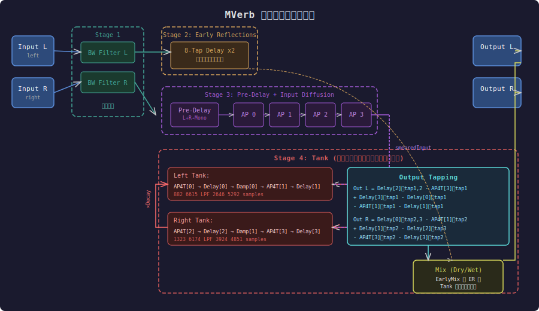
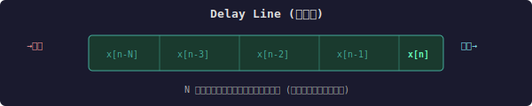
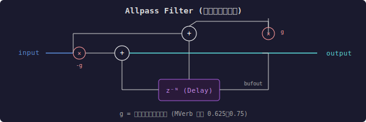
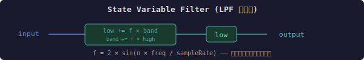
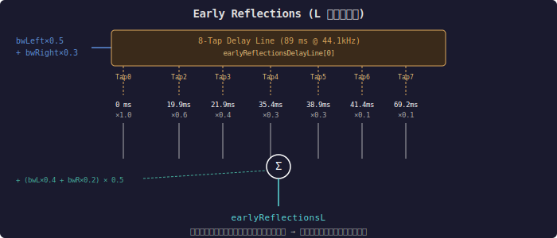
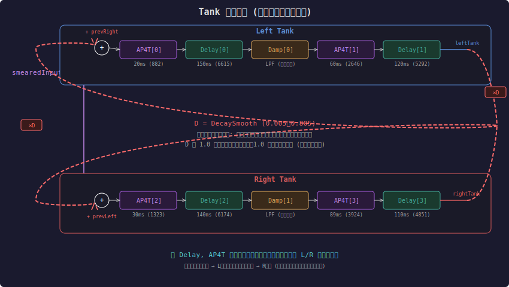
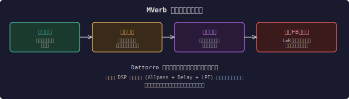

# MVerb アルゴリズム徹底解説

> Martin Eastwood 氏による [MVerb](https://github.com/martineastwood/mverb) のリバーブアルゴリズムを、DSP 初心者向けに図解します。

---

## 目次

1. [リバーブとは？ ── 前提知識](#1-リバーブとは--前提知識)
2. [MVerb の全体構成](#2-mverb-の全体構成)
3. [DSP 基本ブロック](#3-dsp-基本ブロック)
4. [ステージ別詳解](#4-ステージ別詳解)
5. [パラメータ一覧](#5-パラメータ一覧)
6. [遅延時間の設計値](#6-遅延時間の設計値)

---

## 1. リバーブとは？ ── 前提知識

現実の部屋で音が鳴ると、壁や天井に何度も反射して耳に届きます。

```
音源 ──直接音──→ 耳
  │
  ├──壁で反射──→ 耳（少し遅れて届く＝初期反射）
  │
  └──何度も反射──→ 耳（たくさん重なる＝残響テール）
```

デジタルリバーブは、**ディレイ（遅延）** と **フィルタ** を組み合わせてこの現象を再現します。

---

## 2. MVerb の全体構成

MVerb は Jon Dattorro のプレートリバーブ論文に影響を受けた設計で、大きく **4 つのステージ** に分かれます。



### 4 つのステージ

| ステージ | 役割 | 主なコンポーネント |
|---|---|---|
| **1. Bandwidth Filter** | 入力の高域をカットし、自然な音に | State Variable Filter (LPF) x2 |
| **2. Early Reflections** | 壁からの最初の反射音群 | 8-Tap Delay Line x2 |
| **3. Pre-Delay + Diffusion** | 残響の立ち上がりを遅らせ＋拡散 | Delay + Allpass x4 直列 |
| **4. Tank** | フィードバックで残響テールを生成 | Allpass + Delay + Damping を交差フィードバック |

---

## 3. DSP 基本ブロック

MVerb で使われる DSP ブロックを理解しましょう。

### 3.1 ディレイライン（Delay Line）

音を一定サンプル数だけ遅らせる最も基本的なブロックです。



**マルチタップ（Multi-Tap）**: バッファの複数箇所を同時に読み出せる拡張版。MVerb では 4-Tap と 8-Tap を使用。

### 3.2 オールパスフィルタ（Allpass Filter）

周波数特性を変えず（全帯域を通す）、位相だけを変える特殊なフィルタです。
リバーブでは音を「拡散」させ、密度を高めるために使います。



**ポイント**: オールパスは振幅を変えず位相だけ回転させるので、音の「色」は変わらず「広がり」が出ます。

### 3.3 State Variable Filter（状態変数フィルタ）

MVerb では **帯域制限（Bandwidth）** と **ダンピング（高域吸収）** に使用されます。
ローパスフィルタとして動作し、高い周波数を減衰させます。



---

## 4. ステージ別詳解

### 4.1 Stage 1: Bandwidth Filter（帯域制限）

入力信号の高域を制限します。現実の部屋では空気が高い周波数を吸収するため、これを模倣しています。

```
Input L ──→ [SVF LowPass] ──→ bandwidthLeft
Input R ──→ [SVF LowPass] ──→ bandwidthRight

カットオフ周波数 = BandwidthFreq × 18400 + 100 [Hz]
（パラメータ 0.0〜1.0 → 100〜18500 Hz）
```

### 4.2 Stage 2: Early Reflections（初期反射）

部屋の壁・天井からの最初の数回の反射音を模倣します。MVerb では **8-Tap ディレイライン** を使い、異なる遅延時間で複数のコピーを重ね合わせます。



**L と R で異なるタップ遅延時間**を使うことで、ステレオの広がりを作り出しています。

- **L チャンネル**: 0, 19.9, 21.9, 35.4, 38.9, 41.4, 69.2 ms
- **R チャンネル**: 0, 9.9, 11.0, 18.2, 18.9, 21.3, 43.1 ms

### 4.3 Stage 3: Pre-Delay + Input Diffusion（前置遅延＋入力拡散）

```
bandwidthLeft + bandwidthRight
           │
           ×0.5 (モノラルに)
           │
    ┌──────▼──────┐
    │  Pre-Delay  │  ← 0〜200ms の遅延 (部屋の大きさを表現)
    └──────┬──────┘
           │
    ┌──────▼──────┐
    │  Allpass[0]  │  4.8 ms  (g=0.75)
    └──────┬──────┘
    ┌──────▼──────┐
    │  Allpass[1]  │  3.6 ms  (g=0.75)
    └──────┬──────┘
    ┌──────▼──────┐
    │  Allpass[2]  │  12.7 ms (g=0.625)
    └──────┬──────┘
    ┌──────▼──────┐
    │  Allpass[3]  │  9.3 ms  (g=0.625)
    └──────┬──────┘
           │
      smearedInput (拡散された入力)
```

4 つの直列オールパスにより、パルス状の入力が「にじんだ」信号に変換されます。これにより Tank に入る前からエコー感のない密度の高い音になります。

### 4.4 Stage 4: Tank（残響タンク）── 心臓部

ここが MVerb のアルゴリズムの核心です。**交差フィードバック構造** により、信号が左右のタンクを永遠に循環し、残響テールを生成します。



#### Tank の信号の流れ（擬似コード）

```
毎サンプル:
  // Left Tank
  leftTank  = AP4T[0]( smearedInput + PreviousRightTank )
  leftTank  = Delay[0]( leftTank )
  leftTank  = Damping[0]( leftTank )     // 高域を吸収 → ループするたびに暗くなる
  leftTank  = AP4T[1]( leftTank )
  leftTank  = Delay[1]( leftTank )

  // Right Tank
  rightTank = AP4T[2]( smearedInput + PreviousLeftTank )
  rightTank = Delay[2]( rightTank )
  rightTank = Damping[1]( rightTank )
  rightTank = AP4T[3]( rightTank )
  rightTank = Delay[3]( rightTank )

  // フィードバックを保存 (次のサンプルで使用)
  PreviousLeftTank  = leftTank  × Decay
  PreviousRightTank = rightTank × Decay
```

#### 出力タッピング

Tank 内部の **複数のタップポイント** から信号を取り出し、加算・減算して最終出力を構成します。加算と減算を混ぜることで、周波数レスポンスにディップ（谷）が生まれ、自然な残響に近づきます。

```
Out_L = +0.6 × Delay[2].tap1  +0.6 × Delay[2].tap2
        -0.6 × AP4T[3].tap1   +0.6 × Delay[3].tap1
        -0.6 × Delay[0].tap1  -0.6 × AP4T[1].tap1
        -0.6 × Delay[1].tap1

Out_R = +0.6 × Delay[0].tap2  +0.6 × Delay[0].tap3
        -0.6 × AP4T[1].tap2   +0.6 × Delay[1].tap2
        -0.6 × Delay[2].tap3  -0.6 × AP4T[3].tap2
        -0.6 × Delay[3].tap2
```

> **ポイント**: 左出力は主に**右タンク**のディレイから、右出力は主に**左タンク**のディレイから取り出されています。この交差が自然なステレオイメージを生み出します。

### 4.5 最終ミックス

```
final_L = EarlyMix × Tank出力L  + (1 - EarlyMix) × earlyReflectionsL
final_R = EarlyMix × Tank出力R  + (1 - EarlyMix) × earlyReflectionsR

output_L = ( input_L + Mix × (final_L - input_L) ) × Gain
output_R = ( input_R + Mix × (final_R - input_R) ) × Gain
```

- **EarlyMix = 1.0**: Tank 出力（残響テール）のみ
- **EarlyMix = 0.0**: 初期反射のみ
- **Mix = 0.0**: 完全ドライ（原音のみ）
- **Mix = 1.0**: 完全ウェット（残響のみ）

---

## 5. パラメータ一覧

| パラメータ | 範囲 | 説明 |
|---|---|---|
| **Damping Freq** | 0.0〜1.0 | Tank 内のローパスカットオフ。低いほど高域が早く減衰（暗い残響） |
| **Density** | 0.0〜1.0 | Tank 内オールパスのフィードバック量。高いほど密度の高い残響 |
| **Bandwidth Freq** | 0.0〜1.0 | 入力フィルタのカットオフ (100〜18500 Hz)。リバーブに送る帯域を制限 |
| **Decay** | 0.0〜1.0 | フィードバック量 (0.005〜0.805)。残響の長さを制御 |
| **Pre-Delay** | 0.0〜1.0 | 残響が始まるまでの遅延 (0〜200ms)。大きな部屋感 |
| **Size** | 0.0〜1.0 | Tank 内の全ディレイ長を一括スケーリング (0.05〜1.0)。部屋の大きさ |
| **Gain** | 0.0〜1.0 | 出力ゲイン |
| **Mix** | 0.0〜1.0 | ドライ/ウェットのバランス |
| **Early Mix** | 0.0〜1.0 | 初期反射 vs 残響テールのバランス |

---

## 6. 遅延時間の設計値

すべての遅延時間は**互いに素な比率**に近くなるよう設計されており、信号がループ内で規則的なパターンを作らないようにしています（これが金属的な響きを防ぎます）。

### Input Diffusion（入力拡散オールパス）

| ブロック | 遅延 (ms) | サンプル数 (44.1kHz) | フィードバック |
|---|---|---|---|
| Allpass[0] | 4.8 | 211 | 0.75 |
| Allpass[1] | 3.6 | 158 | 0.75 |
| Allpass[2] | 12.7 | 559 | 0.625 |
| Allpass[3] | 9.3 | 410 | 0.625 |

### Tank（Size = 1.0）

| ブロック | 遅延 (ms) | サンプル数 | タップ位置 |
|---|---|---|---|
| AP4T[0] | 20 | 882 | ── |
| Delay[0] | 150 | 6615 | 67ms, 11ms, 121ms |
| AP4T[1] | 60 | 2646 | 6ms, 41ms |
| Delay[1] | 120 | 5292 | 36ms, 89ms |
| AP4T[2] | 30 | 1323 | ── |
| Delay[2] | 140 | 6174 | 8.9ms, 99ms |
| AP4T[3] | 89 | 3924 | 31ms, 11ms |
| Delay[3] | 110 | 4851 | 67ms, 4.1ms |

### Tank 合計遅延（1周分）

| パス | 合計 | ≒ ms |
|---|---|---|
| Left Tank | 882 + 6615 + 2646 + 5292 = **15435** | **350 ms** |
| Right Tank | 1323 + 6174 + 3924 + 4851 = **16272** | **369 ms** |

左右で異なるループ長にすることで、左右の残響パターンが一致せず、よりリッチなステレオ感が生まれます。

---

## まとめ



Dattorro 型プレートリバーブの簡潔な実装。少ない DSP ブロック (Allpass + Delay + LPF) の組み合わせだけでリッチなステレオリバーブを実現しています。

---

*Based on [MVerb](https://github.com/martineastwood/mverb) by Martin Eastwood (GPLv3)*
