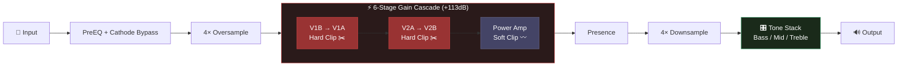
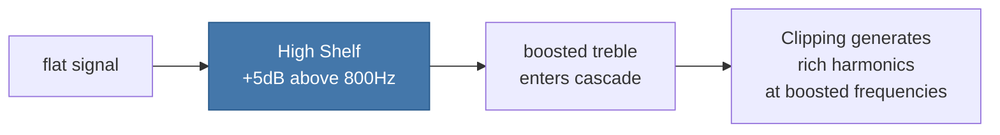
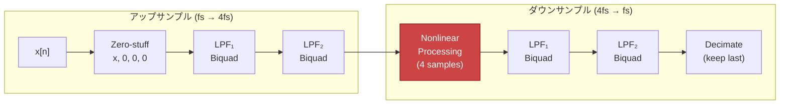
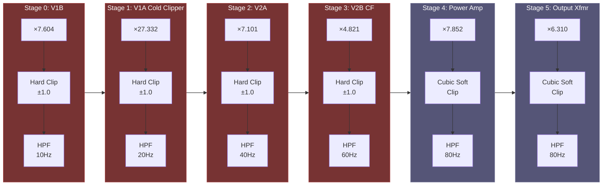
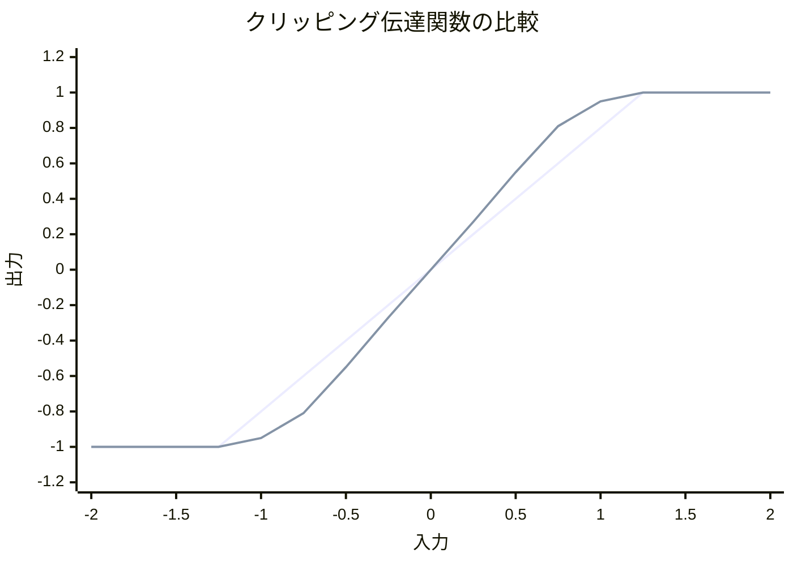

# MS 800 — Marshall JCM800 2203 Amp Model 仕様書

## 概要

Marshall JCM800 2203 の回路動作を DSP でモデリングしたギターアンプシミュレータ。
ZOOM MS-50G+ の DSP 解析データを基盤としつつ、実機 JCM800 の回路特性（カソードバイパス、
ステージ間カップリングキャップ、パワーアンプのソフトクリップ、FMV トーンスタック）を再現。

## ブロック図（簡略）



### なぜ6段なのか？ — 歪みの仕組み

ギターの信号はとても小さい（数十mV）。これを爆音にするには**何万倍**にも増幅する必要がある。
JCM800 は真空管を6段直列につないで、各段で少しずつ増幅する。

```
🎸 ギター信号 (とても小さい)
 │
 ▼
┌──────────────────────────────────────────────────────┐
│  ×7.6 → ×27 → ×7.1 → ×4.8 → ×7.9 → ×6.3          │
│                                                      │
│  全部かけると = 約 449,000倍 (+113dB)                  │
└──────────────────────────────────────────────────────┘
 │
 ▼
🔊 スピーカーへ
```

**ポイント**: 各段で増幅するたびに、信号が真空管の限界（±1.0）を超えた分が
「クリップ」されて波形が潰れる。**この波形の潰れ方こそが「歪み」の正体**。

```
入力 (きれいな波)        → 増幅 → クリップ (歪んだ波)

   ╱╲                         ┌──┐
  ╱  ╲        ×27倍          │  │
 ╱    ╲      ────→          │  │
╱      ╲                    ┘  └──
```

6段もあるので、前の段で歪んだ波がさらに次の段で増幅されて歪む。
**段数が多いほど歪みが複雑になり、倍音が豊かになる**。これが JCM800 の音の秘密。

### 前段 vs 後段 — 2種類の歪み方

```
 Stage:   0       1        2       3       4        5
 Gain:  ×7.6   ×27.3    ×7.1    ×4.8    ×7.9     ×6.3
 Clip:  Hard    Hard     Hard    Hard    Soft     Soft
 HPF:   10Hz    20Hz     40Hz    60Hz    80Hz     80Hz
        ├─── プリアンプ (12AX7) ──┤├─ パワーアンプ (EL34) ─┤
```

**前段4段 (プリアンプ)** — ハードクリップ ✂️
- 限界を超えた信号をバッサリ切り落とす（波形がフラットトップに）
- ジャキジャキした鋭い倍音が出る → JCM800 のキレのある歪みの源
- 12AX7 真空管の動作を模擬

**後段2段 (パワーアンプ)** — ソフトクリップ 〰️
- 限界に近づくと**なめらかに丸まる**（波形の角が丸い）
- 温かみのある柔らかい歪み → ピッキングに追従する「サグ感」
- EL34 パワー管＋出力トランスの動作を模擬

```
ハードクリップ (前段)          ソフトクリップ (後段)

    ┌────────┐                   ╭────────╮
    │        │                  ╱          ╲
────┘        └────          ──╱              ╲──
バッサリ切断 → 鋭い音       なめらかに丸める → 温かい音
```

### カソードバイパス — 高域ブーストの秘密

歪ませる**前に**高い音だけ +5dB 持ち上げる。
すると歪みが高域の倍音を**自然に**たくさん生成してくれる。

> 歪み後に EQ で高域を足す（v1方式）と、ノイズも一緒に増幅してしまう。
> 歪み前にブーストする本方式は、倍音は増えるがノイズは増えない。

---

## 信号フロー


## ZOOM MS-50G+ との比較

### 周波数特性解析（実測 WAV データ）

| 帯域 | 周波数 | ZOOM差分 | 本モデルの対応 |
|------|--------|----------|---------------|
| Sub | 20-80 Hz | +6.1 dB | Sub-bass cut (-7dB@50Hz) で抑制 |
| Low | 80-200 Hz | +13.8 dB | Bass EQ (150Hz) + ステージ間HPFで制御 |
| Low-Mid | 200-500 Hz | +21.6 dB | カスケード歪みによるゲイン |
| Mid | 500-1000 Hz | +23.6 dB | FMV Mid scoop (600Hz) で「V字」形成 |
| Upper-Mid | 1-2 kHz | +23.3 dB | Treble EQ (2.5kHz) 帯域 |
| Presence | 2-4 kHz | +21.9 dB | Presence EQ (NFBモデル) |
| Brilliance | 4-8 kHz | **+30.5 dB** | Cathode bypass (+5dB@800Hz) → 歪み前ブーストで倍音生成 |
| Air | 8-16 kHz | **+29.7 dB** | 4× OVS によるエイリアシング低減 |

### 設計思想の違い

```mermaid
graph TB
    subgraph ZOOM["ZOOM MS-50G+ アプローチ"]
        Z1["ハードクリップ全段"] --> Z2["固定 Brilliance EQ<br/>+7dB@6kHz (歪み後)"]
        Z2 --> Z3["結果: 高域はEQで後付け<br/>ノイズも増幅"]
    end
    subgraph JCM["本モデル (JCM800) アプローチ"]
        J1["Cathode Bypass<br/>+5dB@800Hz (歪み前)"] --> J2["Hard Clip (preamp)<br/>+ Soft Clip (power)"]
        J2 --> J3["結果: 高域倍音は歪みが生成<br/>ノイズ増幅なし"]
    end

    style ZOOM fill:#553,stroke:#aa6
    style JCM fill:#335,stroke:#66a
```



| 項目 | ZOOM MS-50G+ | 本モデル (JCM800) |
|------|-------------|-------------------|
| オーバーサンプリング | 2× | **4×** (エイリアシング -12dB改善) |
| クリッピング方式 | 全段ハードクリップ | **preamp硬 + power amp軟** |
| 高域生成 | 歪み後に+7dB EQ | **歪み前 cathode bypass** |
| ミッド特性 | ブースト (noon: +4.9dB) | **スクープ (noon: -1.9dB)** |
| DC ブロック | 全段 7.6Hz 固定 | **ステージ別 10-80Hz** |
| トレブル中心 | 4000 Hz | **2500 Hz** |
| ベース中心 | 100 Hz | **150 Hz** |
| ミッド中心 | 800 Hz | **600 Hz** |

---

## 各ブロック詳細

### 1. Input Gain — 入力ゲイン

```
input_gain_ = input_val² × 1.41
```

- `params_[6]` (0.0〜1.0) を二乗テーパーで変換
- 0.0 → ミュート、0.5 → -9dB (0.353×)、1.0 → +3dB (1.41×)
- 二乗テーパーにより低ゲイン域の微調整が容易

### 2. PreEQ — Hi Input モデル (3× IIR1)

JCM800 の Hi Input ジャック → V1B グリッドまでの入力回路をモデル化。
ZOOM の DSP 係数テーブルから直接移植。

```
y[n] = a0 × x[n] + a1 × x[n-1] + b1 × y[n-1]
```

| ステージ | 係数 (a0, a1, b1) | モデル対象 |
|---------|-------------------|----------|
| pre_eq_[0] | (0.976, -0.367, 0.391) | V1B 入力インピーダンス |
| pre_eq_[1] | (0.958, 0.218, -0.110) | ステージ間フィルタ |
| pre_eq_[2] | (0.991, -0.980, 0.971) | カップリングキャップ HPF |

#### 伝達関数 (IIR1)

```
         a0 + a1 × z⁻¹
H(z) = ─────────────────
          1 - b1 × z⁻¹
```

pre_eq_[2] の b1=0.971 は約 222Hz の HPF に相当。
これにより入力段で既にサブベースがロールオフされる。

### 3. Cathode Bypass — カソードバイパスキャップ



JCM800 の V1A にある 0.68µF カソードバイパスコンデンサをモデル化。
800Hz 以上を +5dB ブーストしてからゲインカスケードに入れることで、
**歪みが自然に高域倍音を生成**する。

#### 伝達関数 (High Shelf Biquad)

```
         b0 + b1 × z⁻¹ + b2 × z⁻²
H(z) = ──────────────────────────────
          1 + a1 × z⁻¹ + a2 × z⁻²
```

係数計算（Audio EQ Cookbook 準拠）:

```
A     = 10^(gain_dB / 40)     // gain_dB = +5.0
ω₀    = 2π × 800 / fs
α     = sin(ω₀) × √2 / 2     // shelf slope S = 1

b0 = A × [(A+1) + (A-1)cosω₀ + 2√A × α]  /  a0
b1 = -2A × [(A-1) + (A+1)cosω₀]           /  a0
b2 = A × [(A+1) + (A-1)cosω₀ - 2√A × α]  /  a0
a1 = 2 × [(A-1) - (A+1)cosω₀]             /  a0
a2 = [(A+1) - (A-1)cosω₀ - 2√A × α]      /  a0

where a0 = (A+1) - (A-1)cosω₀ + 2√A × α
```

**v1 との違い**: v1 は歪み後に +7dB@6kHz の Brilliance EQ で高域を後付け。
これはノイズフロアも増幅してしまう。本モデルは歪み前にブーストするため、
歪み自体が倍音を生成し、ノイズの増幅が発生しない。

### 4. Gain-Dependent Pre-EQ + Trim

Gain ノブに連動する可変 EQ。低ゲイン時は中域を大きくカットし、
高ゲイン時はカットを緩める。

```
signal → [Peak EQ biquad] → × gain_trim → output
```

| Gain ノブ | EQ 中心周波数 | EQ ゲイン | Q | Trim (dB) |
|-----------|-------------|----------|---|----------|
| 0 (min) | 260 Hz | -34.0 dB | 0.10 | -83.0 dB |
| 5 (noon) | 320 Hz | -24.0 dB | 0.10 | -45.5 dB |
| 10 (max) | 680 Hz | -3.3 dB | 0.10 | -8.0 dB |

ゲイントリムの範囲: -83dB（ほぼ無音）〜 -8dB。
ライン入力のノイズフロア（約 -68dBFS）に対し、
ノブ中央（-45.5dB trim）付近でノイズがクリッピング閾値に達する設計。

#### Peak EQ 伝達関数

```
A     = 10^(gain_dB / 40)
ω₀    = 2π × fc / fs
α     = sin(ω₀) / (2Q)

b0 = (1 + α×A)  / a0
b1 = -2cosω₀    / a0
b2 = (1 - α×A)  / a0
a1 = b1                   ← Peak EQ では b1 = a1
a2 = (1 - α/A)  / a0

where a0 = 1 + α/A
```

### 5. 4× オーバーサンプリング



**処理フロー (コード対応)**:

```cpp
// [3] Upsample: 1サンプル → 4サンプル (zero-stuffing)
up[0] = LPF₂(LPF₁(x × 4.0))    // 元サンプル × 4 (ゲイン補正)
up[1] = LPF₂(LPF₁(0.0))        // ゼロ挿入サンプル 1
up[2] = LPF₂(LPF₁(0.0))        // ゼロ挿入サンプル 2
up[3] = LPF₂(LPF₁(0.0))        // ゼロ挿入サンプル 3

// [4][5] 非線形処理 (4倍レートで実行)
for k in 0..3:
    dn[k] = ProcessNonlinear(up[k])

// [6] Downsample: 4サンプル → 1サンプル
for k in 0..2:
    LPF₂(LPF₁(dn[k]))          // フィルタ状態を更新 (出力は破棄)
y = LPF₂(LPF₁(dn[3]))          // 最後のサンプルのみ使用
```

**Anti-alias フィルタ仕様**:

- タイプ: 2段カスケード Butterworth LPF (4次相当)
- カットオフ: `fs × 0.45` (= 21,600 Hz @ 48kHz)
- 動作レート: `4 × fs` (= 192,000 Hz @ 48kHz)
- Q: 0.707 (Butterworth)

**v1 との違い**: v1 は 2× OVS + 単段 LPF。4× にすることで:
- ナイキスト折り返しノイズが約 -12dB 改善
- ハードクリップの倍音がよりクリーンに再生
- 2段カスケードでフィルタのロールオフが急峻化

### 6. 6-Stage Gain Cascade — ゲインカスケード

JCM800 の真空管 6 ステージをモデル化。各ステージで
「ゲイン → クリップ → DC ブロック」を繰り返す。



#### ステージゲイン一覧

| Stage | 名称 | ゲイン | ゲイン(dB) | クリップ方式 | HPF |
|-------|------|--------|-----------|-------------|-----|
| 0 | V1B | 7.604× | +17.6 dB | Hard ±1.0 | 10 Hz |
| 1 | V1A (Cold Clipper) | 27.332× | +28.7 dB | Hard ±1.0 | 20 Hz |
| 2 | V2A | 7.101× | +17.0 dB | Hard ±1.0 | 40 Hz |
| 3 | V2B (Cathode Follower) | 4.821× | +13.7 dB | Hard ±1.0 | 60 Hz |
| 4 | Power Amp (EL34) | 7.852× | +17.9 dB | **Cubic Soft** | 80 Hz |
| 5 | Output Transformer | 6.310× | +16.0 dB | **Cubic Soft** | 80 Hz |

**合計ゲイン**: 7.604 × 27.332 × 7.101 × 4.821 × 7.852 × 6.310 = **約 449,000× (+113 dB)**

#### プリアンプ: ハードクリップ (Stages 0-3)

```
f(x) = { +1.0   if x > +1.0
        {  x     if -1.0 ≤ x ≤ +1.0
        { -1.0   if x < -1.0
```

12AX7 真空管がグリッド電流領域/カットオフに達した時の飽和を近似。
波形はフラットトップとなり、奇数倍音（3次, 5次, 7次...）が生成される。

#### パワーアンプ: キュービックソフトクリップ (Stages 4-5)

```
f(x) = { +1.0                    if x > +1.0
        { 1.5x - 0.5x³           if -1.0 ≤ x ≤ +1.0
        { -1.0                    if x < -1.0
```



- f(1.0) = 1.5 - 0.5 = 1.0 ✓ (ハードクリップと同じ最大値)
- f'(x) = 1.5 - 1.5x² → f'(1.0) = 0 (**滑らかなニー**)
- f'(0) = 1.5 (小信号ゲインが 1.5×、ハードクリップの 1.0× より高い)

**効果**: EL34 パワー管と出力トランスの飽和特性を近似。
ピッキングの強弱に追従する「サグ」感を再現。ハードクリップのような
急峻な波形変化がないため、高次倍音の量が自然に抑えられる。

#### DC ブロッキングフィルタ — ステージ間カップリングキャップ

```
y[n] = x[n] - x[n-1] + R × y[n-1]
```

1次 HPF。R の値がカットオフ周波数を決定:

```
R = 1 - 2π × fc / fs_ovs
```

| Stage | fc (Hz) | R (@ 192kHz) | 目的 |
|-------|---------|-------------|------|
| 0 | 10 | 0.9997 | V1B: 広帯域パス |
| 1 | 20 | 0.9993 | V1A: サブベース軽減 |
| 2 | 40 | 0.9987 | V2A: 低域タイト化開始 |
| 3 | 60 | 0.9980 | V2B: 低域さらにタイト |
| 4 | 80 | 0.9974 | Power: ローエンドコントロール |
| 5 | 80 | 0.9974 | OT: 出力トランス帯域制限 |

**v1 との違い**: v1 は全段 R=0.999 (fc≈7.6Hz) で統一。
実機は後段ほどカップリングキャップの値が小さく、
HPF カットオフが高い。これにより後段で低域がタイトになり、
低域ノイズの蓄積も防ぐ。

### 7. Presence EQ — ネガティブフィードバックモデル

JCM800 の Presence コントロールはパワーアンプの
ネガティブフィードバック (NFB) ループの周波数特性を変更する。
オーバーサンプリングレート (4×fs) で処理。

- **Boost**: Presence ノブ連動の Peak EQ (周波数・ゲイン・Q すべてテーブル補間)
- **Cut**: Presence > 0.5 で高中域をわずかにカット (NFB の周波数選択性を近似)

### 8. FMV Tone Stack — マーシャルトーンスタック

「Fender-Marshall-Vox」型パッシブトーンスタックの DSP 近似。
3つの独立した Peak EQ Biquad で構成。


#### ノブ位置と EQ ゲイン

**Bass (150Hz, Q=0.7)**:

| ノブ | 0 | 1 | 2 | 3 | 4 | 5 | 6 | 7 | 8 | 9 | 10 |
|-----|---|---|---|---|---|---|---|---|---|---|---|
| linear | 0.39 | 0.48 | 0.58 | 0.70 | 0.92 | 1.42 | 1.55 | 1.65 | 1.75 | 1.82 | 1.88 |
| dB | -8.3 | -6.4 | -4.7 | -3.1 | -0.7 | +3.0 | +3.8 | +4.3 | +4.9 | +5.2 | +5.5 |

**Mid (600Hz, Q=1.0)** — マーシャルの「V字」スクープ:

| ノブ | 0 | 1 | 2 | 3 | 4 | 5 | 6 | 7 | 8 | 9 | 10 |
|-----|---|---|---|---|---|---|---|---|---|---|---|
| linear | 0.25 | 0.32 | 0.40 | 0.50 | 0.63 | 0.80 | 0.95 | 1.10 | 1.25 | 1.45 | 1.70 |
| dB | **-12.0** | -9.9 | -8.0 | -6.0 | -4.0 | **-1.9** | -0.4 | +0.8 | +1.9 | +3.2 | +4.6 |

**ノブ中央 (5) で -1.9dB のスクープ** — これが JCM800 の特徴的な「V字」サウンドの核心。
v1 では同じ位置で +4.9dB のブーストだったため、マーシャルらしさが欠如していた。

**Treble (2500Hz, Q=0.8)**:

| ノブ | 0 | 5 | 10 |
|-----|---|---|---|
| dB | -7.1 | +4.9 | +5.5 |

#### v1 との比較

| パラメータ | v1 | 本モデル | 理由 |
|-----------|-----|---------|------|
| Mid 中心 | 800 Hz | **600 Hz** | マーシャルの mid scoop はこの帯域 |
| Mid noon ゲイン | +4.9 dB | **-1.9 dB** | V字スクープが JCM800 の本質 |
| Treble 中心 | 4000 Hz | **2500 Hz** | プレゼンス帯域 (存在感) |
| Bass 中心 | 100 Hz | **150 Hz** | マーシャルのローエンドキャラクター |

### 9. Sub-bass Cut

50Hz で -7dB の Peak EQ カット (Q=0.7)。
タイトなローエンドを実現し、もこもこした低域を防ぐ。

### 10. Output Level

VOL ノブ (0-10) からテーブル補間で dB 値を取得し、リニアゲインに変換。

| VOL | 0 | 1 | 2 | 3 | 4 | 5 | 6 | 7 | 8 | 9 | 10 |
|-----|---|---|---|---|---|---|---|---|---|---|---|
| dB | -74.5 | -29.0 | -19.0 | -14.0 | -11.0 | -8.0 | -6.5 | -5.0 | -3.5 | -2.2 | -0.95 |
| linear | 0.0002 | 0.035 | 0.112 | 0.200 | 0.282 | 0.398 | 0.473 | 0.562 | 0.668 | 0.776 | 0.898 |

---

## パラメータ一覧

| Index | 名称 | 範囲 | デフォルト | 説明 |
|-------|------|------|----------|------|
| 0 | Gain | 0.0-1.0 | 0.5 | プリアンプドライブ量 (trim -83dB〜-8dB) |
| 1 | Bass | 0.0-1.0 | 0.5 | トーンスタック低域 (150Hz) |
| 2 | Mid | 0.0-1.0 | 0.5 | トーンスタック中域スクープ (600Hz) |
| 3 | Treble | 0.0-1.0 | 0.5 | トーンスタック高域 (2500Hz) |
| 4 | Presence | 0.0-1.0 | 0.5 | パワーアンプ NFB 高域強調 |
| 5 | Volume | 0.0-1.0 | 0.5 | 出力レベル (-8.0dB @ noon) |
| 6 | Input | 0.0-1.0 | 0.5 | 入力ゲイン (-9dB @ noon) |

---

## 技術仕様

| 項目 | 値 |
|------|-----|
| サンプルレート | 48,000 Hz |
| オーバーサンプリング | 4× (内部 192,000 Hz) |
| 処理モード | モノラル (入力 L+R → 出力 dual-mono) |
| Anti-alias フィルタ | 2段カスケード Butterworth LPF (4次) |
| フィルタ種別 | IIR1 (1次), Biquad (2次 Direct Form I) |
| 安全クランプ | ±10.0 (内部), ±1.0 (出力) |
| NaN 保護 | SafeClamp で `x != x` チェック |

---

## ファイル構成

| ファイル | 内容 |
|---------|------|
| `ms800_amp.h` | クラス定義、IIR1 構造体、メンバ変数 |
| `ms800_amp.cpp` | 全処理実装、ルックアップテーブル、biquad 係数計算 |
| `ms800_amp_v1.h` | v1 ベースライン (A/B 比較用) |
| `ms800_amp_v1.cpp` | v1 実装 (ZOOM 忠実版、tanh+bias、2× OVS) |
| `ms800_amp.md` | 本仕様書 |
